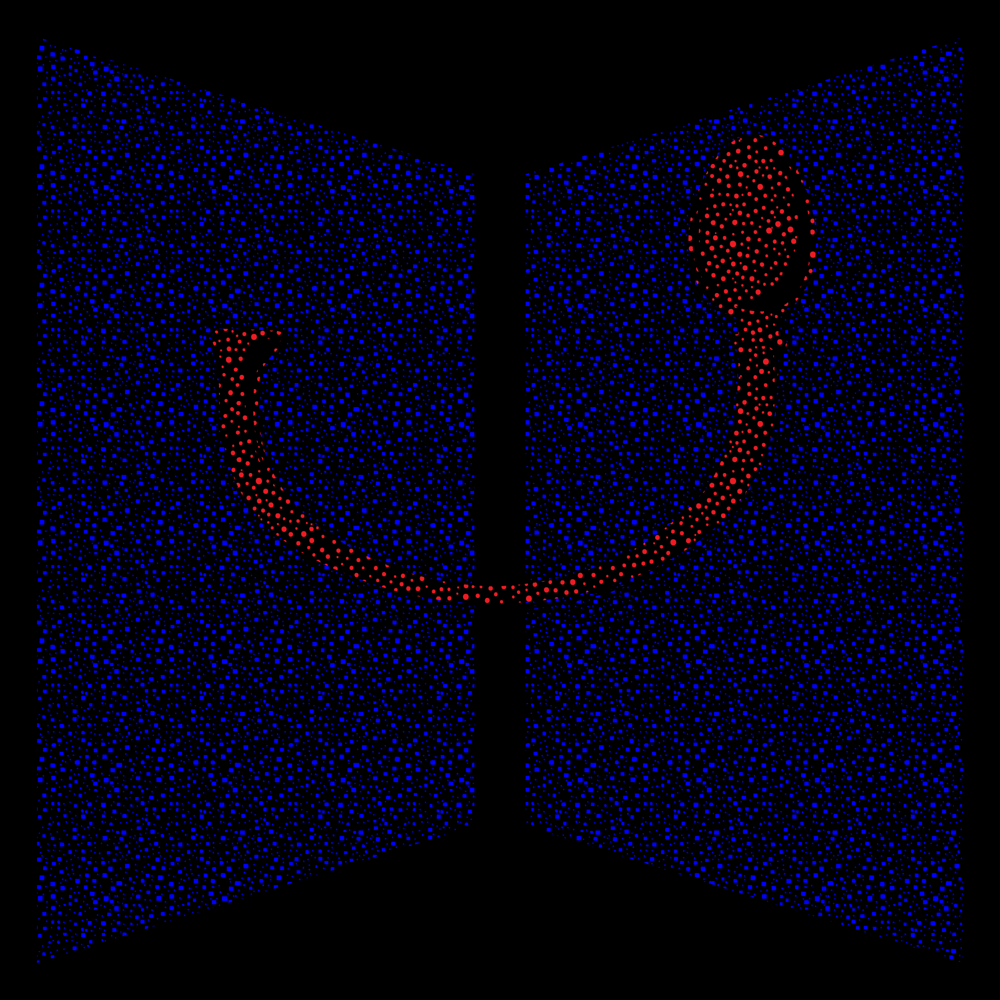

<div class="relative">

# Agentic Programming

<div class="cover-sub">Letting AI write and run your code</div>

<div class="cover-meta">
  Dominique Makowski<br>
  <span class="opacity-60">D.Makowski@sussex.ac.uk</span>
</div>

</div>

<div class="cover-lockup">
  
  
</div>

<div class="cover-keys">
  <div><kbd>&larr;</kbd> <kbd>&rarr;</kbd> navigate &middot; <kbd>b</kbd> draw &middot; <kbd>c</kbd> chalkboard</div>
  <div><kbd>o</kbd> overview &middot; <kbd>d</kbd> dark &middot; <kbd>g</kbd> go to &middot; <kbd>f</kbd> full screen</div>
</div>

---
layout: default
---

# What is Agentic Programming?

Not autocomplete. Not a chatbot you copy-paste from.

<v-clicks>

- An **agent** is given a *goal* and acts: reads your files, writes code, runs commands, fixes its own errors
- You say *what*; it decides *how*. Your job moves from **writing** code to **steering** and **reviewing** it

</v-clicks>

<div v-click class="mt-4 text-sm">

**The usual suspects**

| Terminal agents | IDE-based | In-editor assistants |
|---|---|---|
| Claude Code | Cursor | GitHub Copilot |
| OpenAI Codex | Windsurf | Continue |
| Gemini CLI, Aider | VS Code agent mode | Copilot Chat |

</div>

<div v-click class="mt-3 opacity-70 text-sm">

**Claude Code** (used here) is Anthropic's terminal agent: running bash and editing files are part of its loop, not add-ons.
Tools differ in interface and price, far less in principle - learn the *workflow*, not the tool.

</div>

---
layout: default
---

# The Prerequisite: GitHub

<div class="text-xl mt-2 mb-4">

Any project where an AI has freedom **must** be tracked by git & GitHub.

</div>

<v-clicks>

- An agent rewrites 20 files in 10 seconds. Without version control there is **no undo**
- The three things you and the agent need:
  - **`diff`** - see *exactly* what the agent changed
  - **`commit`** - a safe point to return to (commit *before* you let it loose)
  - **`branch` / `revert`** - throw a bad session away at no cost
- GitHub adds the backup, the history, and the collaboration layer

</v-clicks>

<div v-click class="mt-6 p-4 border-l-4 border-red-500 bg-red-500 bg-opacity-10">

**Master GitHub *first*.** Vibe coding on untracked files is not fast - it is a recipe for disaster. The speed of agentic programming comes entirely from being able to say *"no, undo that"* without fear.

</div>

---
layout: default
---

# Working Directory & Projects

<div class="grid grid-cols-2 gap-8 mt-4">

<div>

## The agent sees a folder

<v-clicks>

- The **working directory** is the agent's whole world: it reads, edits and creates files *there*
- What is inside is context; what is outside does not exist for it
- So the folder is both the **safety boundary** and the **scope** of the task

</v-clicks>

</div>

<div>

## One project = one folder = one repo

<v-clicks>

- Open the agent **in the project folder** - never in `Desktop/`, `Documents/` or your home directory
- Keep projects self-contained: data, scripts, outputs, notes
- Use relative paths (`data/raw.csv`), not `C:/Users/you/...`
- A clean, well-named structure isn't cosmetic: it is what makes the agent competent

</v-clicks>

</div>

</div>

<div v-click class="mt-6 opacity-70 text-sm">

Rule of thumb: if you would be uncomfortable letting the agent delete the folder, don't open it there.

</div>

---
layout: default
---

# AGENTS.md

<div class="text-xl mt-2 mb-3">

A plain-markdown README **for the agent**, at the root of your project.

</div>

<div class="grid grid-cols-2 gap-8">

<div>

<v-clicks>

- Read at the start of every session - you stop repeating yourself
- The emerging **cross-tool standard** (Codex, Cursor, Copilot, Gemini...); `CLAUDE.md` is Claude Code's equivalent
- **Golden rule: under 100 lines.** Long rule sets get skimmed and ignored
- Machine paths, API keys, personal habits: `CLAUDE.local.md`, **git-ignored**
- Nestable: one at the root, more in sub-folders

</v-clicks>

</div>

<div v-click>

```markdown
# AGENTS.md

## Project
Interoception analysis (R, targets).

## Commands
- Tests: `testthat::test_dir("tests")`
- Render: `quarto render index.qmd`

## Conventions
- tidyverse + easystats, not base R
- Native pipe `|>`, never `%>%`
- Never edit files in `data/raw/`
```

<div class="mt-2 text-xs opacity-60">Thirty lines like these beat a three-page essay.</div>

</div>

</div>

---
layout: default
---

# The Agentic Workflow Cycle

<div class="grid grid-cols-4 gap-4 mt-6 text-center">

<div class="p-4 rounded border border-blue-400 bg-blue-500 bg-opacity-5">
  <div class="text-xl font-bold text-blue-700">1. Explore</div>
  <div class="text-xs mt-2 opacity-80">"Read the relevant files first. Don't write anything yet."</div>
</div>

<div class="p-4 rounded border border-purple-400 bg-purple-500 bg-opacity-5">
  <div class="text-xl font-bold text-purple-700">2. Plan</div>
  <div class="text-xs mt-2 opacity-80">Ask for the steps <i>before</i> a file is touched. Read the plan.</div>
</div>

<div class="p-4 rounded border border-emerald-500 bg-emerald-500 bg-opacity-5">
  <div class="text-xl font-bold text-emerald-700">3. Implement</div>
  <div class="text-xs mt-2 opacity-80">Let it write the code <i>and</i> run the checks.</div>
</div>

<div class="p-4 rounded border border-amber-500 bg-amber-500 bg-opacity-5">
  <div class="text-xl font-bold text-amber-700">4. Commit</div>
  <div class="text-xs mt-2 opacity-80">Read the <code>git diff</code> yourself, sanity-check, commit.</div>
</div>

</div>

<div class="text-center text-xs opacity-50 mt-3">&#8635;&nbsp; then back to step 1 for the next task</div>

<v-clicks>

<div class="mt-6 p-4 border-l-4 border-blue-500 bg-blue-500 bg-opacity-10 text-sm">

**Tip:** for anything non-trivial, use **Plan Mode** - it keeps the agent read-only until you approve the blueprint. Most bad sessions are skipped plans.

</div>

<div class="mt-3 text-sm opacity-70">

One cycle, one commit. If you can't describe the change in a commit message, the task was too big.

</div>

</v-clicks>

---
layout: default
---

# One Task, One Session

<div class="text-xl mt-2 mb-4">

Context windows are finite, and agents get worse as they fill up.

</div>

<v-clicks>

- Every file read, command output and error trace stays in context. After ~15-20 turns the agent turns **forgetful, stubborn and expensive**
- **The rhythm:** one task, verify, **commit**, `/clear`, next task
  - ❌ *"Clean the data, run the ANOVA, make the plots and write the report."*
  - ✅ *"Write the cleaning script."* - commit - `/clear` - *"Now the plots."*
- A fresh session costs you nothing: `AGENTS.md` plus a clean, committed repo bring it up to speed in seconds
- Same broken fix twice? Don't argue with it - `Ctrl+C`, `git restore`, fresh session, rephrase

</v-clicks>


---
layout: center
class: text-center rebel-dark rebel-chalkboard
transition: fade
hideInToc: true
---

<div class="relative opacity-30 select-none text-sm">
  chalkboard &middot; <kbd>b</kbd> draw &middot; <kbd>c</kbd> back to the slides
</div>
