## How to do Bayesian Correlations


::::: {.columns}
:::: {.column width="50%" .nonincremental}

- Frequentist Pearson Correlation Matrix

::: {.fragment}


::: {.cell hash='index_cache/revealjs/unnamed-chunk-1_ec4566bae846856b19bfe4cee6b5d81a'}

```{.r .cell-code}
df <- iris  # A dataframe available in base R

correlation::correlation(df) |>
  summary()
```

::: {.cell-output .cell-output-stdout}
```
# Correlation Matrix (pearson-method)

Parameter    | Petal.Width | Petal.Length | Sepal.Width
-------------------------------------------------------
Sepal.Length |     0.82*** |      0.87*** |       -0.12
Sepal.Width  |    -0.37*** |     -0.43*** |            
Petal.Length |     0.96*** |              |            

p-value adjustment method: Holm (1979)
```
:::
:::


:::
::::
:::: {.column}

- **Bayesian** Pearson Correlation Matrix

::: {.fragment}


::: {.cell hash='index_cache/revealjs/unnamed-chunk-2_5b1ddc2b1f0876ef43f98bf1a67bc8ce'}

```{.r .cell-code}
df <- iris  # A dataframe available in base R

correlation::correlation(df, bayesian=TRUE) |>
  summary()
```

::: {.cell-output .cell-output-stdout}
```
# Correlation Matrix (pearson-method)

Parameter    | Petal.Width | Petal.Length | Sepal.Width
-------------------------------------------------------
Sepal.Length |     0.81*** |      0.86*** |       -0.11
Sepal.Width  |    -0.35*** |     -0.41*** |            
Petal.Length |     0.96*** |              |            
```
:::
:::


:::
::::
:::::


## Bayesian stats are easy\* to *do* {.center background-color="#1A237E"}

This module is about understanding *what* we are doing, and *why* we are doing it.


<sub>\* *Easy as in "not too hard"*</sub>


## Why Bayesian Statistics?

The Bayesian framework for statistics has quickly gained popularity among scientists, associated with the general shift towards open, transparent, and more rigorous science. Reasons to prefer this approach are:

- Reliability and accuracy <sub><sup>(Kruschke, Aguinis, & Joo, 2012; Etz & Vandekerckhove, 2016)</sup></sub>
- The possibility of introducing **prior knowledge** into the analysis <sub><sup>(Andrews & Baguley, 2013; Kruschke et al., 2012)</sup></sub>
- **Intuitive results** and their **straightforward interpretation** <sub><sup>(Kruschke, 2010; Wagenmakers et al., 2018)</sup></sub>

## Learning Bayes? Back to the *Bayesics* first

- This module adopts a slightly unorthodox approach: instead of starting with Bayesian theory and equations, we will first consolidate various concepts and notions that are present in Frequentist statistics, that will help us to understand and apply the Bayesian framework
- We **won't** be talking about Bayes until a few sessions in ("awww 😞")
  - But everything we do until then will be in preparation for it
- Understanding Bayes painlessly requires to be very clear about some fundamental concepts, in particular, probability distributions and model parameters

<!-- 1. R refresher and Distributions -->
<!-- 2. Statistics based on Analytical Distributions (Frequentist MLE) -->
<!-- 3. Statistics based on Empirical Distributions (Frequentist Bootstrapping) -->
<!-- 4. Bayes theorem, concept of priors and posterior -->
<!-- 5. Bayes Factors: Bayesian correlations and t-tests -->
<!-- 6. Posterior description -->
<!-- 7. Regression models -->
<!-- 8. MCMC and Model Diagnostics -->
<!-- 9. Model performance and comparison -->
<!-- 10. Advanced regressions -->
<!-- 11. More advanced models -->

## How to successfuly attend this module

::: {style="font-size: 95%"}

- Goal: **Becomes master\* of Bayesian statistics**
  - Master *User*: be comfortable using and reading Bayesian statistics
  - $\neq$ becoming a master mathematician
  - Right level of understanding: not too superficial, not too deep
<!-- - Learn, Understand, Apply -->
- Code shown in the slides should in general be *understood*
  - But you don't need to *memorize* it
  - Best to follow along by trying and **running the code** in your own system
  - (If you need me to slow down, *let me know!*)
- Ideally, make an Quarto file and write there info and code examples
  - Slides will be available online 
- Equations are not generally important
  - No need to memorize it, but you should understand the *concepts*
  - Memorizing a few Greek symbols will be useful
    - In particular [**beta**]{.fragment} $\beta$, [**sigma**]{.fragment} $\sigma$, [**mu**]{.fragment} $\mu$

:::

## R Refresher {.center background-color="#003B49"}

## Setup

- Make sure you have **R** and **RStudio** on your computer
  - Why local installation? *Independence, flexibility, and power*
- Follow the instruction on Canvas (in **/Syllabus**)
- If you have any problem, let me know

{.r-stretch}


## Why R?

- Why not SPSS? Matlab? Python?

  - The best for **statistics** (by far)
  - The best for **visualization**
  - **Free** (independence)
  - **Flexible** (packages)
  - **Powerful** (create websites, presentations, ...)
  - **Demanded** (💰)
  - Gold standard across science
  - Cutting-edge statistics and methods (e.g., Bayesian statistics)
  
## Vocabulary

- **R** = programming language
- **RStudio** = the "editor" that we use to work with R
- **Posit** = The company that created R Studio and that provides cloud services (used to be called *RStudio*)
- **Posit cloud** = The online version of RStudio
- **Quarto** = Used to be called R Markdown. A system to combine code, text, and code output into nice documents (similar to *Jupyter*)
- **Markdown** = A simple syntax to \**format*\* text used on \*\***internet**\*\*

## Panels

{.r-stretch}

1. Source (text editor)
2. Console (interactive)
3. Environment (objects)
4. Files (navigate)

## Interacting

::::: {.columns}
:::: {.column width="50%"}

1. Create a new document (file)
    - `.R` (R script) or `.qmd` (quarto document)
2. Write some code in the script
3. Run the code
    - Click somewhere on the same line that you want to execute
    - Or select the code that you want to execute
    - Hit `Ctrl+Enter`

::::
:::: {.column}

::: {.fragment}

::: {.cell hash='index_cache/revealjs/unnamed-chunk-3_141dada1886d6d3dde78a34bc051d52d'}

```{.r .cell-code}
2 + 2
```

::: {.cell-output .cell-output-stdout}
```
[1] 4
```
:::
:::

:::

::::
:::::

## Classes

::::: {.columns}
:::: {.column width="75%"}

- In R, each thing has a **class** (type)
  - **Numeric** (aka *integers* and *floats*; numbers)
  - **Character** (aka *string*; text)
  - **Logical** (aka *booleans*; `TRUE`/`FALSE`)
    - *Note:* TRUE and FALSE are equivalent to 1 and 0
    - Try: `TRUE + TRUE`
  - **Factors** (aka *categorical*; e.g. experimental conditions)
  - **Comments** (with *hash* #, `CTRL + SHIFT + C`)
  - **"Functions"** (ends with `()`; e.g. `mean()`)
  - Many more...

- You can check the class of an object with `class()`
- You can access a function's documentation with `?mean` or clicking on the function and pressing `F1`

::::
:::: {.column width="25%"}

Types

::: {.cell hash='index_cache/revealjs/unnamed-chunk-4_0db581442eb86d7fad2e801545ec7372'}

```{.r .cell-code}
# Number
3
# Character "quotations"
"text"
# Logical
TRUE
```
:::


::: {.fragment}

Check class

::: {.cell hash='index_cache/revealjs/unnamed-chunk-5_2c7b29f8c35f96df0b00c1140f315144'}

```{.r .cell-code}
x <- 3
class(x)
```

::: {.cell-output .cell-output-stdout}
```
[1] "numeric"
```
:::
:::


:::

::::
:::::

## Vectors vs. Lists (1)

- A **vector** is a "list" of elements of the **same class**, indexed by their **position**
- In R, most operations are by default **vectorized** (i.e. applied to each element of the vector)
- Create and concatenate vectors with the combine function `c()`

::: {.fragment}


::: {.cell hash='index_cache/revealjs/unnamed-chunk-6_a491fbe1e214424e32fca413b635aba5'}

```{.r .cell-code}
# Vector
x <- c(0, 1, 2)
x + 3
```
:::


:::

::: {.fragment}


::: {.cell hash='index_cache/revealjs/unnamed-chunk-7_68abb5113309bf66883a72a87ec021be'}
::: {.cell-output .cell-output-stdout}
```
[1] 3 4 5
```
:::
:::


:::

::: {.fragment}


::: {.cell hash='index_cache/revealjs/unnamed-chunk-8_c442223a9dee13eb0778fb230295be65'}

```{.r .cell-code}
c(x, 3)
```

::: {.cell-output .cell-output-stdout}
```
[1] 0 1 2 3
```
:::
:::


:::

::: {.fragment}

:::: {.callout-warning}

R starts counting at 1, not 0.


::: {.cell hash='index_cache/revealjs/unnamed-chunk-9_b94051872b9430faa39f4bef1cb85ce4'}

```{.r .cell-code}
x[2]
```

::: {.cell-output .cell-output-stdout}
```
[1] 1
```
:::
:::


::::

:::


## Vectors vs. Lists (2)


- A **list** is a container of named elements of **any kind**, indexed by their **name**


::: {.cell hash='index_cache/revealjs/unnamed-chunk-10_9cff1fc8e4d599d1b163dd8384f4ef9f'}

```{.r .cell-code}
mylist <- list(var1 = "some text", var2 = 30, var3 = x)
mylist$var3 # = mylist[["var3"]]
```

::: {.cell-output .cell-output-stdout}
```
[1] 0 1 2
```
:::
:::


::: {.fragment}

:::: {.callout-warning}

`mylist[]` returns a list, while `mylist[[]]` returns the element itself

::::

:::

- You can also merge lists with `c()`

::: {.fragment}


::: {.cell hash='index_cache/revealjs/unnamed-chunk-11_da400590befcba6b3c72723987a3d89e'}

```{.r .cell-code}
mylist2 <- list(var4 = "some other text")
c(mylist, mylist2)
```

::: {.cell-output .cell-output-stdout}
```
$var1
[1] "some text"

$var2
[1] 30

$var3
[1] 0 1 2

$var4
[1] "some other text"
```
:::
:::


:::

## Pipes

- Pipe: `|>`, with `CTRL + SHIFT + M`
  - If old pipe `%>%`: Tools -> Global Options -> Code -> Native Pipe Operator
- Puts the previous "stuff" as the **first** argument of the next function

::: {.fragment}


::: {.cell hash='index_cache/revealjs/unnamed-chunk-12_cec26cd8695a4ebb791a56638b5b7b40'}

```{.r .cell-code}
4 |> sqrt()  # equivalent to
```

::: {.cell-output .cell-output-stdout}
```
[1] 2
```
:::

```{.r .cell-code}
sqrt(4)
```

::: {.cell-output .cell-output-stdout}
```
[1] 2
```
:::
:::


:::

- Pipes are useful to chain operations in a **Human-readable** way ("do this then this then this")

::: {.fragment}


::: {.cell hash='index_cache/revealjs/unnamed-chunk-13_e9c4ad667abcfce7228ada4f31e29587'}

```{.r .cell-code}
result <- 4 |>
  sqrt() |>
  c(1, 0) |>
  as.character()
```
:::


:::

::: {.fragment}


::: {.cell hash='index_cache/revealjs/unnamed-chunk-14_38769aace0cc9a649123c77c1e8f51ca'}

```{.r .cell-code}
result
```

::: {.cell-output .cell-output-stdout}
```
[1] "2" "1" "0"
```
:::
:::


:::

## DataFrames

::: {.nonincremental}

- A **data frame** is a collection of vectors of the **same length** (i.e. a table)
- Each vector is a **column** of the data frame
- Each column can have a **different class** (e.g., numeric, character, logical, etc.)


::: {.cell hash='index_cache/revealjs/unnamed-chunk-15_90a30f847338b483f8db784bbf415c2f'}

```{.r .cell-code}
# Create a data frame
df <- data.frame(
  var1 = c(1, 2, 3),
  var2 = c("a", "b", "c"),
  var3 = c(TRUE, FALSE, TRUE)
)
```
:::


- A few "example" dataframes are directly available in base R, e.g., `mtcars`, `iris`

:::: {.callout-tip}
You can view the first rows of a data frame with `head()`


::: {.cell hash='index_cache/revealjs/unnamed-chunk-16_30339dda1eda6cc233a0f49b542b7ee7'}

```{.r .cell-code}
head(iris)
```

::: {.cell-output .cell-output-stdout}
```
  Sepal.Length Sepal.Width Petal.Length Petal.Width Species
1          5.1         3.5          1.4         0.2  setosa
2          4.9         3.0          1.4         0.2  setosa
3          4.7         3.2          1.3         0.2  setosa
4          4.6         3.1          1.5         0.2  setosa
5          5.0         3.6          1.4         0.2  setosa
6          5.4         3.9          1.7         0.4  setosa
```
:::
:::

::::

:::

## Packages

- Install packages with `install.packages()`

::: {.fragment}


::: {.cell hash='index_cache/revealjs/unnamed-chunk-17_42a24d3a472b98a5afe4191884acd519'}

```{.r .cell-code}
install.packages("tidyverse")
install.packages("easystats")
```
:::


:::

- `tidyverse`[^1] and `easystats`[^2] are actually *collections* of packages
- *Load* packages with `library()`
  - This simply makes the functions of the package available in the current session
  - You can still call functions from packages that are not loaded by explicitly mentioning the package name `pkg::fun()`

::: {.fragment}

:::: {.callout-tip}

It is good practice to explicitly mention a function's package when using it, e.g. `dplyr::select()`, especially when using less popular functions.

::::

:::


[^1]: tidyverse: `ggplot2`, `dplyr`, `tidyr`, `readr`, `purrr`, `tibble`, `stringr`, `forcats`
[^2]: easystats: `report`, `performance`, `parameters`, `insight`, `see`, `modelbased`, `correlation`, `effectsize`, `bayestestR`


## ggplot basics (1)

::::: {.columns}
:::: {.column width="50%" style="font-size: 90%"}

- `ggplot2` is the main R package for data visualization
- It is based on the **Grammar of Graphics** <sub><sup>(Wilkinson, 2005)</sup></sup>
- The main function is `ggplot()`
  1. Takes a data frame as **first** argument
  2. Followed by a mapping of variables to **aesthetic** characteristics (x, y, color, shape, etc.)
  3. We can then add layers to the plot with `+`
- Note: In ggplot (and most tidyverse) packages, variables are **not** quoted (`x=Sepal.Length`, not `x="Sepal.Length"`)
  - This is **not typically the case** (in other packages and languages)

::::

:::: {.column }

::: {.fragment}


::: {.cell hash='index_cache/revealjs/unnamed-chunk-18_dfb6aa91ede982c0f1c49835f5c34783'}

```{.r .cell-code}
library(tidyverse)

ggplot(iris, aes(x = Sepal.Length, y = Sepal.Width)) +
  geom_point() +
  geom_density_2d() +
  theme_classic()
```

::: {.cell-output-display}
{width=3000}
:::
:::


:::
::::
:::::

## ggplot basics (2)
::: {.nonincremental .stretch}

- The arguments passed to `ggplot()` are **inherited** by the layers
- One can specify different data \& aesthetics for each layer


::: {.cell hash='index_cache/revealjs/unnamed-chunk-19_7777c25a8e1d59d4b1719862525a6c54'}

```{.r .cell-code}
ggplot() +
  geom_point(data=iris, aes(x = Sepal.Length, y = Sepal.Width)) +
  geom_density_2d(data=iris, aes(x = Sepal.Length, y = Sepal.Width)) +
  theme_classic()
```

::: {.cell-output-display}
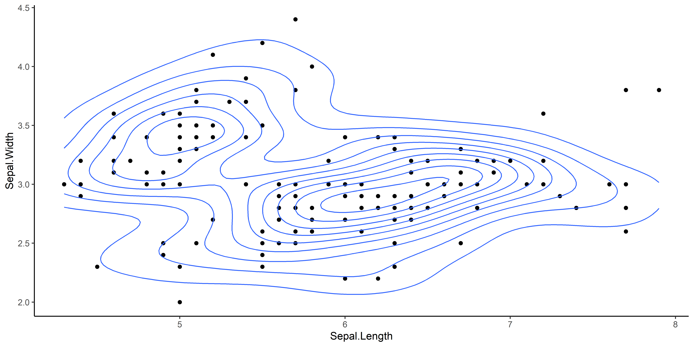{width=3000}
:::
:::


:::


## ggplot basics (3)
::: {.nonincremental .stretch}

- Aside from aesthetics and data, other arguments can be used to customize the plot


::: {.cell hash='index_cache/revealjs/unnamed-chunk-20_6250ccbc17f2c18c92ee250f7f74aa4f'}

```{.r .cell-code}
ggplot(iris, aes(x = Sepal.Length, y = Sepal.Width)) +
  geom_point(color="yellow", size=4, shape="triangle") +
  geom_density_2d(color="red") +
  see::theme_abyss()  # Package in easystats
```

::: {.cell-output-display}
{width=3000}
:::
:::


:::

## ggplot basics (4)

::: {.stretch}

:::: {.callout-warning}

Misnomer: do **NOT** confuse arguments that are **"aesthetics"** in `aes()` (i.e., map variable names to aesthetic features) with arguments that control the **appearance** of the plot (not in `aes()`)

::::

:::: {.columns}

::::: {.column width="50%"}

:::::: {.fragment}


::: {.cell hash='index_cache/revealjs/unnamed-chunk-21_ac6546127701dbe7f5c036bc020c05c5'}

```{.r .cell-code}
ggplot(iris) +
  geom_point(aes(x = Sepal.Length,
                 y = Sepal.Width,
                 color="blue"))
```

::: {.cell-output-display}
{width=3000}
:::
:::


::::::

:::::

::::: {.column}

:::::: {.fragment}


::: {.cell hash='index_cache/revealjs/unnamed-chunk-22_c31b9ae269f5b2e2726b2369fb10a72d'}

```{.r .cell-code}
ggplot(iris) +
  geom_point(aes(x = Sepal.Length,
                 y = Sepal.Width),
             color="blue")
```

::: {.cell-output-display}
{width=3000}
:::
:::


::::::

:::::

::::

:::

## ggplot basics (5)

::: {.stretch}

- The **appearance** of **aesthetic mappings** can be controlled with `scale_*()`

:::: {.fragment}


::: {.cell hash='index_cache/revealjs/unnamed-chunk-23_6e707e4db4f1e4934951d77e405b4684'}

```{.r .cell-code}
iris |>
  ggplot(aes(x = Sepal.Length, y = Sepal.Width, color=Species)) +
  geom_point(size=3) +
  scale_color_manual(values=list(setosa="orange",
                                 versicolor="purple",
                                 virginica="green")) +
  see::theme_abyss()
```

::: {.cell-output-display}
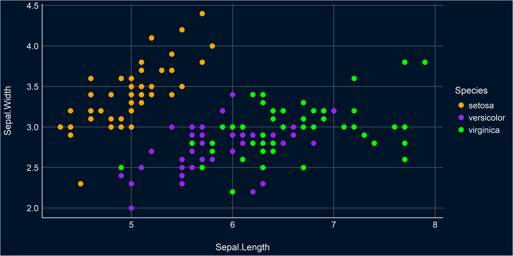{width=3000}
:::
:::


::::

:::

## Quizz Time {background-color="#FFAB91"}

- `1 + "1"` returns an error. Why?
- What's the difference between `c()` and `list()`?
- In ggplot, aesthetics refer to visual customization (e.g., change the color of all points)
- A pipe takes the output of the previous function as the first argument of the next
- What will `True * 3` return?
- What will `TRUE / 10` return?
- I do `ggplot(iris, aes(x="Sepal.Length", y="Petal.Length"))` but it throws an error. Why?
- I do `ggplot(iris, aes(x=Sepal.Length, y=Petal.length))` but it throws an error. Why?

## Distributions {.center background-color="#212121"}

A fundamental concept in Bayesian statistics

## On Normal Distributions {.center background-color="#003B49"}

*Why do statisticians hate normal distributions? Because they are 'mean'!*

## The "Bell" Curve


:::::: {.columns}

::::: {.column width="50%" style="font-size: 90%;"}

- The **Normal Distribution** is one of the most important distribution in statistics <sub><sup>(spoiler alert: for reasons that we will see)</sup></sup>
- *What variables are normally distributed?*
- It is defined by **two parameters**:
  - **Location** ($\mu$ <sub>*"mu"*</sub>)
  - **Deviation**/spread ($\sigma$ <sub>*"sigma"*</sub>)
- Properties:
  - Symmetric
  - **Location = mean** = median = mode
  - **Deviation = standard deviation (SD)**
  - \~68% of the data is within 1 SD of the mean, \~95% within 2 SD, \~99.7% within 3 SD

:::::

::::: {.column}


:::: {.fragment}

::: {.callout-note}
A Normal distribution with $\mu = 0$ and $\sigma = 1$ is also called a **z-Distribution** (aka a **Standard** Normal Distribution)

:::

::::

:::::

::::::


## What is a distribution?

::: {style="font-size: 85%;"}

- A **distribution** describes the **probability** of different outcomes
  - E.g., the distribution of IQ represents the probability of encountering all the different IQ scores
- Distributions are defined by a set of **parameters** (e.g., location, deviation)
  - It is an abstract and convenient way of describing the probability of various events using a limited number of parameters
- The area under the curve is equal to 1 (= describes all possible outcomes)
  - The unit of the y-axis of a "density plot" is thus irrelevant (as it depends on the x-axis)
- Statistical software implement a variety of distributions, which can be used to e.g., **randomly sample** from them
  - In R, the `r*()` functions are used to draw random samples from distributions
  - E.g., `rnorm()` = `random + normal`

:::: {.fragment}


::: {.cell hash='index_cache/revealjs/unnamed-chunk-24_7c9e28a8d5ea20d23f4aa7fdc8904aa1'}

```{.r .cell-code}
# Randomly sample 500 values from a normal distribution
myvar <- rnorm(500, mean = 0, sd = 1)
```
:::


::::

:::: {.fragment}

::::: {.callout-tip}

`report()` from the `report` package can be used to quickly describe various objects

:::::


::: {.cell hash='index_cache/revealjs/unnamed-chunk-25_cbadf9776205b9a30edcd61926f8721d'}

```{.r .cell-code}
report::report(myvar)
```

::: {.cell-output .cell-output-stdout}
```
x: n = 500, Mean = -0.04, SD = 1.03, Median = -0.06, MAD = 1.14, range: [-2.85,
3.01], Skewness = 0.07, Kurtosis = -0.37, 0% missing
```
:::
:::


::::

:::

## Density Estimation


- In practice, we rarely know the true distribution of our data
- Density estimation is the process of estimating the **Probability Distribution** of a variable
- This estimation is based on various assumptions that can be tweaked via arguments (e.g., method, kernel type, bandwidth etc.)
- The resulting density **is just an estimation**, and sometimes can be off
- **How to compute**
  - The `estimate_density()` function returns a data frame with the estimated density
  - Contains two columns, `x` (possible values of the variable) and `y` (its associated probability)

::: {.fragment}


::: {.cell hash='index_cache/revealjs/unnamed-chunk-26_fa1583914480f6be99bd22c17db53aa1'}

```{.r .cell-code}
d <- bayestestR::estimate_density(myvar)
head(d)
```

::: {.cell-output .cell-output-stdout}
```
          x          y
1 -2.854409 0.01050239
2 -2.848679 0.01065317
3 -2.842949 0.01080460
4 -2.837219 0.01095667
5 -2.831489 0.01110972
6 -2.825759 0.01126359
```
:::
:::


:::

## How to visualize a distribution? (1)
::: {.nonincremental}

:::: {.columns}
::::: {.column width="50%"}

- Plot the pre-computed density


::: {.cell hash='index_cache/revealjs/unnamed-chunk-27_8b6f3d504112869f9a91a8b72da5b35b'}

```{.r .cell-code}
ggplot(d, aes(x=x, y=y)) +
  geom_line()
```

::: {.cell-output-display}
{width=3000}
:::
:::


:::::
::::: {.column width="50%"}

- Make the estimation using `ggplot`


::: {.cell hash='index_cache/revealjs/unnamed-chunk-28_d2904399b0e50be057e298d86b969225'}

```{.r .cell-code}
data.frame(x = myvar) |>
  ggplot(aes(x=x)) +  # No 'y' aesthetic is passed (it's to be estimated)
  geom_density()
```

::: {.cell-output-display}
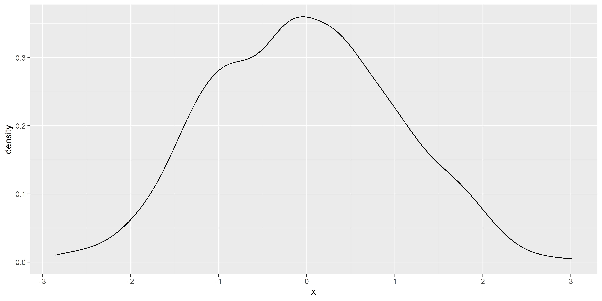{width=3000}
:::
:::


:::::
::::
:::


## How to visualize a distribution? (2)
::: {.nonincremental .stretch}

- Empirical distributions (i.e., the distribution of the data at hand) is often represented using **histograms**
  - Histograms also depends on some parameters, such as the number of bins or the bin width
  - Like density estimates, it can be inaccurate and give a distorted view of the data

:::: {.columns}
::::: {.column width="50%"}


::: {.cell hash='index_cache/revealjs/unnamed-chunk-29_4c38ffef30b5def012ae7148331920e6'}

```{.r .cell-code}
data.frame(x = myvar) |>
  ggplot(aes(x=x)) +
  geom_histogram(binwidth = 0.35, color="black")
```

::: {.cell-output-display}
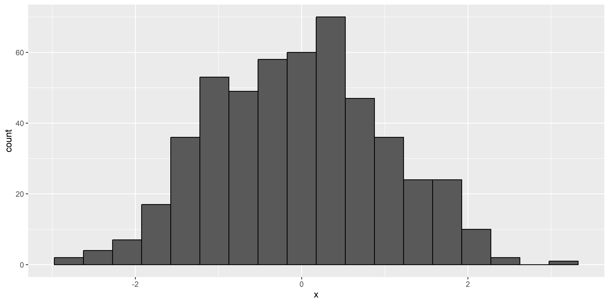{width=3000}
:::
:::


:::::
::::: {.column width="50%"}


::: {.cell hash='index_cache/revealjs/unnamed-chunk-30_8166025e80985b269f393d1d3f0a3552'}

```{.r .cell-code}
data.frame(x = myvar) |>
  ggplot(aes(x=x)) +
  geom_histogram(binwidth = 0.1, color="black")
```

::: {.cell-output-display}
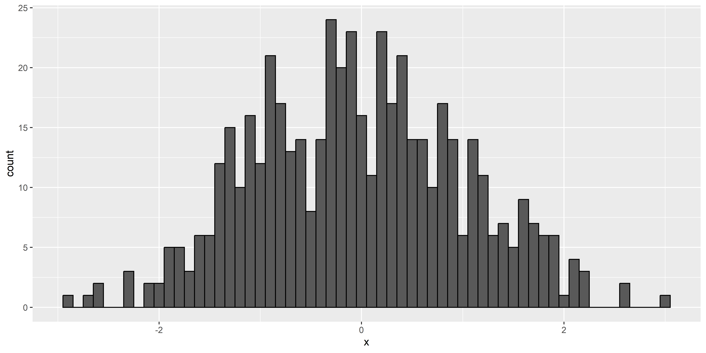{width=3000}
:::
:::


:::::
::::
:::

## Probability Density Function (PDF)


- As we have seen, we can **estimate** the **probability density** of a **random** variable (e.g., a sample of data) and visualize it using a **density plot** or a **histogram**
- Most common distributions have an *analytical solution* (i.e., a formula) to compute the probability density over a range of values.
- It is called the **Probability Density Function (PDF)** and can be obtained using the `d*()` functions
  - E.g., `dnorm()` = `density + normal`
  - It requires a vector of values (`x`), and the parameters of the distribution (e.g., `mean`, `sd`)

::: {.fragment}


::: {.cell hash='index_cache/revealjs/unnamed-chunk-31_6cdee3708c8d2c9284ca5359bc503c7f'}

```{.r .cell-code}
# Get 7 evenly-spaced values between -4 and 4
x <- seq(-4, 4, length.out = 7)
x
```

::: {.cell-output .cell-output-stdout}
```
[1] -4.000000 -2.666667 -1.333333  0.000000  1.333333  2.666667  4.000000
```
:::
:::


:::

::: {.fragment}


::: {.cell hash='index_cache/revealjs/unnamed-chunk-32_2bef2000cace9a4dc425ea67908661cc'}

```{.r .cell-code}
# Compute the PDF at these values according to a normal distribution
y <- dnorm(x, mean = 0, sd = 1)
y
```

::: {.cell-output .cell-output-stdout}
```
[1] 0.0001338302 0.0113959860 0.1640100747 0.3989422804 0.1640100747
[6] 0.0113959860 0.0001338302
```
:::
:::


:::

## Exercice! {background-color="#80DEEA"}
::: {.nonincremental .stretch}

- Visualize the distribution from the following data:


::: {.cell hash='index_cache/revealjs/unnamed-chunk-33_23b45f11eccafd2037ebe0e88069eab2'}

```{.r .cell-code}
x <- seq(-4, 4, length.out = 7)
y <- dnorm(x, mean = 0, sd = 1)
```
:::


:::

## How to visualize a distribution? (3)
::: {.nonincremental .stretch}

- We can visualize the PDF using a **line plot** (as it is a continuous distribution)


::: {.cell hash='index_cache/revealjs/unnamed-chunk-34_2a0242c2539b211f922491295bb4f010'}

```{.r .cell-code}
data.frame(x=x, y=y) |>
  ggplot(aes(x=x, y=y)) +
  geom_line()
```
:::


:::: {.fragment}


::: {.cell hash='index_cache/revealjs/unnamed-chunk-35_30a3cbc3ba4f6cd5e5b6e7d7d38e0009'}
::: {.cell-output-display}
{width=3000}
:::
:::


::::
:::

## How to visualize a distribution? (4)
::: {.nonincremental .stretch}
- Add more points for a more fined-grained estimation plot


::: {.cell hash='index_cache/revealjs/unnamed-chunk-36_1b1916b8b7860277928451530c166a72'}

```{.r .cell-code}
x <- seq(-4, 4, length.out = 1000)
y <- dnorm(x, mean = 0, sd = 1)

data.frame(x=x, y=y) |>
  ggplot(aes(x=x, y=y)) +
  geom_line(color="orange", linewidth=2) +
  see::theme_abyss() +
  labs(y="Density", x="Values of x")
```
:::


:::: {.fragment}


::: {.cell hash='index_cache/revealjs/unnamed-chunk-37_27a761135755c1c7f777ed45d7574176'}
::: {.cell-output-display}
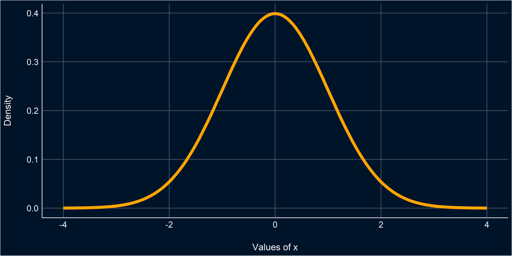{width=70%}
:::
:::


::::

:::


## Understand the parameters
::: {.nonincremental .stretch style="font-size: 70%"}

- Gain an intuitive sense of the parameters' impact
  - Location changes the center of the distribution
  - Scale changes the width of the distribution


::: {.cell hash='index_cache/revealjs/unnamed-chunk-38_989340338ce5d6a0db8945b29f4a309a'}

```{.r .cell-code  code-fold="true" code-summary="Show code"}
library(gganimate)

df_norm <- data.frame()
for(u in c(0, 2.5, 5)) {
  for(sd in c(1, 2, 3)) {
    dat <- data.frame(x = seq(-10, 10, length.out=200))
    dat$p <- dnorm(dat$x, mean = u, sd = sd)
    dat$distribution <- "Normal"
    dat$parameters <- paste0("mean = ", u, ", SD = ", sd)
    df_norm <- rbind(dat, df_norm)
  }
}

p <- df_norm |>
  ggplot(aes(x=x, y=p, group=parameters)) +
  geom_vline(xintercept=0, linetype="dashed") +
  geom_line(aes(color=distribution), linewidth=2, color="#2196F3") +
  theme_minimal() +
  theme(legend.position = "none",
        axis.title.y = element_blank(),
        plot.title = element_text(size=15, face="bold", hjust=0.5),
        plot.tag = element_text(size=20, face="bold", hjust=0.5),
        strip.text = element_text(size=15, face="bold"))

# Make animation
# anim <- p +
#   labs(title = '{closest_state}', tag="Normal Distribution") +
#   transition_states(parameters, transition_length = 0.5, state_length = 2) +
#   ease_aes('linear') +
#   enter_fade() +
#   exit_fade()
# animate(anim, height=500, width=1000, fps=15)

p + facet_wrap(~parameters)
```

::: {.cell-output-display}
{width=3000}
:::
:::


:::

## Quizz {background-color="#FFAB91"}

- What are the parameters that govern a normal distribution?
- What is the difference between `rnorm()` and `dnorm()`?
- Density estimation and histograms always gives an accurate representation of the data
- You cannot change the SD without changing the mean of a normal distribution
- A variable is drawn from $Normal(\mu=3, \sigma=1)$:
  - What is the most likely value?
  - What is the probability that the value is lower than 3?
  - The bulk of the values (~99.9%) will fall between which two values?

## On Binomial Distributions {.center background-color="#003B49"}

*Why did the binomial distribution break up with its partner? Because it found their relationship too binary*

## Binomial Distribution
::: {.nonincremental .stretch}

- The **Binomial distribution** models the probability of a series of **binary** outcome trials (e.g., successes/failures, heads/tails, etc.)[^3]
- It is defined by two parameters: `size` (number of trials) and `prob` (probability of "success")[^4]

[^3]: The probability of a **single** binary event is related to the *Bernoulli* distribution. A **series** of Bernoulli trials is related to a *Binomial* distribution.
[^4]: Ones vs. zeros

:::

## Random draws

::: {.stretch}

- Let's draw 10 times 1 trial with a probability of 0.5

:::: {.fragment}


::: {.cell hash='index_cache/revealjs/unnamed-chunk-39_dbeb72a447965ba46b18bb7594620505'}

```{.r .cell-code}
y <- rbinom(10, size=1, prob=0.5)
y
```

::: {.cell-output .cell-output-stdout}
```
 [1] 0 1 0 0 1 1 1 1 1 1
```
:::
:::


::::


- The "probability" argument changes the ratio of 0s and 1s


:::: {.fragment}


::: {.cell animation.hook='gifski' hash='index_cache/revealjs/unnamed-chunk-40_166236a97c0e5569b52a660662fc11dd'}

```{.r .cell-code  code-fold="true" code-summary="Show plot code"}
library(gganimate)

df_binom <- data.frame()
for(p in c(1/3, 1/2, 2/3)) {
  dat <- data.frame()
  for(i in 1:1000) {
    rez <- rbinom(1, size=1, prob=p)
    dat2 <- data.frame(Zero = 0, One = 0, i=i)
    dat2$Zero[rez==0] <- 1
    dat2$One[rez==1] <- 1
    dat2$distribution <- "Binomial"
    dat2$parameters <- paste0("p = ", insight::format_value(p))
    dat <- rbind(dat, dat2)
  }
  dat$Zeros <- cumsum(dat$Zero)
  dat$Ones <- cumsum(dat$One)
  df_binom <- rbind(df_binom, dat)
}
df_binom <- pivot_longer(df_binom, c("Zeros", "Ones"), names_to="Outcome", values_to="Count") |>
  mutate(Outcome = factor(Outcome, levels=c("Zeros", "Ones")))

anim <- df_binom |>
  ggplot(aes(x=Outcome, y=Count, group=parameters)) +
  geom_bar(aes(fill=parameters), stat="identity", position="dodge")  +
  theme_minimal() +
  labs(title = 'N events: {frame_time}', tag="Binomial Distribution") +
  transition_time(i)

animate(anim, height=500, width=1000, fps=15)
```

::: {.cell-output-display}
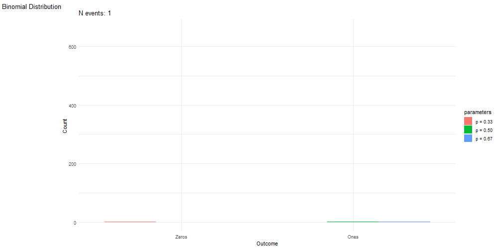
:::
:::


:::: 

:::

## Binomial = Sampling from a list of 0s and 1s

- Another way of sampling from a binomial distribution is simply to randomly sample from a list of 0s and 1s

:::: {.fragment}


::: {.cell hash='index_cache/revealjs/unnamed-chunk-41_b2a297676f19cf0c3d3e5520db3d8264'}

```{.r .cell-code}
rbinom(10, size=1, prob=0.5)
```

::: {.cell-output .cell-output-stdout}
```
 [1] 0 0 0 1 1 0 0 0 0 1
```
:::

```{.r .cell-code}
# Is equivalent to
sample(c(0, 1), size=10, replace = TRUE)
```

::: {.cell-output .cell-output-stdout}
```
 [1] 0 0 1 1 0 1 1 1 1 0
```
:::
:::


::::


## Random Walk

::: {.stretch}

- Mr. Brown^[Random walks are a type of "Brownian motion", named after the botanist Robert Brown who observed the random motion of pollen grains in water.] is walking through a crowd. Every second, he decides to move to the left or to the right to avoid bumping into random people
- This type of trajectory can be modelled as a **random walk**. The probability of moving to the left or to the right at each step is 0.5
- In R, a random walk can be simulated by randomly **sampling** from from **1s** and **-1s** and then cumulatively summing them^[It is a special case of the **Binomial distribution** where `prob = 0.5`.]

:::: {.fragment}


::::

:::: {.fragment}


::: {.cell hash='index_cache/revealjs/unnamed-chunk-43_c815a3cd712bb1af634228e86c591de3'}

```{.r .cell-code}
# Simulate random walk
n_steps <- 7
decisions <- sample(c(-1, 1), n_steps, replace = TRUE)
decisions
```

::: {.cell-output .cell-output-stdout}
```
[1] -1  1 -1 -1  1 -1 -1
```
:::

```{.r .cell-code}
x <- c(0, cumsum(decisions))  # Add starting point at 0
x
```

::: {.cell-output .cell-output-stdout}
```
[1]  0 -1  0 -1 -2 -1 -2 -3
```
:::
:::


::::

:::


## Visualize a random walk (1)


- Creating function is very useful to avoid repeating code, and it is also good to think about your code in terms of encapsulated bits.
- It is also useful for reproducibility and generalization (you can often re-use useful functions in other projects)
- A function is created with `function()` in which you define input arguments. The last line of the function says what the function will return.

::: {.fragment}


::: {.cell hash='index_cache/revealjs/unnamed-chunk-44_7a01d499c33a58b04c2e4099a38026ec'}

```{.r .cell-code}
# Create function
random_walk <- function(n_steps) {
  decisions <- sample(c(-1, 1), n_steps, replace = TRUE)
  x <- c(0, cumsum(decisions))  # Add starting point at 0
  return(x)
}

random_walk(10)
```

::: {.cell-output .cell-output-stdout}
```
 [1]  0 -1  0  1  0 -1 -2 -3 -4 -3 -2
```
:::
:::


:::

## Visualize a random walk (2)

::: {.nonincremental .stretch}


::: {.cell hash='index_cache/revealjs/unnamed-chunk-45_7f04ba1b71d3976769d4d1f80f740bb1'}

```{.r .cell-code}
x <- random_walk(10)
data <- data.frame(trajectory = x, time = seq(0, length(x)-1))
data
```

::: {.cell-output .cell-output-stdout}
```
   trajectory time
1           0    0
2           1    1
3           2    2
4           1    3
5           0    4
6          -1    5
7          -2    6
8          -3    7
9          -4    8
10         -5    9
11         -4   10
```
:::

```{.r .cell-code}
ggplot(data, aes(x=time, y=trajectory)) +
  geom_line() +
  coord_flip()  # Flip x and y axes
```

::: {.cell-output-display}
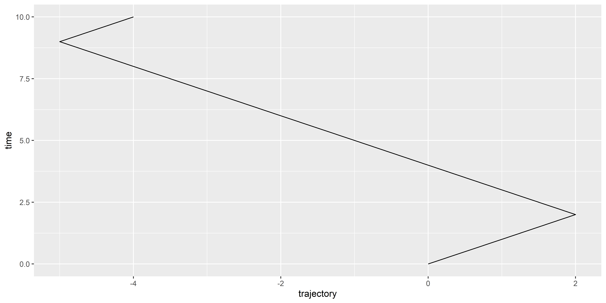{width=3000}
:::
:::


:::

## Exercice! {background-color="#80DEEA"}

::: {.nonincremental .stretch}

- Can you simulate 20 different random walks and visualize them as different colors?


:::: {.callout-tip}

- You can **loop** over a sequence of iterations with `for(i in 1:20) {...}`
- The `data.frame()` function can be used to initialize an empty data frame
- The `rbind()` ("row-bind") function can be used to concatenate data frames vertically

::::

:::

## Solution (1) {background-color="#80DEEA"}

::: {.nonincremental .stretch}

- Can you **simulate 20 different random walks** and visualize them as different colors?


::: {.cell hash='index_cache/revealjs/unnamed-chunk-46_3529e0992bf653cac69f16cb2425ab1a'}

```{.r .cell-code}
data <- data.frame()  # Initialize empty data frame
for(i in 1:20) {
  walk_data <- data.frame(
    trajectory = random_walk(10),
    time = seq(0, 10),
    iteration = i
  )
  data <- rbind(data, walk_data)
}

data
```

::: {.cell-output .cell-output-stdout}
```
    trajectory time iteration
1            0    0         1
2           -1    1         1
3           -2    2         1
4           -1    3         1
5            0    4         1
6            1    5         1
7            0    6         1
8            1    7         1
9            0    8         1
10          -1    9         1
11           0   10         1
12           0    0         2
13          -1    1         2
14           0    2         2
15           1    3         2
16           2    4         2
17           3    5         2
18           2    6         2
19           3    7         2
20           4    8         2
21           5    9         2
22           6   10         2
23           0    0         3
24           1    1         3
25           0    2         3
26          -1    3         3
27           0    4         3
28          -1    5         3
29           0    6         3
30           1    7         3
31           0    8         3
32          -1    9         3
33           0   10         3
34           0    0         4
35           1    1         4
36           2    2         4
37           1    3         4
38           0    4         4
39           1    5         4
40           2    6         4
41           3    7         4
42           4    8         4
43           5    9         4
44           6   10         4
45           0    0         5
46          -1    1         5
47           0    2         5
48           1    3         5
49           2    4         5
50           3    5         5
51           2    6         5
52           1    7         5
53           0    8         5
54           1    9         5
55           2   10         5
56           0    0         6
57          -1    1         6
58          -2    2         6
59          -1    3         6
60           0    4         6
61           1    5         6
62           0    6         6
63          -1    7         6
64          -2    8         6
65          -1    9         6
66          -2   10         6
67           0    0         7
68           1    1         7
69           0    2         7
70           1    3         7
71           0    4         7
72          -1    5         7
73           0    6         7
74           1    7         7
75           0    8         7
76          -1    9         7
77          -2   10         7
78           0    0         8
79           1    1         8
80           2    2         8
81           1    3         8
82           2    4         8
83           3    5         8
84           4    6         8
85           3    7         8
86           2    8         8
87           1    9         8
88           0   10         8
89           0    0         9
90           1    1         9
91           0    2         9
92          -1    3         9
93          -2    4         9
94          -3    5         9
95          -4    6         9
96          -3    7         9
97          -2    8         9
98          -1    9         9
99           0   10         9
100          0    0        10
101         -1    1        10
102          0    2        10
103          1    3        10
104          2    4        10
105          3    5        10
106          2    6        10
107          1    7        10
108          2    8        10
109          1    9        10
110          0   10        10
111          0    0        11
112          1    1        11
113          2    2        11
114          1    3        11
115          0    4        11
116         -1    5        11
117          0    6        11
118         -1    7        11
119          0    8        11
120         -1    9        11
121          0   10        11
122          0    0        12
123          1    1        12
124          2    2        12
125          1    3        12
126          2    4        12
127          1    5        12
128          0    6        12
129          1    7        12
130          0    8        12
131          1    9        12
132          2   10        12
133          0    0        13
134          1    1        13
135          0    2        13
136         -1    3        13
137          0    4        13
138         -1    5        13
139         -2    6        13
140         -3    7        13
141         -4    8        13
142         -3    9        13
143         -2   10        13
144          0    0        14
145          1    1        14
146          2    2        14
147          3    3        14
148          2    4        14
149          1    5        14
150          0    6        14
151          1    7        14
152          0    8        14
153         -1    9        14
154          0   10        14
155          0    0        15
156         -1    1        15
157         -2    2        15
158         -1    3        15
159         -2    4        15
160         -3    5        15
161         -2    6        15
162         -3    7        15
163         -4    8        15
164         -3    9        15
165         -2   10        15
166          0    0        16
167          1    1        16
168          2    2        16
169          1    3        16
170          2    4        16
171          1    5        16
172          0    6        16
173         -1    7        16
174         -2    8        16
175         -3    9        16
176         -2   10        16
177          0    0        17
178         -1    1        17
179          0    2        17
180         -1    3        17
181         -2    4        17
182         -1    5        17
183         -2    6        17
184         -1    7        17
185          0    8        17
186          1    9        17
187          0   10        17
188          0    0        18
189          1    1        18
190          0    2        18
191         -1    3        18
192          0    4        18
193          1    5        18
194          0    6        18
195          1    7        18
196          2    8        18
197          3    9        18
198          2   10        18
199          0    0        19
200         -1    1        19
201          0    2        19
202         -1    3        19
203         -2    4        19
204         -3    5        19
205         -4    6        19
206         -3    7        19
207         -4    8        19
208         -5    9        19
209         -6   10        19
210          0    0        20
211          1    1        20
212          2    2        20
213          1    3        20
214          2    4        20
215          3    5        20
216          4    6        20
217          5    7        20
218          6    8        20
219          5    9        20
220          6   10        20
```
:::
:::


:::

## Solution (2) {background-color="#80DEEA"}

::: {.nonincremental .stretch}

- Can you simulate 20 different random walks and **visualize them as different colors**?


::: {.cell hash='index_cache/revealjs/unnamed-chunk-47_6d5ed8954cc768e92ccae0235e5da835'}

```{.r .cell-code}
ggplot(data, aes(x=time, y=trajectory, color=iteration)) +
  geom_line() +
  coord_flip()
```

::: {.cell-output-display}
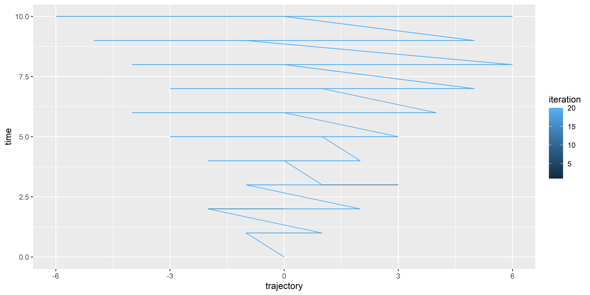{width=3000}
:::
:::


:::

## Solution (3) {background-color="#80DEEA"}

::: {.nonincremental .stretch}

- The `color` aesthetic needs to be converted to a **factor** to be interpreted as a discrete variable


::: {.cell hash='index_cache/revealjs/unnamed-chunk-48_a53810e21b4c18ae83cd91acb59bd2e6'}

```{.r .cell-code}
data |>
  mutate(iteration = as.factor(iteration)) |>
  ggplot(aes(x=time, y=trajectory, color=iteration)) +
  geom_line() +
  coord_flip()
```

::: {.cell-output-display}
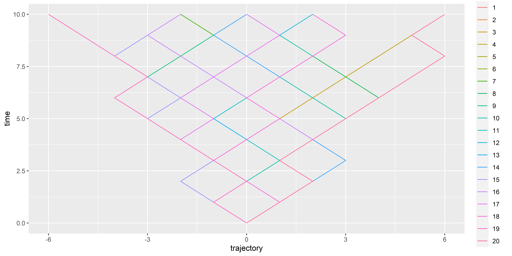{width=3000}
:::
:::


:::


## Make it nicer

::: {.nonincremental .stretch}


::: {.cell hash='index_cache/revealjs/unnamed-chunk-49_285f88e061c4e9fda073a33fdffbfcea'}

```{.r .cell-code  code-fold="true" code-summary="Show plot code"}
data <- data.frame()  # Initialize empty data frame
for(i in 1:20) {
  walk_data <- data.frame(
    trajectory = random_walk(500),
    time = seq(0, 500),
    iteration = i
  )
  data <- rbind(data, walk_data)
}

data |>
  mutate(iteration = as.factor(iteration)) |>
  ggplot(aes(x=time, y=trajectory, color=iteration)) +
  geom_line(linewidth = 0.5) +
  labs(y = "Position", x = "Time") +
  scale_color_viridis_d(option = "inferno", guide="none") +
  see::theme_blackboard() +
  coord_flip()
```

::: {.cell-output-display}
{width=3000}
:::
:::


:::


## Quizz {background-color="#FFAB91"}

- A Binomial distributions deals with discrete, binary outcomes
- Tossing a coin (heads vs. tails) enacts a Binomial distribution
- A Random Walk is the successive sum of random binary outcomes
- **What is the distribution of the result of a Random Walk?**

## Solution {background-color="#FFAB91"}

::: {.nonincremental .stretch}

- Select values at last step and compute histogram


::: {.cell hash='index_cache/revealjs/unnamed-chunk-50_c1d02bfb4af8da969236fcf863f676c5'}

```{.r .cell-code}
data |>
  filter(time == max(time)) |>
  ggplot(aes(x=trajectory)) +
  geom_histogram()
```

::: {.cell-output-display}
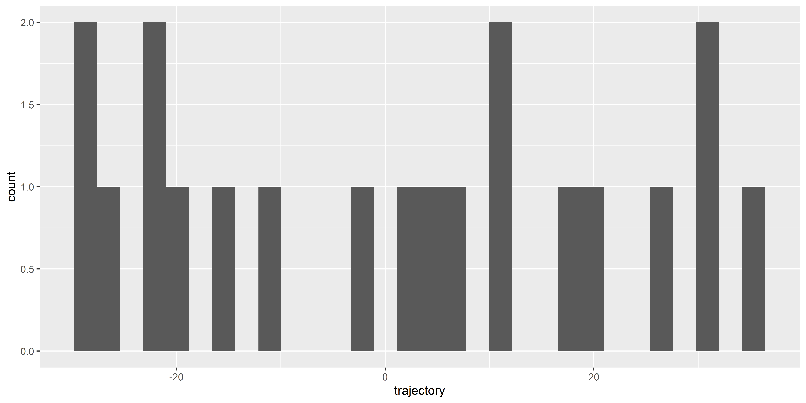{width=3000}
:::
:::


:::

## What happens with more trials?

::: {.stretch}

- Try increasing the number of walks

:::: {.columns}

::::: {.column width="65%" .stretch}

:::::: {.fragment}


::: {.cell animation.hook='gifski' hash='index_cache/revealjs/RandomWalkAnimation_eff080a678253a5d1b992b221e09950b'}

```{.r .cell-code  code-fold="true" code-summary="Show figure code"}
library(gganimate)

set.seed(1)

data <- data.frame()
all_iter <- data.frame()
distr <- data.frame()
for(i in 1:100) {
  walk_data <- data.frame(
    trajectory = random_walk(99),
    time = seq(0, 99),
    group = i,
    iteration = NA
  )
  data <- rbind(data, walk_data)
  data$iteration <- i

  max_t <- max(walk_data$time)
  distr_data <- filter(data, time == max_t)$trajectory |>
    bayestestR::estimate_density(precision=256) |>
    mutate(
      y = datawizard::rescale(y, to=c(max_t, max_t + max_t/3)),
      iteration = i)
  distr <- rbind(distr, distr_data)

  all_iter <- rbind(all_iter, data)
}

df <- all_iter |>
  mutate(iteration = as.factor(iteration),
         group = as.factor(group))


p <- df |>
  # filter(iteration == 100) |>
  ggplot() +
  geom_line(aes(x=time, y=trajectory, color=group), alpha=0.7, linewidth = 1.3) +
  geom_ribbon(data=distr, aes(xmin=max(all_iter$time), xmax=y, y=x), fill="#FF9800") +
  geom_point(data=filter(df, time == max(time)), aes(x=time, y=trajectory, color=group), size=5, alpha=0.2) +
  labs(y = "Position", x = "Time", title="N random walks: {frame}") +
  scale_color_viridis_d(option = "turbo", guide="none") +
  see::theme_blackboard() +
  theme(plot.title = element_text(hjust = 0.5, size=15, face="bold")) +
  coord_flip()
# p

anim <- p + transition_manual(iteration)
animate(anim, height=1000, width=1000, fps=7, end_pause=7*4, duration=20)
```

::: {.cell-output-display}
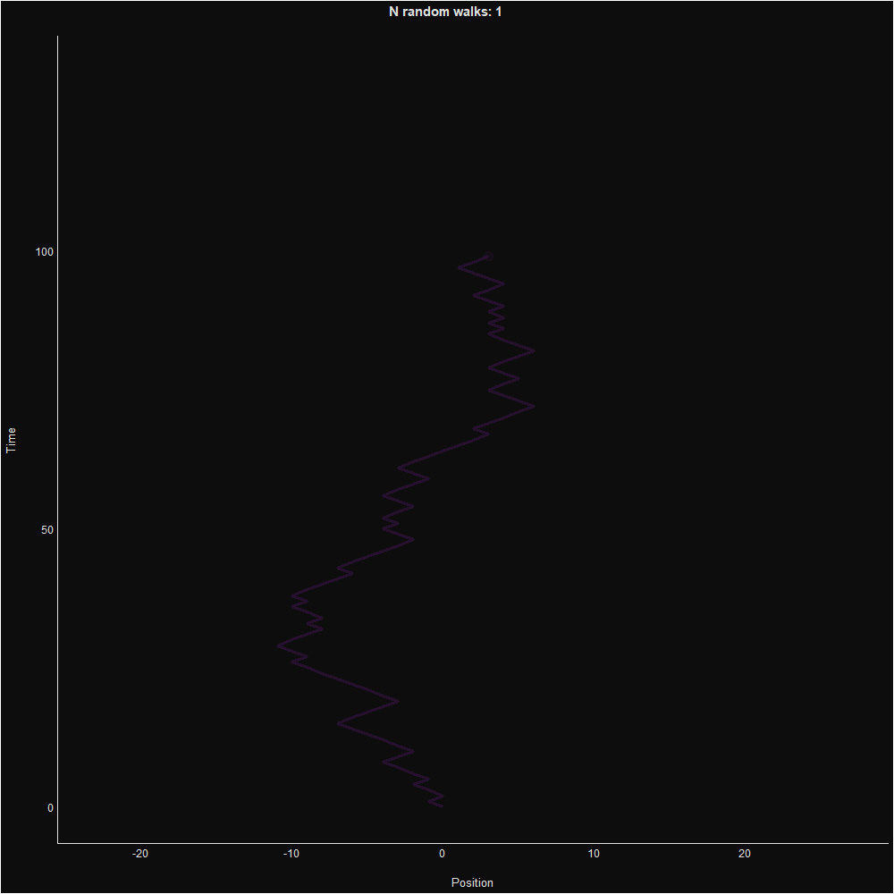{width=80%}
:::
:::


::::::

:::::

::::: {.column width="35%"}

:::::: {.fragment}


🤯🤯🤯🤯🤯🤯🤯🤯

**A NORMAL DISTRIBUTION**

🤯🤯🤯🤯🤯🤯🤯🤯


::::::

- How is it possible than a complex distribution emerges from such a simple process of random binary choices?

:::::

::::

:::

## Central Limit Theorem (1)

::: {.columns}

:::: {.column width="60%"}

- Formula of the Normal Distribution:<br><br> $f(x) = \frac{1}{\sigma\sqrt{2\pi}} e^{-\frac{1}{2}\left(\frac{x-\mu}{\sigma}\right)^2}$
- Despite its (relative) complexity, the Normal distribution naturally emerges from very simple processes!
- This is known as the **Central Limit Theorem**, which states that the distribution of the sums/means of many random variables tends to a **Normal distribution**
- This is why the Normal distribution is so ubiquitous in nature and statistics!
  - Because many measurements are the amalgamation result of many random mechanisms

::::
:::: {.column width="40%"}

{width=80% fig-align="left"}


::::
:::

## On Uniform Distributions {.center background-color="#003B49"}

*Why did the uniform distribution get hired as a referee? Because it always calls it fair and square, giving every player an equal chance!*

## Uniform Distribution


- The Uniform distribution is the simplest distribution
- It is defined by two parameters: a **lower** and **upper** bound
- All values between the bounds are **equally likely** (the PDF is **flat**)
- **Exercice:** generate 50,000 random values between -10 and 10 and plot the histogram
  - Tip: use `runif()`

::: {.fragment .r-strecth}


::: {.cell hash='index_cache/revealjs/unnamed-chunk-51_ef2d3bf7a230f9dbee3e1c5c22fbc6f9'}

```{.r .cell-code}
# Use runif(): random + uniform
data.frame(x = runif(50000, min=-10, max=10)) |>
  ggplot(aes(x=x)) +
  geom_histogram(bins = 50, color="black") +
  coord_cartesian(xlim=c(-15, 15))
```

::: {.cell-output-display}
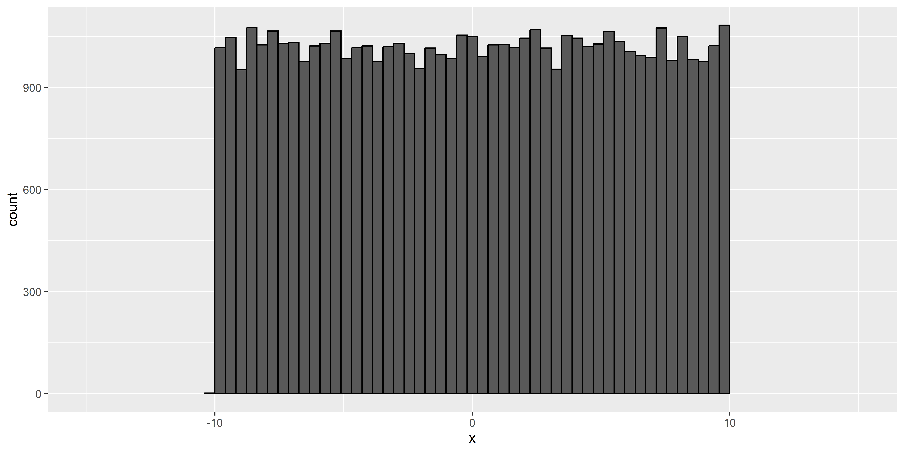{width=3000}
:::
:::


:::


## Uniform Distribution - Applications

- [x] Often used in experimental designs
  - E.g., to jitter the Inter-Stimulus Intervals, to randomly select between various conditions, etc.
- [x] It is the least **informative** distribution
  - Can be used when we want to make **no assumptions**[^7] about the distribution of the data

[^7]: This is a bit of a lie. The Uniform distribution is actually an assumption: it assumes that all values are equally likely, which is in practice often not true.

## On Beta Distributions {.center background-color="#003B49"}

*Why do beta distributions love to go to the gym? So that they are not out of shape!*


## Beta Distribution


- The Beta distribution can be used to model probabilities
- Defined by two shape parameters, **α** and **β** (`shape1` \& `shape2`)^[Note that other parameterizations exist, especially in Beta-regression models]
- Only expressed in the range $]0, 1[$ (i.e., null outside of this range)

::: {.fragment .r-stretch}


::: {.cell hash='index_cache/revealjs/unnamed-chunk-52_40b83912fb22be45ad73140e405f52e0'}

```{.r .cell-code}
data.frame(x = rbeta(10000, shape1 = 1.5, shape2 = 10)) |>
  ggplot(aes(x=x)) +
  geom_histogram(bins=50, color="black")
```

::: {.cell-output-display}
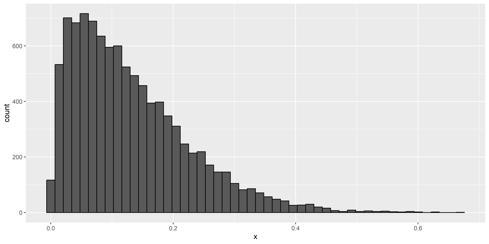{width=60%}
:::
:::


:::

## Beta Distribution - Parameters

::: {.nonincremental .stretch}
- $\alpha$ (`shape1`) and $\beta$ (`shape2`) parameters control the shape of the distribution
- $\alpha$ pushes the distribution to the right, $\beta$ to the left
- When $\alpha = \beta$, the distribution is symmetric


::: {.cell hash='index_cache/revealjs/unnamed-chunk-53_753141feb4c1c5863c3fe504c81e276f'}

```{.r .cell-code  code-fold="true" code-summary="Show figure code"}
df_beta <- data.frame()
for(shape1 in c(1, 2, 3, 6)) {
  for(shape2 in c(1, 2, 3, 6)) {
    dat <- data.frame(x = seq(-0.25, 1.25, 0.0001))
    dat$p <- dbeta(dat$x, shape1 = shape1, shape2 = shape2)
    dat$distribution <- "Beta"
    dat$parameters <- paste0("alpha = ", shape1, ", beta = ", shape2)
    df_beta <- rbind(dat, df_beta)
  }
}

p <- df_beta |>
  ggplot(aes(x=x, y=p, group=parameters)) +
  geom_vline(xintercept=c(0, 1), linetype="dashed") +
  geom_line(aes(color=distribution), linewidth=2, color="#4CAF50") +
  theme_minimal() +
  theme(legend.position = "none",
        axis.title.y = element_blank(),
        plot.title = element_text(size=15, face="bold", hjust=0.5),
        plot.tag = element_text(size=20, face="bold", hjust=0.5),
        strip.text = element_text(size=15, face="bold")) +
  facet_wrap(~parameters, scales="free_y")
p
```

::: {.cell-output-display}
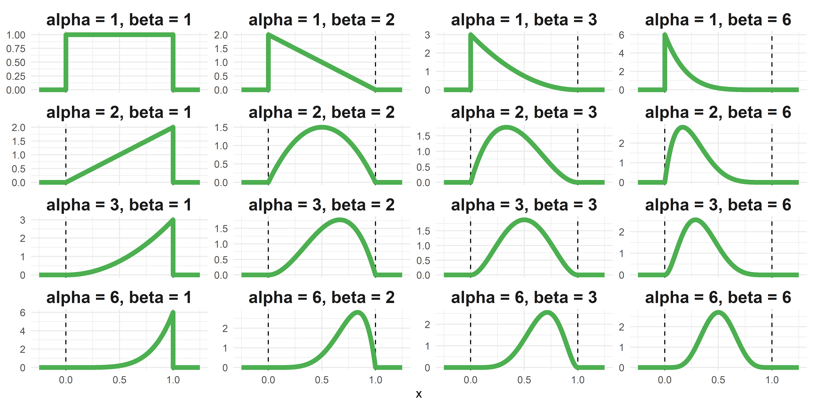{width=3000}
:::
:::


:::


## Beta Distribution - Applications

- [x] Ideal for modeling proportions and probabilities in psychological data
  - E.g., proportion of time a patient exhibits a certain behavior
- [x] Used in modeling attitudes and opinions on a bounded scale (e.g., analog scale)
- [x] Useful when we know that a given parameters cannot be outside of 0-1


## On Gamma Distributions {.center background-color="#003B49"}

*Gamma distributions receive many compliments about their long tail. That's why there are always positive!*


## Gamma Distribution

::: {.stretch}

- Defined by a shape parameter **k** and a scale parameter **θ** (theta)
- Only expressed in the range $[0, +\infty [$ (i.e., non-negative)
- Left-skewed distribution
- Used to model continuous non-negative data (e.g., time)


::: {.cell hash='index_cache/revealjs/unnamed-chunk-54_19bb48f59e4d28b855a23b09011b5122'}

```{.r .cell-code}
data.frame(x = rgamma(100000, shape = 2, scale = 10)) |>
  ggplot(aes(x=x)) +
  geom_histogram(bins=100, color="black")
```

::: {.cell-output-display}
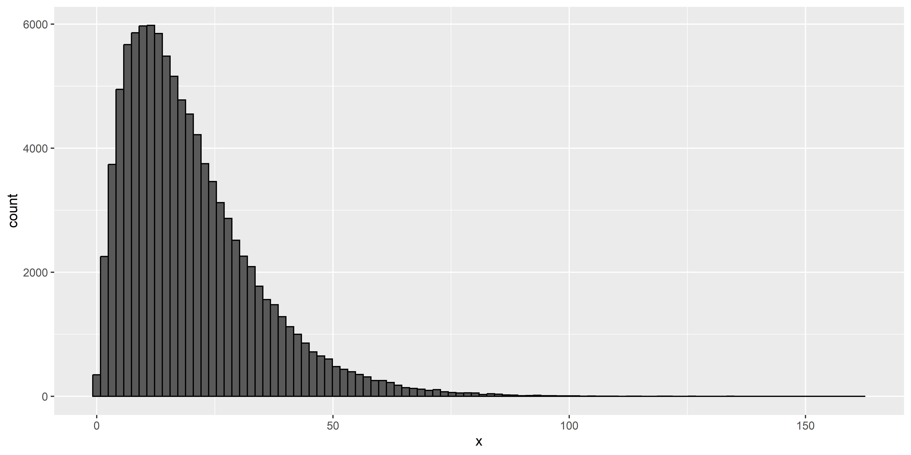{width=3000}
:::
:::


:::

## Gamma Distribution - Parameters

::: {.nonincremental .stretch}
- $k$ (`shape`) and $\theta$ (`scale`) parameters control the shape of the distribution
- When $k = 1$, it is equivalent to an **exponential** distribution


::: {.cell hash='index_cache/revealjs/unnamed-chunk-55_f8a3bc48abd09249890d9f772453a729'}

```{.r .cell-code  code-fold="true" code-summary="Show figure code"}
df_gamma <- data.frame()
for(shape in c(0.5, 1, 2, 4)) {
  for(scale in c(0.1, 0.5, 1, 2)) {
    dat <- data.frame(x = seq(0.001, 25, length.out=1000))
    dat$p <- dgamma(dat$x, shape = shape, scale = scale)
    dat$distribution <- "Beta"
    dat$parameters <- paste0("k = ", shape, ", theta = ", scale)
    df_gamma <- rbind(dat, df_gamma)
  }
}

p <- df_gamma |>
  ggplot(aes(x=x, y=p, group=parameters)) +
  # geom_vline(xintercept=c(0, 1), linetype="dashed") +
  geom_line(aes(color=distribution), linewidth=2, color="#9C27B0") +
  theme_minimal() +
  theme(legend.position = "none",
        axis.title.y = element_blank(),
        plot.title = element_text(size=15, face="bold", hjust=0.5),
        plot.tag = element_text(size=20, face="bold", hjust=0.5),
        strip.text = element_text(size=15, face="bold")) +
  facet_wrap(~parameters, scales="free_y")
p
```

::: {.cell-output-display}
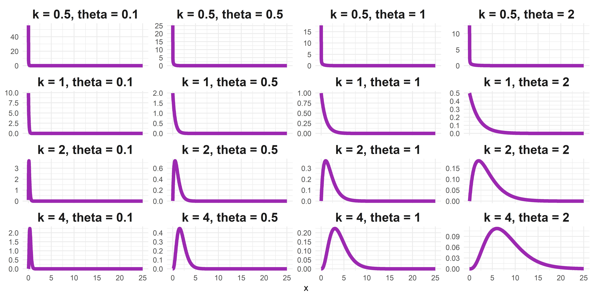{width=3000}
:::
:::


:::

## Exercice! {background-color="#80DEEA"}

- Make groups. Each groups picks a distribution (Normal, Uniform, Beta, Gamma) and a set of parameters
- Then:
  - Draw 100 random samples from that distribution
  - Compute the **mean** of each random subset
  - Store results in a vector
  - Repeat 10,000 times
  - Plot the distribution of the means

## Solution {background-color="#80DEEA"}

::: {.columns}
:::: {.column width="65%"}


::: {.cell hash='index_cache/revealjs/unnamed-chunk-56_bfed490d9197923b82c07d5a541317ee'}

```{.r .cell-code}
means <- c()  # Initialize an empty vector
for(i in 1:10000) {  # Iterate
  x <- rbeta(100, shape1 = 10, shape2 = 1.5)
  means <- c(means, mean(x))
}
```
:::


::::
:::

## Solution {background-color="#80DEEA"}

::: {.columns}
:::: {.column width="65%"}


::: {.cell hash='index_cache/revealjs/unnamed-chunk-57_50ce4050c368a9fa21828cebb61e36a6'}

```{.r .cell-code}
means <- c()  # Initialize an empty vector
for(i in 1:10000) {  # Iterate
  x <- rbeta(100, shape1 = 10, shape2 = 1.5)
  means <- c(means, mean(x))
}

data.frame(x = means) |>
  ggplot(aes(x=x)) +
  geom_histogram(bins=40, color="black")
```
:::


::::
:::

## Solution {background-color="#80DEEA"}

::: {.columns}
:::: {.column width="65%"}


::: {.cell hash='index_cache/revealjs/unnamed-chunk-58_7c854534adf3b361befafeda3fb0d1da'}

```{.r .cell-code}
means <- c()
for(i in 1:10000) {
  x <- rbeta(100, shape1 = 10, shape2 = 1.5)
  means <- c(means, mean(x))
}

data.frame(x = means) |>
  ggplot(aes(x=x)) +
  geom_histogram(bins=40, color="black")
```

::: {.cell-output-display}
{width=3000}
:::
:::


::::

:::: {.column width="35%"}

::::: {.fragment}


🤯🤯🤯🤯🤯🤯🤯🤯

**A NORMAL DISTRIBUTION**

🤯🤯🤯🤯🤯🤯🤯🤯


:::::
::::
:::


## Central Limit Theorem (2)

- The **Central Limit Theorem** hits gain: **"the distribution of sample means approximates a normal distribution as the sample size gets larger, regardless of the population's distribution"**
- **Practical Implications**: The Central Limit Theorem is crucial for inferential statistics. It underpins many statistical methods, such as frequentist hypothesis testing and confidence intervals. It allows for the use of normal probability models to make inferences about population parameters even when the population distribution is not normal.
- **Standard Error (SE)** *vs.* **Standard Deviation (SD)**
  - The standard deviation is a measure of the variability of a **single** sample of observations
  - The standard error is a measure of the variability of **many sample means** (it is the SD of the averages of many samples drawn from the same parent distribution). The SE is often assumed to be normally distributed (even if the underlying distribution is not normal).

## On Cauchy Distributions {.center background-color="#003B49"}

*Why don't statisticians play hide and seek with Cauchy distributions? Because they never know where they're going to show up and how far away they could be!*

## Cauchy Distribution

::: {.nonincremental .stretch}

- The Cauchy distribution is known for its "heavy tails" (aka "fat tails")
- Characterized by a location parameter (the median) and a scale parameter (the spread)
- The Cauchy distribution is **one notable exception** to the Central Limit Theorem (CLT): the distribution of the sample means of a Cauchy distribution remains a Cauchy distribution (instead of Normal). This is because the heavy tails of the Cauchy distribution significantly influence the sample mean, preventing it from settling into a normal distribution.

{fig-align="center"}

:::

## On *t*-Distributions {.center background-color="#003B49"}

*How do you call the PhD diploma of a Student's t-distribution? A degree of freedom!*

## *t*-Distribution

::: {.nonincremental .stretch}

- Both Cauchy and Normal are extreme cases of the Student's *t*-distribution
  - <small>Student's *t*-distribution becomes the Cauchy distribution when the degrees of freedom is **equal to one** and converges to the normal distribution as the degrees of freedom go to **infinity**</small>
- Defined by its degrees of freedom $df$ (*location* and *scale* usually fixed to 0 and 1)
- Tends to have heavier tails than the normal distribution (but less than Cauchy)


::: {.cell layout-align="center" hash='index_cache/revealjs/unnamed-chunk-59_76f243a5f2536b417eda57d17f50ccb4'}

```{.r .cell-code  code-fold="true" code-summary="Show figure code"}
df <- data.frame(x = seq(-5, 5, length.out=1000))
df$Normal <- dnorm(df$x, mean = 0, sd = 1)
df$Cauchy <- dcauchy(df$x, location = 0, scale = 1)
df$Student_1.5 <- dt(df$x, df = 1.5)
df$Student_2 <- dt(df$x, df = 2)
df$Student_3 <- dt(df$x, df = 3)
df$Student_5 <- dt(df$x, df = 5)
df$Student_10 <- dt(df$x, df = 10)
df$Student_20 <- dt(df$x, df = 20)

df |>
  pivot_longer(starts_with("Student"), names_to="Distribution", values_to="PDF") |>
  separate(Distribution, into=c("Distribution", "df"), sep="_") |>
  mutate(label = paste0("Student (df=", df, ")")) |>
  ggplot(aes(x=x)) +
  geom_line(data=df, aes(y=Normal, color="Normal (0, 1)"), linewidth=2) +
  geom_line(data=df, aes(y=Cauchy, color="Cauchy (0, 1)"), linewidth=2) +
  geom_line(aes(y=PDF, color=label)) +
  scale_color_manual(values=c(`Cauchy (0, 1)`="#F44336",
                              `Student (df=1.5)`="#FF5722",
                              `Student (df=2)`="#FF9800",
                              `Student (df=3)`="#FFC107",
                              `Student (df=5)`="#FFEB3B",
                              `Student (df=10)`="#CDDC39",
                              `Student (df=20)`="#8BC34A",
                              `Normal (0, 1)`="#2196F3"),
                     breaks=c("Normal (0, 1)",
                              "Student (df=20)",
                              "Student (df=10)",
                              "Student (df=5)",
                              "Student (df=3)",
                              "Student (df=2)",
                              "Student (df=1.5)",
                              "Cauchy (0, 1)"
                              )) +
  see::theme_modern() +
  theme(axis.title.x = element_blank(),
        axis.title.y = element_blank(),
        axis.ticks.y = element_blank(),
        plot.title = element_text(size=15, face="bold", hjust=0.5),
        strip.text = element_text(size=15, face="bold")) +
  labs(title="Normal, Cauchy, and Student's t-Distribution", color=NULL)
```

::: {.cell-output-display}
{fig-align='center' width=6000}
:::
:::


:::

## *t*-Distribution - Applications

- [x] Widely used in hypothesis testing (e.g. *t*-tests), particularly for small sample sizes
  - E.g., comparing the means of two groups in an experiment
- [x] Essential in constructing confidence intervals


## Next Week

- **Bring your laptops!** We are going to try to install a particular package together


## The End <sub><sup>(for now)</sup></sub> {.center background-color="#212121"}

*Thank you!*

