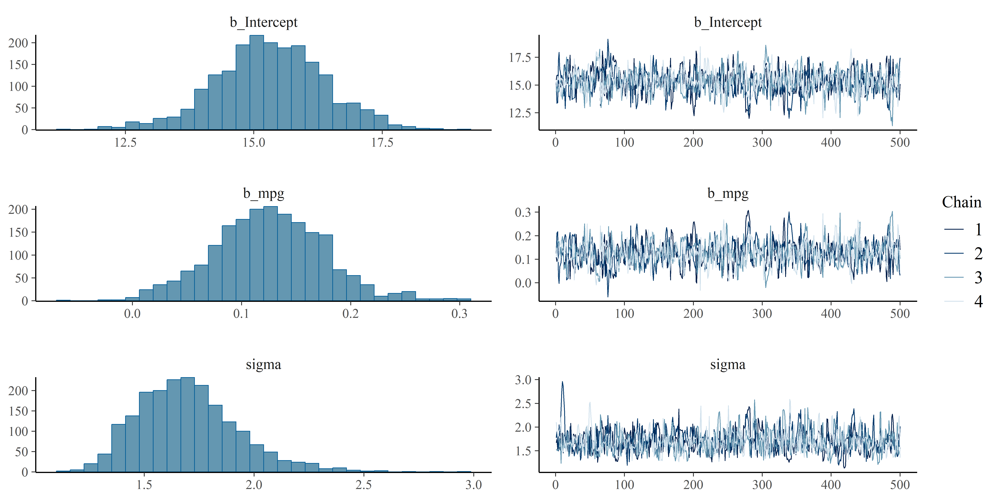
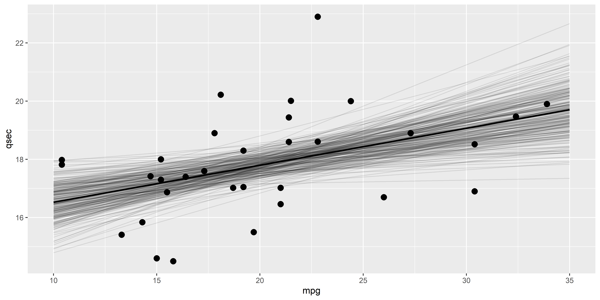

## Recap

1. Formula specification

::: {.fragment}


::: {.cell}

```{.r .cell-code}
library(brms)

f <- brms::brmsformula(qsec ~ 0 + Intercept + mpg)
```
:::


:::

2. Prior specification

- Intercept
  - e.g., $\mu$ = `mean(mtcars$qsec)` and $\sigma$ = `10 * sd(mtcars$qsec)`
- Slope
  - e.g., $\mu$ = 0 and $\sigma$ = 5

::: {.fragment}


::: {.cell}

```{.r .cell-code}
priors <- c(
  brms::set_prior("normal(17.85, 17.9)", class = "b", coef = "Intercept"),
  brms::set_prior("normal(0, 5)", class = "b", coef = "mpg")
) |> 
  brms::validate_prior(f, data=mtcars)

priors
```

::: {.cell-output .cell-output-stdout}

```
                prior class      coef group resp dpar nlpar lb ub  source
               (flat)     b                                       default
  normal(17.85, 17.9)     b Intercept                                user
         normal(0, 5)     b       mpg                                user
 student_t(3, 0, 2.5) sigma                                  0    default
```


:::
:::


:::


## Fitting the model

- Pass the formula, the data, and the priors (optional) to `brms::brm()` ("Bayesian Regression Model")

::: {.fragment}


::: {.cell}

```{.r .cell-code}
model <- brms::brm(f, 
                   data = mtcars, 
                   prior = priors)
```
:::


:::

- Options pertaining to the **sampling algorithm** can be specified^[See the function documentation for the massive list of options]

::: {.fragment}


::: {.cell}

```{.r .cell-code}
model <- brms::brm(f, 
                   data = mtcars, 
                   prior = priors,
                   chains = 4, # Number of independent sampling processes 
                   iter = 1000,  # Number of draws per chain
                   refresh = 0)  # Print progress
```
:::


:::

## MCMC

- By default, `brms` uses MCMC
  - In particular, the **No-U-Turn Sampler (NUTS)** algorithm, which is a variant of **Hamiltonian Monte Carlo (HMC)**
- Stan (the language used by `brms` in the background) also implements **variational inference** algorithms that sample from an approximation of the posterior, which are faster but less accurate
  - You can use them by specifying `algorithm = "meanfield"` or `algorithm = "fullrank"`
  - Can be useful for "quick" checks and adjustments but should not necessarily be used for final results
  - Interestingly, some neuroscientific theories suggest that variational inference approximation is what the brain actually does
- For this module we will focus on MCMC, which is slowest but the "true" Bayesian solution

## MCMC parameters

- MCMC can be tuned
  - Number of **chains**, number of **iterations**
  - **Warm-up**: the number of initial samples that are discarded (burn-in phase)
  - **Thinning**: the number of samples that are kept (every n-th sample)
  - **Adaptation**: the algorithm can adapt its parameters during the burn-in phase
  - ...
- In most cases, the default values are fine
- It's only when there are problems that you should start considering tweaking these parameters


## Sampling Diagnostics - Trace Plots 

- **HAIRY CATERPILLARS**
- The MCMC algorithm is supposed to draw **independent** samples from the posterior
- There should be no autocorrelation between successive samples (i.e., no patterns in the trace plot)
  - They should look like [**hairy caterpillars**]{.fragment}
- We typically draw multiple independent **chains** (useful for parallel computing, e.g., one chain per core)


::: {.fragment}


::: {.cell}

```{.r .cell-code}
plot(model)
```

::: {.cell-output-display}
{width=3000}
:::
:::


:::

- The plots shows 1) the **posterior** distribution of the parameters and 2) the **trace** plot of the MCMC algorithm
- One trace per chain: there should not be any pattern 
  
## Sampling Diagnostics - Effective Sample Size (ESS)


::: {.cell}

```{.r .cell-code}
model
```

::: {.cell-output .cell-output-stdout}

```
 Family: gaussian 
  Links: mu = identity; sigma = identity 
Formula: qsec ~ 0 + Intercept + mpg 
   Data: mtcars (Number of observations: 32) 
  Draws: 4 chains, each with iter = 1000; warmup = 500; thin = 1;
         total post-warmup draws = 2000

Regression Coefficients:
          Estimate Est.Error l-95% CI u-95% CI Rhat Bulk_ESS Tail_ESS
Intercept    15.31      1.06    13.08    17.40 1.01      723      718
mpg           0.13      0.05     0.02     0.24 1.01      722      663

Further Distributional Parameters:
      Estimate Est.Error l-95% CI u-95% CI Rhat Bulk_ESS Tail_ESS
sigma     1.70      0.23     1.33     2.23 1.00      697      779

Draws were sampled using sampling(NUTS). For each parameter, Bulk_ESS
and Tail_ESS are effective sample size measures, and Rhat is the potential
scale reduction factor on split chains (at convergence, Rhat = 1).
```


:::
:::


- The **effective sample size** (ESS) is an estimation of the number of independent samples that we have
  - ESS ("Bulk" ESS) is a measure of how well the **centre** of the posterior distribution is described
  - Can be see as an index of the accuracy of the indices of centrality
  - "Tail" ESS is a measure of how well the **tails** of the distribution are described
  - Can be see as an index of the accuracy of the indices based on range
- ESS should be at least 1000 (see `effectsize::interpret_ess()`)

## Sampling Diagnostics - $\hat{R}$

- The $\hat{R}$ ("R-hat") is a measure of **convergence**
- It compares the **variance** within chains to the **variance** between chains
- If the chains have not converged to a common distribution, the $\hat{R}$ statistic will be greater than one
- Should be lower than 1.01 (see `effectsize::interpret_rhat()`)

## Posterior Description


::: {.cell}

```{.r .cell-code}
parameters::parameters(model)
```

::: {.cell-output .cell-output-stdout}

```
# Fixed Effects

Parameter   | Median |         95% CI |     pd |  Rhat |    ESS
---------------------------------------------------------------
(Intercept) |  15.31 | [13.08, 17.40] |   100% | 1.008 | 700.00
mpg         |   0.13 | [ 0.02,  0.24] | 99.60% | 1.007 | 689.00

# Sigma

Parameter | Median |       95% CI |   pd |  Rhat |    ESS
---------------------------------------------------------
sigma     |   1.68 | [1.33, 2.23] | 100% | 1.005 | 670.00
```


:::
:::


- Indices of centrality, uncertainty, existence, significance
- Customize the parameters shown

::: {.fragment}


::: {.cell}

```{.r .cell-code}
parameters::parameters(model,
                       centrality="mean", 
                       dipsersion=TRUE,
                       ci=0.89)
```

::: {.cell-output .cell-output-stdout}

```
# Fixed Effects

Parameter   |  Mean |         89% CI |     pd |  Rhat |    ESS
--------------------------------------------------------------
(Intercept) | 15.31 | [13.64, 16.99] |   100% | 1.008 | 700.00
mpg         |  0.13 | [ 0.04,  0.20] | 99.60% | 1.007 | 689.00

# Sigma

Parameter | Mean |       89% CI |   pd |  Rhat |    ESS
-------------------------------------------------------
sigma     | 1.70 | [1.37, 2.10] | 100% | 1.005 | 670.00
```


:::
:::


:::


## Effect Significance


::: {.cell}
::: {.cell-output .cell-output-stdout}

```
# Fixed Effects

Parameter   | Median |         95% CI |     pd |  Rhat |    ESS
---------------------------------------------------------------
(Intercept) |  15.31 | [13.08, 17.40] |   100% | 1.008 | 700.00
mpg         |   0.13 | [ 0.02,  0.24] | 99.60% | 1.007 | 689.00

# Sigma

Parameter | Median |       95% CI |   pd |  Rhat |    ESS
---------------------------------------------------------
sigma     |   1.68 | [1.33, 2.23] | 100% | 1.005 | 670.00
```


:::
:::


- Easiest is to use *pd* or decision threshold based on CI overlapping 0 (similar to Frequentist NHST)
- **ROPE?** But what ROPE bounds to use?
  - Not straightforward to define
  - Easier to use when data is standardized (and parameters are expressed in terms of SD)
  - Or when you have clear hypotheses on the effect size
- **BF?** 
  - Complicated to compute for model parameters
  
  
## Model Performance - R2

- Once that sampling quality has been assessed, and that the posteriors have been described, we can assess the model's performance
- How well does the model fit/predict the data?
- R-squared, the percentage of variance explained by the model (for linear models), can be computed

::: {.fragment}


::: {.cell}

```{.r .cell-code}
performance::r2(model)
```

::: {.cell-output .cell-output-stdout}

```
# Bayesian R2 with Compatibility Interval

  Conditional R2: 0.178 (95% CI [5.913e-06, 0.353])
```


:::
:::


:::

- With Bayesian statistics - where every parameter is **probabilistic**, we also get a posterior distribution of the R-squared, and can thus compute **credible intervals**
- Note that R-squared is straightforward to interpret for **linear** model but gets tricky for GLMs (because there is no "variance" of the outcome in the same sense). We cannot say "the model explains X% of the variance" baed on the R2 for GLMs.

## Model Performance - Relative Indices

- Other **"relative" indices of fit** exist to compare models between them (we will see that later)

::: {.fragment}


::: {.cell}

```{.r .cell-code}
performance::performance(model)
```

::: {.cell-output .cell-output-stdout}

```
# Indices of model performance

ELPD    | ELPD_SE |   LOOIC | LOOIC_SE |    WAIC |    R2 | R2 (adj.) |  RMSE | Sigma
------------------------------------------------------------------------------------
-63.628 |   4.996 | 127.256 |    9.992 | 127.160 | 0.178 |     0.117 | 1.597 | 1.669
```


:::
:::


:::

## Posterior Predictive Check

- **Posterior predictive checks** is a way to assess the model by comparing the **observed** data to the **predicted** data

::: {.fragment}


::: {.cell}

```{.r .cell-code}
pred <- get_predicted(model, data=mtcars, iterations=100) |> 
  as.data.frame() |> 
  reshape_iterations()
  
head(pred)
```

::: {.cell-output .cell-output-stdout}

```
  Predicted iter_index iter_group iter_value
1  18.01666          1          1   17.95846
2  18.01666          2          1   17.95846
3  18.25219          3          1   18.09550
4  18.06900          4          1   17.98891
5  17.71571          5          1   17.78335
6  17.63720          6          1   17.73767
```


:::
:::


:::

## Posterior Predictive Check - Distribution

- We can see wether the distribution of predicted values are closer to the observed values (in particular, its mean when using linear models)

::: {.fragment}


::: {.cell}

```{.r .cell-code}
ggplot(mtcars, aes(x=qsec)) +
  geom_line(data=pred, aes(x=iter_value, group=iter_group), 
            stat="density",  alpha=0.3) +
  geom_density(fill="skyblue", alpha=0.5) +
  theme_minimal() +
  coord_cartesian(ylim=c(0, 1))
```

::: {.cell-output-display}
{width=3000}
:::
:::


:::

- Note the use of `geom_line(stat="density")` for the lines instead of `geom_density()` to be able to modify the alpha of the lines (and not the *filling*)
- Posterior predictive checks of the distribution is particularly useful for more complex models to see if the model manages to reproduce the 

## Visualizing the Effects - Datagrid

- We typically are interested in visualizing the **effects** (i.e., the impact of the predictors)
- This means predicting the outcome for different values of the predictor

::: {.fragment}


::: {.cell}

```{.r .cell-code}
newdata <- data.frame(mpg = seq(10, 35, length.out=6))
newdata
```

::: {.cell-output .cell-output-stdout}

```
  mpg
1  10
2  15
3  20
4  25
5  30
6  35
```


:::
:::


:::

## Visualizing the Effects - Make Predictions


- Predict data on this hypothetical dataset

::: {.fragment}


::: {.cell}

```{.r .cell-code}
pred <- get_predicted(model, data=newdata, iterations=250) |> 
  as.data.frame() |> 
  cbind(newdata) 

head(pred)
```

::: {.cell-output .cell-output-stdout}

```
  Predicted   iter_1   iter_2   iter_3   iter_4   iter_5   iter_6   iter_7
1  16.52748 16.38425 17.69495 16.60526 16.43123 16.29018 17.13837 17.14352
2  17.16278 17.10572 18.12744 17.39246 17.00082 17.17579 17.32551 17.42751
3  17.79808 17.82718 18.55994 18.17967 17.57042 18.06140 17.51265 17.71151
4  18.43338 18.54865 18.99244 18.96687 18.14002 18.94702 17.69979 17.99550
5  19.06868 19.27011 19.42494 19.75408 18.70962 19.83263 17.88693 18.27949
6  19.70398 19.99158 19.85744 20.54129 19.27922 20.71825 18.07407 18.56349
    iter_8   iter_9  iter_10  iter_11  iter_12  iter_13  iter_14  iter_15
1 16.08705 15.40554 17.08481 16.35078 16.90511 17.93837 16.89727 17.23075
2 16.65531 16.24475 17.43307 16.92888 17.42841 18.21705 17.43354 17.80519
3 17.22358 17.08397 17.78133 17.50697 17.95171 18.49574 17.96981 18.37964
4 17.79185 17.92318 18.12959 18.08507 18.47501 18.77442 18.50608 18.95408
5 18.36012 18.76239 18.47785 18.66316 18.99831 19.05311 19.04235 19.52853
6 18.92838 19.60161 18.82611 19.24126 19.52161 19.33179 19.57862 20.10297
   iter_16  iter_17  iter_18  iter_19  iter_20  iter_21  iter_22  iter_23
1 15.77784 15.98522 16.41464 16.23804 16.65223 16.47624 16.62878 16.79662
2 16.75569 16.93657 17.01045 16.85616 17.07684 16.93098 17.15072 17.12206
3 17.73355 17.88791 17.60625 17.47429 17.50145 17.38571 17.67266 17.44750
4 18.71140 18.83926 18.20206 18.09241 17.92606 17.84045 18.19460 17.77295
5 19.68925 19.79061 18.79787 18.71054 18.35067 18.29519 18.71654 18.09839
6 20.66710 20.74196 19.39367 19.32866 18.77528 18.74993 19.23848 18.42383
   iter_24  iter_25  iter_26  iter_27  iter_28  iter_29  iter_30  iter_31
1 15.72472 16.57374 16.28472 16.77277 16.67415 16.73971 15.79185 17.94099
2 16.64301 17.24891 17.02521 17.24848 17.28679 17.45593 16.65340 18.03459
3 17.56130 17.92407 17.76571 17.72420 17.89942 18.17214 17.51496 18.12818
4 18.47959 18.59924 18.50620 18.19991 18.51206 18.88836 18.37651 18.22178
5 19.39788 19.27440 19.24669 18.67562 19.12470 19.60457 19.23807 18.31538
6 20.31617 19.94956 19.98719 19.15134 19.73734 20.32079 20.09962 18.40898
   iter_32 iter_33  iter_34  iter_35  iter_36  iter_37  iter_38  iter_39
1 16.26211 16.8708 16.33955 15.12448 15.57742 15.97813 15.81644 15.05919
2 16.96278 17.4751 16.84399 16.41132 16.99479 16.69929 16.90484 16.43718
3 17.66344 18.0794 17.34844 17.69817 18.41215 17.42045 17.99324 17.81517
4 18.36411 18.6837 17.85288 18.98501 19.82951 18.14161 19.08164 19.19316
5 19.06478 19.2880 18.35733 20.27185 21.24687 18.86277 20.17004 20.57115
6 19.76545 19.8923 18.86177 21.55869 22.66423 19.58393 21.25844 21.94914
   iter_40  iter_41  iter_42  iter_43  iter_44  iter_45  iter_46  iter_47
1 15.81271 16.54837 15.93116 15.98509 16.14525 16.32867 16.61757 15.75008
2 16.86761 17.18666 16.76873 16.84117 17.05426 16.95769 17.38572 16.79921
3 17.92251 17.82496 17.60629 17.69724 17.96328 17.58671 18.15386 17.84833
4 18.97740 18.46325 18.44386 18.55332 18.87229 18.21573 18.92201 18.89746
5 20.03230 19.10154 19.28142 19.40939 19.78130 18.84475 19.69015 19.94658
6 21.08720 19.73984 20.11899 20.26547 20.69031 19.47377 20.45829 20.99571
   iter_48  iter_49  iter_50  iter_51  iter_52  iter_53  iter_54  iter_55
1 16.00918 16.21475 17.12175 15.85033 17.54786 16.79583 16.43327 16.10716
2 16.70529 17.00347 17.66399 16.76670 17.82987 17.46624 17.21708 16.97184
3 17.40140 17.79220 18.20623 17.68306 18.11189 18.13666 18.00088 17.83653
4 18.09751 18.58092 18.74846 18.59943 18.39391 18.80707 18.78469 18.70121
5 18.79362 19.36965 19.29070 19.51580 18.67592 19.47749 19.56849 19.56590
6 19.48973 20.15837 19.83294 20.43216 18.95794 20.14790 20.35230 20.43058
   iter_56  iter_57  iter_58  iter_59  iter_60  iter_61  iter_62  iter_63
1 17.57139 17.47551 16.46482 16.94116 16.49898 17.03957 17.09424 16.98503
2 17.94406 17.74118 17.16310 17.32344 16.93220 17.10119 17.47222 17.56118
3 18.31673 18.00685 17.86138 17.70571 17.36543 17.16282 17.85021 18.13733
4 18.68941 18.27252 18.55966 18.08799 17.79866 17.22444 18.22819 18.71348
5 19.06208 18.53819 19.25795 18.47027 18.23188 17.28606 18.60618 19.28964
6 19.43475 18.80386 19.95623 18.85255 18.66511 17.34769 18.98416 19.86579
   iter_64  iter_65  iter_66  iter_67  iter_68  iter_69  iter_70  iter_71
1 17.00755 16.22382 17.17149 16.02771 17.10136 17.17895 16.07439 17.35175
2 17.58588 17.07264 17.30395 16.49986 17.52183 17.54793 16.93245 17.57207
3 18.16421 17.92146 17.43640 16.97200 17.94230 17.91691 17.79051 17.79239
4 18.74254 18.77029 17.56885 17.44414 18.36278 18.28589 18.64857 18.01270
5 19.32087 19.61911 17.70130 17.91629 18.78325 18.65487 19.50663 18.23302
6 19.89920 20.46793 17.83376 18.38843 19.20372 19.02385 20.36469 18.45334
   iter_72  iter_73  iter_74  iter_75  iter_76  iter_77  iter_78  iter_79
1 17.21433 16.12659 16.94347 16.86691 17.16683 14.79164 16.59227 16.78404
2 17.62625 16.96245 17.37938 17.38827 17.74776 15.81552 17.22508 17.18176
3 18.03817 17.79830 17.81530 17.90963 18.32869 16.83940 17.85789 17.57948
4 18.45009 18.63415 18.25121 18.43099 18.90962 17.86328 18.49070 17.97720
5 18.86202 19.47001 18.68713 18.95234 19.49055 18.88716 19.12351 18.37491
6 19.27394 20.30586 19.12305 19.47370 20.07148 19.91104 19.75632 18.77263
   iter_80  iter_81  iter_82  iter_83  iter_84  iter_85  iter_86  iter_87
1 16.55929 15.49614 16.90306 15.76775 15.97046 16.99722 16.84345 16.90212
2 17.32045 16.53170 17.21360 16.80192 16.62841 17.54809 17.42732 17.49365
3 18.08161 17.56726 17.52414 17.83609 17.28636 18.09896 18.01119 18.08518
4 18.84276 18.60282 17.83468 18.87025 17.94431 18.64983 18.59506 18.67671
5 19.60392 19.63838 18.14522 19.90442 18.60226 19.20070 19.17893 19.26824
6 20.36508 20.67394 18.45576 20.93859 19.26021 19.75157 19.76280 19.85977
   iter_88  iter_89  iter_90  iter_91  iter_92  iter_93  iter_94  iter_95
1 16.53591 15.66347 16.85700 16.29807 16.30278 16.21586 16.88688 16.48153
2 17.29159 16.49655 17.47485 17.03848 16.86890 17.01597 17.30717 16.94573
3 18.04726 17.32962 18.09270 17.77890 17.43501 17.81607 17.72747 17.40993
4 18.80293 18.16269 18.71055 18.51932 18.00113 18.61618 18.14776 17.87413
5 19.55860 18.99576 19.32840 19.25974 18.56725 19.41629 18.56806 18.33833
6 20.31428 19.82884 19.94625 20.00015 19.13337 20.21639 18.98835 18.80253
   iter_96  iter_97  iter_98  iter_99 iter_100 iter_101 iter_102 iter_103
1 17.07701 16.17588 16.70311 16.71663 16.21761 16.19375 16.48411 16.69425
2 17.63500 16.97185 17.32428 17.35100 16.82603 16.99573 17.18036 17.24946
3 18.19300 17.76782 17.94545 17.98537 17.43445 17.79772 17.87661 17.80466
4 18.75100 18.56379 18.56661 18.61974 18.04287 18.59970 18.57286 18.35987
5 19.30900 19.35976 19.18778 19.25411 18.65129 19.40169 19.26911 18.91508
6 19.86699 20.15573 19.80894 19.88849 19.25972 20.20367 19.96536 19.47029
  iter_104 iter_105 iter_106 iter_107 iter_108 iter_109 iter_110 iter_111
1 16.44930 15.18797 17.08420 17.05843 16.71028 16.17842 16.35125 16.62097
2 17.03745 16.44856 17.53100 17.45404 17.18866 16.89122 16.87114 17.18379
3 17.62559 17.70916 17.97781 17.84965 17.66703 17.60402 17.39102 17.74661
4 18.21373 18.96975 18.42462 18.24526 18.14541 18.31682 17.91090 18.30943
5 18.80188 20.23034 18.87142 18.64088 18.62378 19.02962 18.43078 18.87224
6 19.39002 21.49094 19.31823 19.03649 19.10215 19.74242 18.95067 19.43506
  iter_112 iter_113 iter_114 iter_115 iter_116 iter_117 iter_118 iter_119
1 16.48480 16.25621 15.86034 16.91335 16.44883 17.28930 16.03374 16.36281
2 17.11139 17.14608 16.65608 17.69979 16.95375 17.47964 16.86396 16.94231
3 17.73798 18.03595 17.45182 18.48623 17.45867 17.66998 17.69417 17.52182
4 18.36457 18.92582 18.24757 19.27268 17.96359 17.86032 18.52439 18.10132
5 18.99116 19.81569 19.04331 20.05912 18.46851 18.05065 19.35461 18.68082
6 19.61776 20.70555 19.83905 20.84556 18.97343 18.24099 20.18482 19.26032
  iter_120 iter_121 iter_122 iter_123 iter_124 iter_125 iter_126 iter_127
1 16.23881 16.45206 15.95239 16.30594 16.53463 17.29878 16.28236 15.82438
2 17.08954 17.33382 16.82108 17.13319 17.14890 17.80901 17.06240 16.69591
3 17.94026 18.21558 17.68977 17.96044 17.76316 18.31925 17.84244 17.56743
4 18.79098 19.09734 18.55846 18.78769 18.37743 18.82948 18.62248 18.43895
5 19.64171 19.97910 19.42715 19.61494 18.99170 19.33972 19.40252 19.31047
6 20.49243 20.86086 20.29584 20.44219 19.60597 19.84995 20.18256 20.18200
  iter_128 iter_129 iter_130 iter_131 iter_132 iter_133 iter_134 iter_135
1 17.52742 16.63947 16.65251 17.04728 16.89255 17.01034 16.39905 16.47439
2 17.68154 17.18100 17.21588 17.28550 17.43273 17.27733 17.09140 17.02721
3 17.83566 17.72253 17.77924 17.52372 17.97291 17.54433 17.78375 17.58002
4 17.98977 18.26406 18.34261 17.76194 18.51310 17.81132 18.47610 18.13283
5 18.14389 18.80559 18.90597 18.00016 19.05328 18.07831 19.16845 18.68564
6 18.29800 19.34712 19.46934 18.23838 19.59346 18.34531 19.86079 19.23846
  iter_136 iter_137 iter_138 iter_139 iter_140 iter_141 iter_142 iter_143
1 16.86614 16.68557 16.00076 16.38028 15.77289 15.69769 16.24212 16.04658
2 17.42190 17.22347 16.91682 16.94617 16.75935 16.62235 16.93446 16.89031
3 17.97766 17.76137 17.83288 17.51207 17.74581 17.54701 17.62680 17.73405
4 18.53342 18.29927 18.74894 18.07797 18.73227 18.47167 18.31914 18.57778
5 19.08918 18.83717 19.66500 18.64387 19.71873 19.39633 19.01148 19.42152
6 19.64493 19.37507 20.58106 19.20976 20.70519 20.32099 19.70382 20.26525
  iter_144 iter_145 iter_146 iter_147 iter_148 iter_149 iter_150 iter_151
1 16.78035 17.09549 16.62513 15.91855 17.07469 16.03211 16.84652 16.14366
2 17.32466 17.51720 17.14386 16.81476 17.48191 16.69894 17.42829 17.14195
3 17.86898 17.93890 17.66260 17.71097 17.88914 17.36577 18.01005 18.14024
4 18.41329 18.36060 18.18133 18.60718 18.29637 18.03260 18.59181 19.13853
5 18.95760 18.78231 18.70006 19.50339 18.70360 18.69943 19.17357 20.13682
6 19.50191 19.20401 19.21880 20.39959 19.11083 19.36627 19.75533 21.13512
  iter_152 iter_153 iter_154 iter_155 iter_156 iter_157 iter_158 iter_159
1 15.58953 17.03381 16.87915 17.23801 17.90509 17.56030 16.76818 15.96524
2 16.85483 17.51142 17.58065 17.69434 17.96775 17.87483 17.13798 16.89860
3 18.12013 17.98904 18.28214 18.15066 18.03041 18.18937 17.50779 17.83197
4 19.38542 18.46665 18.98364 18.60699 18.09307 18.50391 17.87759 18.76534
5 20.65072 18.94427 19.68514 19.06331 18.15573 18.81845 18.24740 19.69870
6 21.91602 19.42188 20.38663 19.51964 18.21839 19.13299 18.61720 20.63207
  iter_160 iter_161 iter_162 iter_163 iter_164 iter_165 iter_166 iter_167
1 17.43965 16.50958 15.94888 16.22202 16.58297 16.05747 17.79746 15.66998
2 17.66505 17.16078 16.64989 16.98993 17.31474 16.83685 17.89498 16.73198
3 17.89044 17.81198 17.35090 17.75785 18.04651 17.61623 17.99250 17.79398
4 18.11584 18.46318 18.05190 18.52576 18.77828 18.39560 18.09002 18.85599
5 18.34124 19.11438 18.75291 19.29368 19.51006 19.17498 18.18754 19.91799
6 18.56663 19.76558 19.45392 20.06159 20.24183 19.95436 18.28506 20.97999
  iter_168 iter_169 iter_170 iter_171 iter_172 iter_173 iter_174 iter_175
1 15.96645 17.18905 16.77773 16.80722 17.35568 16.00628 16.98969 17.13052
2 16.83873 17.62614 17.20669 17.35445 17.47115 16.73274 17.32270 17.56799
3 17.71101 18.06323 17.63566 17.90168 17.58662 17.45921 17.65570 18.00546
4 18.58329 18.50032 18.06462 18.44892 17.70210 18.18567 17.98871 18.44294
5 19.45557 18.93742 18.49358 18.99615 17.81757 18.91213 18.32171 18.88041
6 20.32785 19.37451 18.92254 19.54338 17.93304 19.63860 18.65472 19.31788
  iter_176 iter_177 iter_178 iter_179 iter_180 iter_181 iter_182 iter_183
1 16.29829 15.83028 16.92029 14.91770 15.18336 16.88985 17.18735 16.16108
2 16.86280 16.72091 17.30286 16.18457 16.47320 17.17379 17.78686 16.76022
3 17.42732 17.61154 17.68543 17.45143 17.76304 17.45773 18.38637 17.35936
4 17.99183 18.50217 18.06799 18.71830 19.05289 17.74167 18.98588 17.95850
5 18.55634 19.39279 18.45056 19.98516 20.34273 18.02561 19.58539 18.55764
6 19.12085 20.28342 18.83313 21.25203 21.63257 18.30955 20.18490 19.15678
  iter_184 iter_185 iter_186 iter_187 iter_188 iter_189 iter_190 iter_191
1 17.23429 16.04598 14.94555 16.01753 17.19405 16.06996 16.51727 16.88577
2 17.80754 16.72851 16.04004 17.02868 17.53774 16.81831 17.07395 17.57838
3 18.38079 17.41103 17.13453 18.03983 17.88144 17.56666 17.63063 18.27098
4 18.95404 18.09356 18.22902 19.05099 18.22513 18.31501 18.18732 18.96359
5 19.52729 18.77609 19.32351 20.06214 18.56883 19.06336 18.74400 19.65620
6 20.10054 19.45862 20.41800 21.07329 18.91252 19.81171 19.30068 20.34880
  iter_192 iter_193 iter_194 iter_195 iter_196 iter_197 iter_198 iter_199
1 16.57668 16.10318 16.03810 15.72732 16.86497 16.96545 16.86407 16.46202
2 16.90934 16.98771 16.87026 16.44841 17.64912 17.40620 17.27690 17.25624
3 17.24200 17.87223 17.70242 17.16951 18.43326 17.84694 17.68974 18.05047
4 17.57466 18.75676 18.53458 17.89061 19.21741 18.28769 18.10257 18.84469
5 17.90733 19.64129 19.36674 18.61170 20.00156 18.72843 18.51540 19.63891
6 18.23999 20.52581 20.19890 19.33280 20.78570 19.16918 18.92823 20.43313
  iter_200 iter_201 iter_202 iter_203 iter_204 iter_205 iter_206 iter_207
1 16.14662 17.13965 16.46727 16.34424 16.29028 17.64434 16.61544 17.97009
2 16.79092 17.50863 17.07459 16.99334 16.86283 17.84754 17.06482 18.12163
3 17.43521 17.87761 17.68191 17.64244 17.43539 18.05073 17.51420 18.27317
4 18.07951 18.24660 18.28922 18.29155 18.00794 18.25392 17.96357 18.42470
5 18.72380 18.61558 18.89654 18.94065 18.58049 18.45712 18.41295 18.57624
6 19.36810 18.98457 19.50385 19.58975 19.15304 18.66031 18.86233 18.72778
  iter_208 iter_209 iter_210 iter_211 iter_212 iter_213 iter_214 iter_215
1 16.25722 15.74742 16.46349 16.81402 17.10746 16.88624 17.48280 16.78577
2 16.77095 16.71316 17.12845 17.33777 17.61995 17.66104 17.77649 17.40714
3 17.28469 17.67890 17.79341 17.86151 18.13244 18.43585 18.07018 18.02850
4 17.79842 18.64465 18.45837 18.38526 18.64493 19.21065 18.36386 18.64986
5 18.31215 19.61039 19.12333 18.90901 19.15742 19.98546 18.65755 19.27123
6 18.82589 20.57613 19.78829 19.43275 19.66991 20.76026 18.95124 19.89259
  iter_216 iter_217 iter_218 iter_219 iter_220 iter_221 iter_222 iter_223
1 16.80332 16.16037 15.98769 16.82386 16.14977 16.64552 15.65010 16.25076
2 17.19339 16.97079 16.78591 17.45304 17.16477 16.89425 16.50140 17.26305
3 17.58346 17.78120 17.58413 18.08221 18.17978 17.14298 17.35271 18.27534
4 17.97353 18.59162 18.38235 18.71139 19.19478 17.39171 18.20401 19.28763
5 18.36360 19.40203 19.18057 19.34057 20.20979 17.64045 19.05532 20.29992
6 18.75368 20.21244 19.97879 19.96975 21.22480 17.88918 19.90662 21.31222
  iter_224 iter_225 iter_226 iter_227 iter_228 iter_229 iter_230 iter_231
1 16.18622 16.20675 17.50357 16.69041 16.76039 16.65408 16.95041 16.75450
2 16.90886 16.81947 17.96228 17.25006 17.27888 17.12074 17.64878 17.20452
3 17.63150 17.43218 18.42100 17.80971 17.79737 17.58741 18.34714 17.65454
4 18.35413 18.04490 18.87971 18.36937 18.31585 18.05407 19.04550 18.10457
5 19.07677 18.65762 19.33843 18.92902 18.83434 18.52073 19.74386 18.55459
6 19.79940 19.27033 19.79714 19.48867 19.35283 18.98740 20.44223 19.00462
  iter_232 iter_233 iter_234 iter_235 iter_236 iter_237 iter_238 iter_239
1 17.58872 16.08319 15.79890 16.44414 16.75532 16.47611 17.35105 17.14176
2 17.81401 17.01195 16.65981 17.39922 17.21672 17.18610 17.69665 17.61828
3 18.03930 17.94072 17.52071 18.35430 17.67813 17.89609 18.04226 18.09480
4 18.26459 18.86949 18.38161 19.30938 18.13953 18.60608 18.38786 18.57132
5 18.48988 19.79825 19.24251 20.26446 18.60093 19.31606 18.73346 19.04784
6 18.71518 20.72702 20.10342 21.21954 19.06234 20.02605 19.07906 19.52436
  iter_240 iter_241 iter_242 iter_243 iter_244 iter_245 iter_246 iter_247
1 16.95405 15.32461 17.24354 15.47192 17.22519 16.82297 16.98327 15.62068
2 17.60478 16.54953 17.72135 16.21576 17.39666 17.52086 17.89469 16.34450
3 18.25552 17.77445 18.19917 16.95961 17.56812 18.21874 18.80612 17.06832
4 18.90626 18.99937 18.67698 17.70345 17.73959 18.91663 19.71754 17.79213
5 19.55699 20.22429 19.15479 18.44730 17.91106 19.61451 20.62896 18.51595
6 20.20773 21.44921 19.63260 19.19114 18.08252 20.31240 21.54038 19.23977
  iter_248 iter_249 iter_250 mpg
1 16.36240 16.41993 16.21646  10
2 17.14211 17.06809 17.06299  15
3 17.92182 17.71626 17.90953  20
4 18.70153 18.36442 18.75606  25
5 19.48124 19.01259 19.60260  30
6 20.26095 19.66075 20.44913  35
```


:::
:::


::: 

- `Predicted` column corresponds to the `mean` predicted value
- We want to put the predictions in a "long" format (convenient for plotting)

::: {.fragment}


::: {.cell}

```{.r .cell-code}
pred <- reshape_iterations(pred)
head(pred)
```

::: {.cell-output .cell-output-stdout}

```
  Predicted mpg iter_index iter_group iter_value
1  16.52748  10          1          1   16.38425
2  17.16278  15          2          1   17.10572
3  17.79808  20          3          1   17.82718
4  18.43338  25          4          1   18.54865
5  19.06868  30          5          1   19.27011
6  19.70398  35          6          1   19.99158
```


:::
:::


:::


## Visualizing the Effects - Plot

- Plot predictions with real data points

::: {.fragment}


::: {.cell}

```{.r .cell-code}
ggplot(mtcars, aes(x=mpg, y=qsec)) +
  geom_point(size=3) +
  geom_line(data=pred, aes(y=iter_value, group=iter_group), alpha=0.1) +
  geom_line(data=pred, aes(y=Predicted), linewidth=1)
```

::: {.cell-output-display}
{width=3000}
:::
:::


:::

- Each line corresponds to one "plausible" regression line (given our posterior beliefs about the model parameters)
- Most of them indicate a positive relationship between `mpg` and `qsec`

## Comparing Models

- LOO (Leave-One-Out) cross-validation


<!-- - Derivatives -->
<!-- Complex models -->

## The End <sub><sup>(for good)</sup></sub> {.center background-color="#212121"}

*Thank you!*


