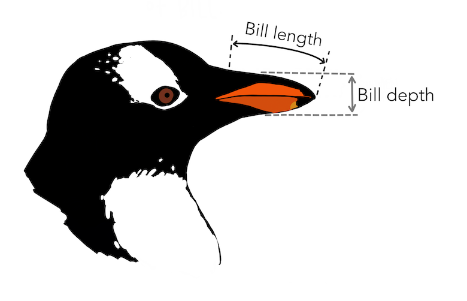

```{r}
#| include: false

library(tidyverse)
library(patchwork)
library(easystats)

options(brms.backend = "cmdstanr")

set.seed(333)
```

## Penguins - Pick your fighter!


- **Adelie**: The pebble thieves. They steal pebbles from other penguins to build their nests.
- **Chinstrap**: The power-nappers. They take thousands of microsleeps (4s) a day.
- **Gentoo**: The speedos. They can reach speeds of up to 36 km/h in the water.

::: {.fragment}

```{r}
#| echo: true

head(penguins)
```


:::: {.columns}

::::: {.column width="50%"}


:::::

::::: {.column width="50%"}



::::::

::::

:::

## How Big are these bad boys?

- What is the average `body_mass` value for each species?

::: {.fragment}

```{r}
#| echo: true

empirical_means <- penguins |> 
  summarise(Empirical_Mean = mean(body_mass, na.rm = TRUE), .by = "species")

empirical_means
```

:::

- Gentoo (speedos) > Chinstrap (power-nappers) > Adelie (Pebble thieves)
- But are they "significantly" different? 

## Marginal Means & Contrasts {.center background-color="#1A237E"}

## Model 1: Species as Predictor {background-color="#FFAB91"}

- Fit the model with `species` as a predictor and interpret the parameters

::: {.fragment}

```{r}
#| echo: true

model1 <- brms::brm(body_mass ~ species, 
                    data = penguins, refresh=0)
```

:::


::: {.fragment}

```{r}
#| echo: true

parameters::parameters(model1)
```

:::

- When a factor is used as a predictor, the first level is used as the reference level (i.e., **becomes the intercept**)
- The other levels are compared to the reference level
- **Question**: What is the average `body_mass` for "Chinstrap" penguins?
- Can we easily get the value of the outcome at each level?


## Marginal Means

::: {.columns style="font-size: 90%;"}

:::: {.column width=45%}

- A statistical model defines a relationship between the outcome and any predictor values
- It is straightforward to compute the model-based value (i.e., the **prediction**) of the outcome at each level of a factor
  - `estimate_prediction()`, `estimate_relation()`
- Model predictions can in turn be leveraged to compute **marginal means** <sup><sub>(see [Makowski et al., 2025](https://joss.theoj.org/papers/10.21105/joss.07969)</sub></sup>
- Marginal means are typically the *average predicted values* of the outcome at each level of a factor, **averaged over all other predictors / random effects** (i.e., *marginalized* for other stuff)

::::

:::: {.column width=55%}


::::: {.fragment}

```{r}
#| echo: true

modelbased::estimate_means(model1, by="species")
```

:::::

- Marginal means are conceptually (and in practice) different from **empirical means** (i.e., direct average of the observed values) because they are based on a model (and thus can better generalize, extrapolate, and take into account other predictors)
- Marginal means are a powerful tool to estimate any quantities of interest in a statistical model

::::: {.fragment}

```{r}
#| echo: true

empirical_means
```

- In this case, they are very similar to the empirical means because this is what this linear model does (estimating the mean of the outcome as a function of predictors)
- Benefit 1 of marginal means: they provide **inferential** information (CIs, etc.)

:::::

::::

:::


## Marginal Contrasts

- Benefit 2: One very useful application of marginal means is to compute **marginal contrasts** (contrasts of marginal means)

::: {.fragment}

```{r}
#| echo: true

modelbased::estimate_contrasts(model1, contrast="species")
```

:::

- What can we conclude in terms of differences?

## Visualization

- Most outputs of `modelbased` functions can be directly visualized with `plot()`

::: {.fragment}

```{r}
#| echo: true

means1 <- modelbased::estimate_means(model1, by="species", test = NULL)
plot(means1, show_data = TRUE)
```

:::

- (But often better to plot it yourself for publication-ready figures)


## Model 2: "Adjusting" for another Predictor

::: {.columns}

:::: {.column width="60%"}

```{r}
#| echo: true
#| message: false

model2 <- brms::brm(body_mass ~ species + bill_len, 
                    data = penguins, refresh=0)
```

::: {.fragment}

```{r}
#| echo: true

parameters::parameters(model2)
```

:::

::::

:::: {.column width="40%"}


:::::

:::


- How to interpret these parameters? 
- The model now estimates the effect of Species on **Petal.Length** while holding **Petal.Width** constant
  
## Model 2: Marginal Means


::: {.columns}

:::: {.column width=50%}

::::: {.fragment}

```{r}
#| echo: true

means2 <- modelbased::estimate_means(model2, by="species", test = NULL)
means2

plot(means2)
```

:::::

::::

:::: {.column width=50%}

::::: {.fragment}

```{r}
#| echo: true

means1

plot(means1)
```

:::::

::::

:::


- Why is it different?
- Marginal means here answer a different question: "What *would* be the average body mass if all penguins had the **same bill length** (specifically, the average bill length of the dataset), **assuming that the relationship between bill length and body mass is the same across species?**"

## Model 3: Interaction


```{r}
#| echo: true
#| message: false

model3 <- brms::brm(body_mass ~ species * bill_len, 
                    data = penguins, refresh=0)
```

- The interaction terms models a different relationship between bill length and  body mass across species

::: {.fragment}

```{r}
#| echo: true

means3 <- modelbased::estimate_means(model3, by="species", test = NULL)
means3

plot(means3)
```

:::

- Marginal means answers the question: "What *would* be the average body mass of different species, "controlling" for bill length, and taking into account the specific relationship between bill length and body mass of each species. 
- In general, in modern statistics, there is little reasons not to include interactions in a model. 

## Marginal Contrasts: New Answers


```{r}
#| echo: true

estimate_contrasts(model3, contrast="species", test = "pd")
```

- Contrary to our initial conclusion, all species differ significantly on body mass when controlling for bill length.

## Visualisation

```{r}
#| echo: true

pred <- estimate_relation(model3, by = c("species", "bill_len"))

ggplot(penguins, aes(x = bill_len, y = body_mass)) +
  geom_point(aes(color  = species)) +
  geom_ribbon(data = pred, aes(x = bill_len, y = Predicted, ymin = CI_low, ymax = CI_high, fill = species), alpha = 0.2) +
  geom_line(data = pred, aes(x = bill_len, y = Predicted, color = species)) +
  theme_minimal()
```

- Would the difference in body mass be significant for penguins with the same **tiny** bill?

## Varying Marginal Contrasts 

```{r}
#| out-height: "50%"

pred <- estimate_relation(model3, by = c("species", "bill_len"), preserve_range = FALSE)

p <- ggplot(penguins, aes(x = bill_len, y = body_mass)) +
  geom_point(aes(color  = species)) +
  geom_ribbon(data = pred, aes(x = bill_len, y = Predicted, ymin = CI_low, ymax = CI_high, fill = species), alpha = 0.2) +
  geom_line(data = pred, aes(x = bill_len, y = Predicted, color = species)) +
  theme_minimal()
p
```

- Contrasts can be computed explicitly at any value of the predictor (e.g., bill length = 30mm)
- In `estimate_contrasts()` (like in all other modelbased functions), the `length` argument can be used to easily specify the number of points on continuous predictors

::: {.fragment}

```{r}
#| echo: true

estimate_contrasts(model3, contrast = "species", by = "bill_len", length = 3, test = "pd")
```

:::


- Useful to understand interactions


## Marginal Effects {.center background-color="#1A237E"}

## Estimated Slopes

```{r}
#| out-height: "50%"

p
```

- What is the effect of bill length on body mass for each species?  
- The same model-based estimation logic used for means& contrasts can be applied to "slopes" (effects). 
- We can technically compute effects at any levels of predictors.


```{r}
#| echo: true

estimate_slopes(model3, slope = "bill_len", by = "species")
```


<!-- TODO: Derivatives and non-linear relationships -->

<!-- - Polynomial and Derivatives -->
<!-- - GLMs -->
<!-- - Mixed models -->


## Model Comparison {.center background-color="#1A237E"}

## Models Recap

```{r}
#| echo: true
#| eval: false

model1 <- brms::brm(body_mass ~ species,  data = penguins, refresh=0)
model2 <- brms::brm(body_mass ~ species + bill_len,  data = penguins, refresh=0)
model3 <- brms::brm(body_mass ~ species * bill_len,  data = penguins, refresh=0)
```

- Which one is better?

<!-- ## Bayes Factors -->

<!-- - It is *possible* to *estimate* Bayes Factors to compare models -->

<!-- ::: {.fragment} -->

<!-- ```{r} -->
<!-- #| echo: true -->

<!-- bayestestR::bayesfactor_models(model, model2, model3) -->
<!-- ``` -->

<!-- ::: -->

<!-- - Paradoxically, BFs are not straightforward to obtain to compare Bayesian models -->
<!--   - Typically computationally expensive -->
<!--   - Typically algorithmically complex -->
<!--   - Typically not very reliable -->
<!-- - Not necessarily the first choice as good alternatives exist -->
<!-- - Other indices of model performance?  -->


## Coefficient of Determination - R2

::: {.columns}

:::: {.column width=50%}

- R2 measures how well the model explains the data **already observed**, focusing on variance reduction
- R2 can sometimes give misleading impressions in cases of **overfitting**; a model might appear to perform very well on the training data but poorly on new data
- R2 is primarily applicable (and intuitive) to **linear models** where it corresponds to "variance explained"


::::

:::: {.column}

::::: {.fragment}

```{r}
#| echo: true

performance::r2(model1)
performance::r2(model2)
performance::r2(model3)
```

:::::

::::

:::


## ELPD

- Other "relative" indices of fit can be used that measures how well the model predicts each data point and how well it could in-theory generalize to new data
  - This quality of fit metric is called the **ELPD** *(Expected Log Pointwise Predictive Density)*
- It can be computed using 2 main procedures:
  - **WAIC** (Widely Applicable Information Criterion)
  - **LOO** (Leave-One-Out Information Criterion)
  
## ELPD - WAIC

- **WAIC** (Widely Applicable Information Criterion)
  - An index of prediction error adjusted for the number of parameters
  - It provides a **balance between model fit and complexity**, penalizing models that have too many parameters (similar to the BIC).
  - Computationally more straightforward than LOO, but might not be as accurate (more sensitive to outliers)

::: {.fragment}

```{r}
#| echo: true

loo::waic(model1)
loo::waic(model2)
loo::waic(model3)
```

:::

## What to do with these numbers?


- Note that $ELPD = -(\frac{WAIC}{2})$
- Use `loo::loo_compare()` to get the difference in ELPD between models

::: {.fragment}

```{r}
#| echo: true

results1 <- loo::loo_compare(loo::waic(model1), loo::waic(model2), loo::waic(model3))
results1
```

:::

- Shows the "best" model first


## ELPD - LOOIC

- Leave-One-Out (LOO) Cross-Validation is a method to assess model performance by estimating how well a model predicts each observation, one at a time, using the rest of the data
- Instead of refitting the model *n* times, each time leaving out one of the *n* data points, approximations like PSIS *(Pareto Smoothed Importance Sampling)* are used to avoid extensive computation
- Provides a robust measure of model's predictive accuracy (without direct complexity adjustment - but indirect through overfitting sensitivity)

::: {.fragment}

```{r}
#| echo: true

results2 <- loo::loo_compare(loo::loo(model1), loo::loo(model2), loo::loo(model3))
results2
```

:::


## Better by how much? Interpretation rules of thumb

::: {.columns}

:::: {.column width=50%}


```{r}
#| echo: true

results1
```

::::

:::: {.column width=50%}


```{r}
#| echo: true

results2
```

::::


:::

- We can focus on the ELPD difference and its SE
- The "standardized" difference ($\Delta_{ELPD} / SE$) can be interpreted as a z-score
  - $> |1.96|$ ~ p < .05
  - $> |3.29|$ ~ p < .001
  - Use `1-pnorm(|z-score|)` to get the one-tailed p-value
- But the standarized difference does not make much sense if the absolute is small ($|\Delta_{ELPD}|<4$)
  - It's not useful to say one model is likely to provide better predictions than other if the the predictions are almost the same anyways
- Reporting should include the raw ELPD difference and its SE (and eventually the z-score or *p*-value if it makes sense)

::: {.fragment}

```{r}
#| echo: true

report::report(results2)
```

:::


## Exercice {background-color="#FFAB91"}

- A researcher is interested in the relationship between the two dimensions (verbal and quantitative) of the SAT (a standardized test for college admissions), in particular whether the quantitative score is predicted by the verbal score. A colleague suggests that gender is important.
- Using the real dataset `sat.act` from the `psych` package, analyze the data and answer the question
- Load the dataset as follows:

::: {.fragment}

```{r}
#| echo: true

df <- psych::sat.act
df$gender <- as.factor(df$gender)  # gender=1: males, 2: females
```

:::


```{r}
#| echo: false
#| eval: false

summary(lm(SATQ ~ gender * SATV, data = df))

df |>
  ggplot(aes(x=SATV, y=SATQ, color=gender)) +
  geom_smooth(method="lm")
```


## Conclusion

::: {.columns}

:::: {.column width="50%" style="font-size: 75%;"}

- You have (hopefully) learned:
  - What Bayesian statistics were about, the philosophy and applications of Bayes theorem
  - The strengths and drawbacks, and the differences and similarities with other approaches
  - How to apply it using simple and less simple models
- This background knowledge helped you gain confidence about knowing where to look to learn more
- Bayesian statistics is a very rapidly evolving field
  - Challenge to teach \& learn (lots of uncertainty)
- Important to keep up-to-date with the latest developments
  - Follow the development of new and existing packages (e.g., *brms*, *rstan*, ...)
  - Follow forums, blogs and developers (e.g., Twitter, LinkedIn, ...)
- Learn by engaging with the community
  - Ask for help - it will often be helpful to people
  - Help others (share tips and tricks, little successes)

::::

:::: {.column width="50%"}


- Spread the Bayesian gospel to your fellow academics
  - But don't be a blind zealot - **think for yourselves**
  
::::: {.fragment}


:::::

::::

:::

## The End <sub><sup>(for good)</sup></sub> {.center background-color="#212121"}

::: {.columns}

:::: {.column width="30%"}

*Thank you!*

::::

:::: {.column width="70%"}


