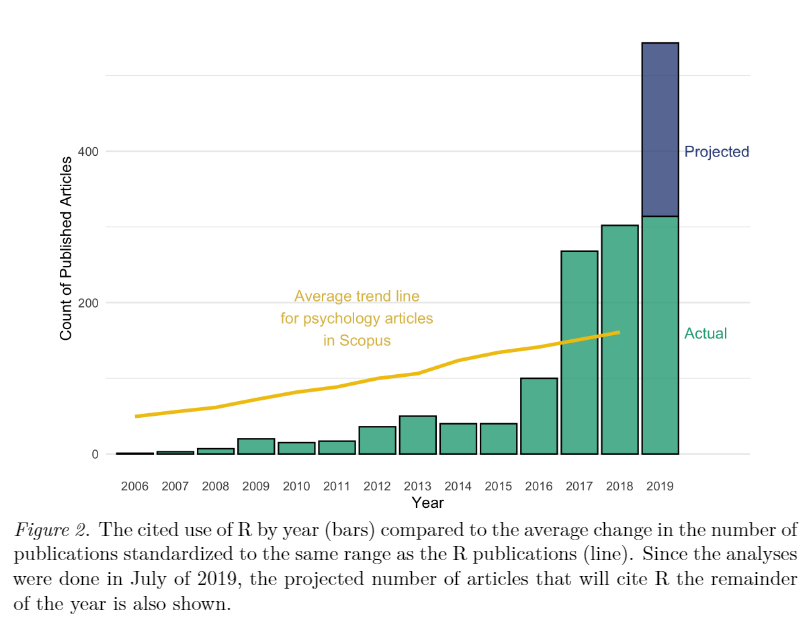
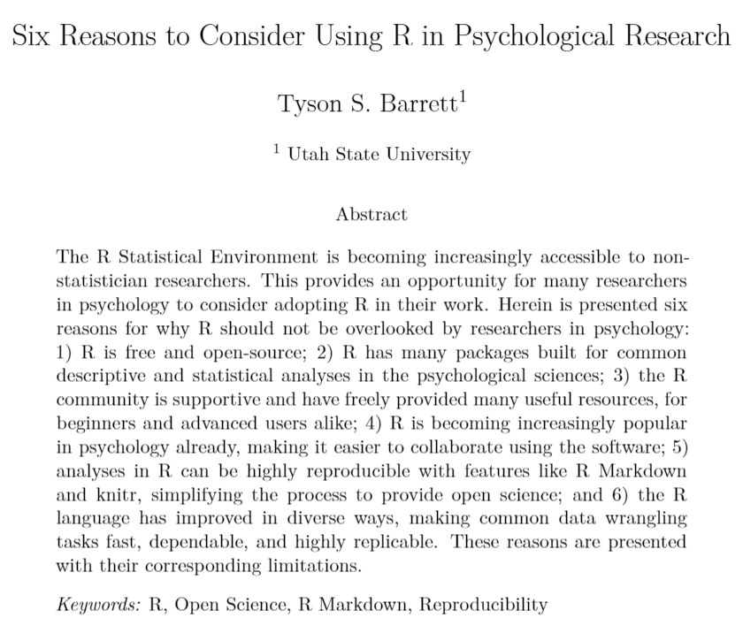

```{r setup, include=FALSE}
knitr::opts_chunk$set(echo = FALSE)

library(emo)
```


## Prerequisites {.build}

- Install necessary packages 

```{r echo=TRUE, message=FALSE, warning=FALSE, eval=FALSE}
install.packages(c("devtools", "tidyverse", "knitr", 
                   "lme4", "plotly", "BayesFactor", "rstanarm"))
devtools::install_github("easystats/easystats")
```

- Check if packages installed 

```{r echo=TRUE, message=FALSE, warning=FALSE, eval=FALSE}
library(tidyverse)
library(easystats)
```

- Download the 'emotion' dataset in the `materials` folder at https://github.com/DominiqueMakowski/teaching

<!-- https://raw.githubusercontent.com/DominiqueMakowski/teaching/master/R/2019_09_CBL_workshop/materials/emotion.csv -->

## Outline

1. Conceptual intro
2. Tools (R, Rstudio...)
3. Packages and data
4. Basic tests (correlations, *t*-tests, ANOVAs)
5. Regressions (GLMs)
6. Mixed Models
7. Taste of Bayes


## About me {.build}

- I am not a statistician
- I am not a programmer
- I am not a computer scientist
- I am not a geek *(originally...)*

## About you {.build}

- Programming?
- SPSS? MatLab? Python? ...

## Why R? 

- To catch up with the trend

{width=75%}

<!-- ## Why R? -->
<!-- {width=90%} -->


## Why R?

- To catch up with the trend

{width=95%}

<!-- ```{r echo = FALSE, warning=FALSE, message=FALSE} -->
<!-- library(tidyverse) -->

<!-- read.csv("scripts/citations.csv") %>%  -->
<!--   ggplot(aes(x = Year, y = Citations, color = Software)) + -->
<!--   geom_line() + -->
<!--   scale_y_continuous(labels = scales::number) -->
<!-- ``` -->


## Why R?
### **R *vs.* SPSS, Excel, SAS...**

- Free
- Open-source
- Cross-platform
- Safe for your data
- Incredible community (twitter, stackoverflow, github...)
- Gold standart accross science
- Cutting-edge statistics and methods
- Reproducible research


## Why R?
### **R *vs.* Python**

- Python for signal processing, machine learning and other applications
- R for data manipulation, statistics, visualisation and communication ([1](https://neuropsychology.shinyapps.io/patientassessmentapp/), [2](https://malco.io/), [3](https://github.com/easystats/easystats/blob/master/publications/makowski_2019_bayesian/manuscript/preprint.pdf),  [4](https://github.com/DominiqueMakowski/teaching/blob/master/R/2019_09_CBL_workshop/2019_09_CBL_workshop.Rmd))<!-- websites, presentations, pdf reports -->
- Use both!

## Long road ahead {.build}

- No course or workshop will teach you R
- Just dive in and try to accomplish a goal
- Steep learning curve
- Many frustrating moments
- People think "*now it's not the best time for me to learn it, because I have to deliver X. I'll do it when* `<insertSomething>`" 
- Every minute invested in learning R will be worth it
- You won't regret it!
- Biggest blockers: **fear and apprehension**


## Old R *vs.* new R {.build}

{width=15%}

```{r echo = TRUE, eval=FALSE}
# base R
data[data["col1"] < 3, c("col2", "col3" )]
```

{width=15%}

```{r echo = TRUE, eval=FALSE}
library(tidyverse)

data %>%
  filter(col1 < 3) %>%
  select(col2, col3) 
```


## R and R studio

- Hands on!
- Editor and Console
- Theme
- Create an Rmarkdown file (`chunk output in console`)
- `R` chunks vs. `markdown` text
- Remove the first code chunk
- Try clicking on `Knit`
- Shortcuts
  - `CTLR + ENTER`: Run the selection
  - `CTRL + SHIFT + C`: Comment selection
  - `CTRL + SHIFT + M`: Ceci n'est pas une pipe `%>%`

## Install and Import Packages `r emo::ji("package")` {.build}

- Everything is done through **packages**
- Packages provide **new functions**
- The main challenge in R is not *"if something is possible"*, but rather *"what is the package that implements it the best"* (importance of staying "tuned", r-bloggers, twitter, github...)
- Packages have to be *installed* only once, and *loaded* whenever you want to use their functions

```{r echo=TRUE, message=FALSE, warning=FALSE}
# Load the package
library(tidyverse)
```

## Discover functions and documentation {.build}

- **Don't learn the functions!!!** Know what you want to do, and search for it (on google)

```{r echo = TRUE, eval=FALSE}
anova()
```

- Show documentation (`F1` or `?function`)
- Google the CRAN repository page of the package ([`"bayestestR CRAN"`](https://www.google.com/search?q=bayestestR+CRAN&rlz=1C1CHBD_frSG849SG849&oq=bayestestR+CRAN&aqs=chrome..69i57j69i60l3j69i59.706j0j7&sourceid=chrome&ie=UTF-8))
- Check out the manual, the Github page or the *vignettes*


## Summary: Where to find help {.build}

- Google
- Stack Overflow
- Google
- Github (create issues)
- Stack Overflow
- Really, Stack Overflow


## Load data {.build}

- **Session -> Set Working Directory -> to Source File Location**
- A classic code line containg a *function* (e.g., `f()`), to which we provide inputs via *arguments* (e.g., `f(x)`) and that outputs something that be stored in an object (e.g., `y <- f(x)`)
- There are usually multiple arguments to function (e.g., `y <- f(x, great_workshop=TRUE, great_audience=TRUE)`)
- Assignments are traditionnaly done with `<-`, but `=` is equivalent

```{r echo=TRUE, message=FALSE, warning=FALSE}
df <- read.csv("materials/emotion.csv")
```

<!-- df <- read.csv("https://raw.githubusercontent.com/DominiqueMakowski/teaching/master/R/2019_09_CBL_workshop/materials/emotion.csv") -->

- Check the documentation of the function. Many other possible arguments with **default** values, that we can override.

```{r echo=TRUE, message=FALSE, warning=FALSE}
df <- read.csv("materials/emotion.csv", stringsAsFactors = FALSE)
```

## Explore the data {.build}

- Click on the object in the **Environment** panel to see it
- If the output of a function is not stored in an object, R will *print* it

```{r echo=TRUE, message=FALSE, warning=FALSE}
df
```


## Explore the data {.build}

- Useful functions to describe objects, such as `summary()` or `report()` (in the easystats collection)

```{r echo=TRUE, message=FALSE, warning=FALSE, results='hide'}
library(easystats)
```
```{r echo=TRUE, message=FALSE, warning=FALSE}
report(df)
```

## Explore the data {.build}

- Young and healthy adults watched pictures, that were either **Negative** or **Neutral** (the **`condition` variable**)
- For each picture (48 different items), they had to rate the **Intensity** (arousal) and **Valence** (positive - negative) of the emotion that they felt, as well as the **Self-Relevance** (the "autobiographical link", i.e., how do they personally relate to the content of the picture)
- 30 min after the presentation, participants had to **recall** the images


## Explore the data {.build}

- Report the sample

```{r echo=TRUE, message=FALSE, warning=FALSE}
report_participants(df, age = "Age", 
                    sex = "Sex", 
                    participant = "Participant_ID")
```

## Data Manipulation {.build}

- Summarize variables by condition
- The pipes (`%>%`) make the workflow easier to read (take this, do that, then that, ...)

```{r echo=TRUE, message=FALSE, warning=FALSE}
df_condition <- df %>% 
  group_by(Participant_ID, Condition) %>% 
  summarise(Arousal = mean(Arousal),
            SelfRelevance = mean(SelfRelevance),
            Sex = unique(Sex))
``` 


## Data Manipulation

```{r echo=TRUE, message=FALSE, warning=FALSE}
head(df_condition)
```

## Data Manipulation {.build}

- From *long* format to *wide*

```{r echo=TRUE, message=FALSE, warning=FALSE}
df_sub <- df_condition %>% 
  pivot_wider(names_from = "Condition",
              values_from = c("Arousal", "SelfRelevance"))
df_sub
```

## Accessing things in objects {.build}

- Use the dollar `$` sign to access a specific variable of a dataframe

```{r echo=TRUE, message=FALSE, warning=FALSE}
df_sub$Arousal_Negative
median(df_sub$Arousal_Negative)
median(df_sub$Arousal_Neutral)
```

## *t*-tests {.build}

- *t*-tests can be performed using the `t.test` function

```{r echo=TRUE, message=FALSE, warning=FALSE}
t.test(df_sub$Arousal_Negative, df_sub$Arousal_Neutral)
```


## *t*-tests {.build}

- The `report()` function can also be used in this case

```{r echo=TRUE, message=FALSE, warning=FALSE}
t.test(df_sub$Arousal_Negative, df_sub$Arousal_Neutral) %>% 
  report()
```

- About *pipes* (`%>%`):

```{r echo=TRUE, message=FALSE, warning=FALSE, eval=FALSE}
f(x, something=TRUE)
x %>% f(something=TRUE)
```

```{r echo=TRUE, message=FALSE, warning=FALSE}
result <- t.test(df_sub$Arousal_Negative, df_sub$Arousal_Neutral)
report(result)
```


## Correlation {.build}

- Correlations can be done in a similar way

```{r echo=TRUE, message=FALSE, warning=FALSE}
cor.test(df_sub$SelfRelevance_Negative, df_sub$Arousal_Negative)
```

## Bayesian correlation {.build}

- Need to load the `BayesFactor` package (case-sensitive!)

```{r echo=TRUE, message=FALSE, warning=FALSE}
library(BayesFactor)

correlationBF(df_sub$SelfRelevance_Negative, df_sub$Arousal_Negative) %>% 
  model_parameters()
```


## Correlation Plot {.build}

```{r echo=TRUE, message=FALSE, warning=FALSE}
p <- df_sub %>% 
  ggplot(aes(x = SelfRelevance_Negative, y = Arousal_Negative)) +
  geom_point() +
  geom_smooth(method = "lm")
p
```


## Interactive plots {.build}

- Try this:

```{r echo=TRUE, message=FALSE, warning=FALSE, eval=FALSE}
library(plotly)
ggplotly(p)
```

## Conclusion {.build}

- Negative pictures elicit significantly more emotional **arousal**
- Anecdotal evidence for a positive correlation between the **self-relevance** and **arousal** for negative pictures
- New hypothesis: Could this be modulated by **Sex**?
- How? An ANOVA `Sex * self-relevance`?

## Create New Variables {.build}

```{r echo=TRUE, message=FALSE, warning=FALSE}
df_sub$SelfRelevance_Binary <- ifelse(
  df_sub$SelfRelevance_Negative > mean(df_sub$SelfRelevance_Negative),
  "High", "Low")
```
```{r echo=TRUE, message=FALSE, warning=FALSE}
report(df_sub$SelfRelevance_Binary)
```


## ANOVAs {.build}

- Done with the `aov()` function (Analysis Of Variance)
- The first argument is a formula `y ~ a + b` 

```{r echo=TRUE, message=FALSE, warning=FALSE}
model <- aov(Arousal_Negative ~ Sex * SelfRelevance_Binary, data = df_sub)
```

## ANOVAs {.build}

```{r echo=TRUE, message=FALSE, warning=FALSE}
result <- report(model)
result
as.data.frame(result)
```

## Boxplots {.build}

```{r echo=TRUE, message=FALSE, warning=FALSE}
df_sub %>% 
  ggplot(aes(x = SelfRelevance_Binary, y = Arousal_Negative, fill = Sex)) +
  geom_boxplot()
```

## Boxplots (nicer) {.build}

- Reverse x-axis Order, tweak colors 

```{r echo=TRUE, message=FALSE, warning=FALSE}
df_sub %>% 
  ggplot(aes(x = fct_rev(SelfRelevance_Binary), y = Arousal_Negative, fill = Sex)) +
  geom_boxplot() +
  theme_modern() +
  scale_fill_manual(values = c("pink", "lightblue"))
```


## Regressions {.build}

- Most of the "tests" taught *are* linear models (https://lindeloev.github.io/tests-as-linear/)
- Much more informative and powerful

```{r echo=TRUE, message=FALSE, warning=FALSE}
model <- aov(Arousal_Negative ~ Sex * SelfRelevance_Binary, data = df_sub)
```
```{r echo=TRUE, message=FALSE, warning=FALSE}
model <- lm(Arousal_Negative ~ Sex * SelfRelevance_Binary, data = df_sub)
anova(model)
```

## Regressions

```{r echo=TRUE, message=FALSE, warning=FALSE}
result <- report(model)
result
as.data.frame(result)
```

## Regressions {.build}

- Can mix continuous and categorical variables

```{r echo=TRUE, message=FALSE, warning=FALSE}
model <- lm(Arousal_Negative ~ Sex * SelfRelevance_Negative, data = df_sub) 

model %>% 
  report() %>% 
  as.data.frame()
```

## Model Visualisation (Optional) {.build}

- A model can best be understood when visualised 

```{r echo=TRUE, message=FALSE, warning=FALSE}
model %>% 
  estimate_link() %>% 
  ggplot(aes(y = Predicted, x = SelfRelevance_Negative)) + 
  geom_ribbon(aes(ymin=CI_low, ymax=CI_high, fill=Sex), alpha = 0.3) +
  geom_line(aes(color = Sex)) 
  ylab("Predicted Arousal")
```

## Model Visualisation (with points) {.build}

```{r echo=TRUE, message=FALSE, warning=FALSE}
model %>% 
  estimate_link() %>% 
  ggplot(aes(y = Predicted, x = SelfRelevance_Negative)) + 
  geom_ribbon(aes(ymin=CI_low, ymax=CI_high, fill=Sex), alpha = 0.3) +
  geom_line(aes(color = Sex)) + 
  geom_point(data = df_sub, aes(y = Arousal_Negative, color = Sex))
```


## Adding the Condition {.build}

- Let's drop the sex but investigate the whole set of pictures (including neutral)
- Is there a relationship between self-relevance and arousal for the neutral pictures?

```{r echo=TRUE, message=FALSE, warning=FALSE}
lm(Arousal ~ Condition * SelfRelevance, data = df_condition) %>% 
  report() %>% 
  as.data.frame()
```

## Mixed Models {.build}

- There is a hierarchical (i.e., grouped) structure

```{r echo=TRUE, message=FALSE, warning=FALSE}
library(lme4)

model <- lmer(Arousal ~ Condition * SelfRelevance + (1|Participant_ID), 
              data = df_condition)

model %>% 
  report() %>% 
  as.data.frame()
```

## Predicting the Recall of Items {.build}

- Investigate the determinants of item recall

```{r echo=TRUE, message=FALSE, warning=FALSE}
report(df)
```

## A Logistic Mixed Model {.build}

- Investigate the determinants of item recall

```{r echo=TRUE, message=FALSE, warning=FALSE}
model <- glmer(Recall ~ Condition * SelfRelevance + 
                 (1|Participant_ID) + (1|Item_Name), 
               family = "binomial", data = df)
report(model) %>% 
  as.data.frame()
```

## A Bayesian Logistic Mixed Model {.build}

```{r echo=TRUE, message=FALSE, warning=FALSE, eval=FALSE}
library(rstanarm)

model <- stan_glmer(Recall ~ Condition * SelfRelevance + 
                      (1|Participant_ID) + (1|Item_Name), 
                    family = "binomial", data = df)
```

## A Bayesian Logistic Mixed Model

```{r echo=TRUE, message=FALSE, warning=FALSE, results="hide"}
library(rstanarm)

model <- stan_glmer(Recall ~ Condition * SelfRelevance + 
                      (1|Participant_ID) + (1|Item_Name), 
                    family = "binomial", data = df, iter = 500)
```

## A Bayesian Logistic Mixed Model

```{r echo=TRUE, message=FALSE, warning=FALSE}
report(model) %>% 
  as.data.frame()
```

## Visualisation

```{r echo=TRUE, message=FALSE, warning=FALSE}
model %>% 
  estimate_link() %>% 
  ggplot(aes(x = SelfRelevance, y = Predicted)) +
  geom_ribbon(aes(ymin = CI_low, ymax = CI_high, fill = Condition), alpha = 0.2) +
  geom_line(aes(color = Condition), size = 1)  + 
  theme_modern() +
  ylab("Probability of Recalling the Item")
```


## Resources {.build}

- https://easystats.github.io/blog/resources/
- Bayesian tutorial: https://easystats.github.io/bayestestR/
- Structural modelling: https://easystats.github.io/parameters/articles/efa_cfa.html
- **Thank you!**


<font size="4">`dom.makowski@gmail.com`</font> 
