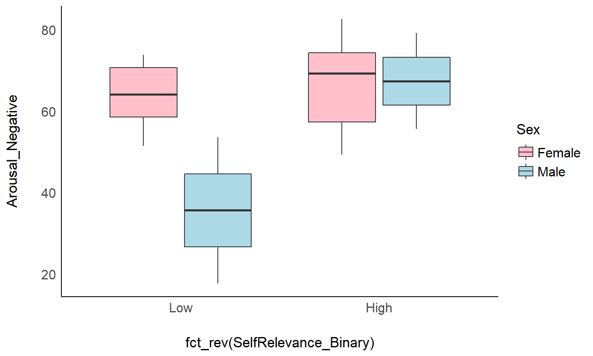
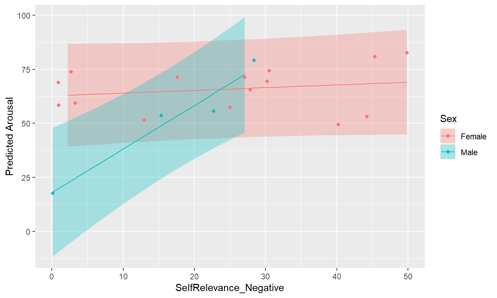
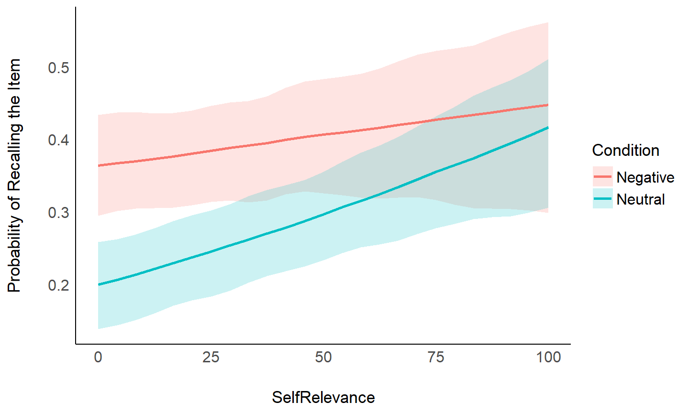

## Prerequisites

- Install necessary packages


- Download the 'emotion' dataset in the `materials` folder at https://github.com/DominiqueMakowski/teaching

<!-- https://raw.githubusercontent.com/DominiqueMakowski/teaching/master/R/2019_09_CBL_workshop/materials/emotion.csv -->

## Outline

1. Conceptual intro
2. Tools (R, Rstudio...)
3. Packages and data
4. Basic tests (correlations, *t*-tests, ANOVAs)
5. Regressions (GLMs)
6. Mixed Models
7. Taste of Bayes


## About me

- I am not a statistician
- I am not a programmer
- I am not a computer scientist
- I am not a geek *(originally...)*

## Why R? {.build}

- To catch up with the trend

{width=90%}

## Why R?

{width=90%}


## Why R?
### **R *vs.* SPSS, Excel, SAS...**

{width=100%}

<!-- ```{r echo = FALSE, warning=FALSE, message=FALSE} -->
<!-- library(tidyverse) -->

<!-- read.csv("scripts/citations.csv") %>%  -->
<!--   ggplot(aes(x = Year, y = Citations, color = Software)) + -->
<!--   geom_line() + -->
<!--   scale_y_continuous(labels = scales::number) -->
<!-- ``` -->


## Why R?
### **R *vs.* SPSS, Excel, SAS...**

- Free
- Open-source
- Cross-platform
- Safe for your data
- Incredible community (twitter, stackoverflow, github...)
- Gold standart accross science
- Cutting-edge statistics and methods
- Reproducible research


## Why R?
### **R *vs.* Python**

- Python for signal processing, machine learning and other applications
- R for data manipulation, statistics, visualisation and communication ([1](https://neuropsychology.shinyapps.io/patientassessmentapp/), [2](https://malco.io/), [3](https://github.com/DominiqueMakowski/teaching/blob/master/R/2019_09_CBL_workshop/2019_09_CBL_workshop.Rmd))<!-- websites, presentations, pdf reports -->
- Use both!

## Long road ahead {.build}

- Steep learning curve
- No course or workshop will teach you R
- Just dive in and try to accomplish a goal
- Many frustrating moments
- People think "*now it's not the best time for me to learn it, because I have to deliver X. I'll do it when* `<insertSomething>`" 
- Every minute invested in learning R will be worth it
- You won't regret it!


## Old R *vs.* new R {.build}

{width=15%}


```r
# base R
data[data["col1"] < 3, c("col2", "col3" )]
```

{width=15%}


```r
library(tidyverse)

data %>%
  filter(col1 < 3) %>%
  select(col2, col3) 
```


## R and R studio

- Hands on!
- Editor and Console
- Theme
- Create an Rmarkdown file (`chunk output in console`)
- `R` chunks vs. `markdown` text
- Try clicking on `Knit`
- Shortcuts
  - `CTLR + ENTER`: Run the selection
  - `CTRL + SHIFT + C`: Comment selection
  - `CTRL + SHIFT + M`: Ceci n'est pas une pipe `%>%`

## Install and Import Packages 📦 {.build}

- Everything is done through **packages**
- Packages provide **new functions**
- The main challenge in R is not *"if something is possible"*, but rather *"what is the package that implements it the best"* (importance of sating "tuned", r-bloggers, twitter, github...)
- Packages have to be *installed* only once, and *loaded* whenever you want to use their functions


```r
# Load the package
library(tidyverse)
```

## Discover functions and documentation {.build}

- **Don't learn the functions!!!** Know what you want to do, and search for it
- Browse functions through autocompletion (`<TAB>`)


```r
bayestestR::hdi()
```

- Show documentation (`F1` or `?function`)
- Google the CRAN repository page of the package ([`"bayestestR CRAN"`](https://www.google.com/search?q=bayestestR+CRAN&rlz=1C1CHBD_frSG849SG849&oq=bayestestR+CRAN&aqs=chrome..69i57j69i60l3j69i59.706j0j7&sourceid=chrome&ie=UTF-8))
- Check out the manual, the Github page or the *vignettes*

## Load data {.build}

- A classic code line containg a *function* (`f()`), to which we provide inputs via *arguments* (`f(x)`) and that outputs something that be stored in an object (`y <- f(x)`)


```r
df <- read.csv("materials/emotion.csv")
```

<!-- df <- read.csv("https://raw.githubusercontent.com/DominiqueMakowski/teaching/master/R/2019_09_CBL_workshop/materials/emotion.csv") -->

- Check the documentation of the function. Many other possible arguments with **default** values, that we can override.


```r
df <- read.csv("materials/emotion.csv", stringsAsFactors = FALSE)
```

- Click on the object in the **Environment** panel to see it
- If the output of a function is not stored in an object, R will *print* it.


```r
df
```

```
##     Participant_ID      Age    Sex Item_Category    Item_Name Trial_Order
## 1               1S 18.38467 Female        People People_158_h           1
## 2               1S 18.38467 Female         Faces  Faces_045_h           2
## 3               1S 18.38467 Female        People People_138_h           3
## 4               1S 18.38467 Female        People People_148_h           4
## 5               1S 18.38467 Female         Faces  Faces_315_h           5
## 6               1S 18.38467 Female         Faces  Faces_224_h           6
## 7               1S 18.38467 Female         Faces  Faces_016_h           7
## 8               1S 18.38467 Female         Faces  Faces_170_h           8
## 9               1S 18.38467 Female         Faces  Faces_362_v           9
## 10              1S 18.38467 Female         Faces  Faces_366_h          10
## 11              1S 18.38467 Female        People People_226_h          11
## 12              1S 18.38467 Female        People People_201_v          12
## 13              1S 18.38467 Female        People People_149_h          13
## 14              1S 18.38467 Female         Faces  Faces_057_h          14
## 15              1S 18.38467 Female         Faces  Faces_364_v          15
## 16              1S 18.38467 Female        People People_222_h          16
## 17              1S 18.38467 Female         Faces  Faces_319_v          17
## 18              1S 18.38467 Female        People People_128_h          18
## 19              1S 18.38467 Female        People People_184_h          19
## 20              1S 18.38467 Female        People People_163_v          20
## 21              1S 18.38467 Female         Faces  Faces_293_h          21
## 22              1S 18.38467 Female         Faces  Faces_010_h          22
## 23              1S 18.38467 Female        People People_038_h          23
## 24              1S 18.38467 Female        People People_208_h          24
## 25              1S 18.38467 Female        People People_056_h          25
## 26              1S 18.38467 Female        People People_238_h          26
## 27              1S 18.38467 Female        People People_246_h          27
## 28              1S 18.38467 Female        People People_102_h          28
## 29              1S 18.38467 Female         Faces  Faces_343_h          29
## 30              1S 18.38467 Female        People People_220_h          30
## 31              1S 18.38467 Female         Faces  Faces_341_h          31
## 32              1S 18.38467 Female         Faces  Faces_251_v          32
## 33              1S 18.38467 Female         Faces  Faces_196_h          33
## 34              1S 18.38467 Female         Faces  Faces_064_h          34
## 35              1S 18.38467 Female         Faces  Faces_365_v          35
## 36              1S 18.38467 Female        People People_211_v          36
## 37              1S 18.38467 Female        People People_237_h          37
## 38              1S 18.38467 Female         Faces  Faces_367_h          38
## 39              1S 18.38467 Female         Faces  Faces_172_h          39
## 40              1S 18.38467 Female         Faces  Faces_207_h          40
## 41              1S 18.38467 Female        People People_114_h          41
## 42              1S 18.38467 Female         Faces  Faces_149_v          42
## 43              1S 18.38467 Female        People People_227_h          43
## 44              1S 18.38467 Female        People People_097_h          44
## 45              1S 18.38467 Female         Faces  Faces_371_v          45
## 46              1S 18.38467 Female        People People_104_h          46
## 47              1S 18.38467 Female         Faces  Faces_195_v          47
## 48              1S 18.38467 Female        People People_063_h          48
## 49              2S 23.59754 Female        People People_056_h           1
## 50              2S 23.59754 Female         Faces  Faces_045_h           2
## 51              2S 23.59754 Female        People People_184_h           3
## 52              2S 23.59754 Female         Faces  Faces_010_h           4
## 53              2S 23.59754 Female        People People_128_h           5
## 54              2S 23.59754 Female        People People_102_h           6
## 55              2S 23.59754 Female        People People_149_h           7
## 56              2S 23.59754 Female         Faces  Faces_149_v           8
## 57              2S 23.59754 Female        People People_104_h           9
## 58              2S 23.59754 Female         Faces  Faces_319_v          10
## 59              2S 23.59754 Female        People People_138_h          11
## 60              2S 23.59754 Female         Faces  Faces_172_h          12
## 61              2S 23.59754 Female         Faces  Faces_315_h          13
## 62              2S 23.59754 Female        People People_246_h          14
## 63              2S 23.59754 Female        People People_237_h          15
## 64              2S 23.59754 Female         Faces  Faces_293_h          16
## 65              2S 23.59754 Female         Faces  Faces_343_h          17
## 66              2S 23.59754 Female         Faces  Faces_196_h          18
## 67              2S 23.59754 Female         Faces  Faces_064_h          19
## 68              2S 23.59754 Female         Faces  Faces_207_h          20
## 69              2S 23.59754 Female        People People_038_h          21
## 70              2S 23.59754 Female         Faces  Faces_170_h          22
## 71              2S 23.59754 Female         Faces  Faces_341_h          23
## 72              2S 23.59754 Female        People People_222_h          24
## 73              2S 23.59754 Female         Faces  Faces_016_h          25
## 74              2S 23.59754 Female        People People_208_h          26
## 75              2S 23.59754 Female        People People_097_h          27
## 76              2S 23.59754 Female        People People_227_h          28
## 77              2S 23.59754 Female        People People_211_v          29
## 78              2S 23.59754 Female        People People_063_h          30
## 79              2S 23.59754 Female         Faces  Faces_224_h          31
## 80              2S 23.59754 Female        People People_163_v          32
## 81              2S 23.59754 Female         Faces  Faces_371_v          33
## 82              2S 23.59754 Female        People People_148_h          34
## 83              2S 23.59754 Female        People People_158_h          35
## 84              2S 23.59754 Female         Faces  Faces_365_v          36
## 85              2S 23.59754 Female         Faces  Faces_251_v          37
## 86              2S 23.59754 Female        People People_238_h          38
## 87              2S 23.59754 Female        People People_201_v          39
## 88              2S 23.59754 Female        People People_226_h          40
## 89              2S 23.59754 Female         Faces  Faces_195_v          41
## 90              2S 23.59754 Female         Faces  Faces_366_h          42
## 91              2S 23.59754 Female         Faces  Faces_367_h          43
## 92              2S 23.59754 Female        People People_114_h          44
## 93              2S 23.59754 Female         Faces  Faces_364_v          45
## 94              2S 23.59754 Female        People People_220_h          46
## 95              2S 23.59754 Female         Faces  Faces_362_v          47
## 96              2S 23.59754 Female         Faces  Faces_057_h          48
## 97              3S 22.11910 Female        People People_184_h           1
## 98              3S 22.11910 Female         Faces  Faces_362_v           2
## 99              3S 22.11910 Female         Faces  Faces_016_h           3
## 100             3S 22.11910 Female        People People_227_h           4
## 101             3S 22.11910 Female        People People_238_h           5
## 102             3S 22.11910 Female        People People_102_h           6
## 103             3S 22.11910 Female         Faces  Faces_196_h           7
## 104             3S 22.11910 Female         Faces  Faces_371_v           8
## 105             3S 22.11910 Female         Faces  Faces_057_h           9
## 106             3S 22.11910 Female         Faces  Faces_343_h          10
## 107             3S 22.11910 Female         Faces  Faces_010_h          11
## 108             3S 22.11910 Female        People People_226_h          12
## 109             3S 22.11910 Female         Faces  Faces_319_v          13
## 110             3S 22.11910 Female        People People_063_h          14
## 111             3S 22.11910 Female         Faces  Faces_366_h          15
## 112             3S 22.11910 Female        People People_237_h          16
## 113             3S 22.11910 Female         Faces  Faces_045_h          17
## 114             3S 22.11910 Female         Faces  Faces_365_v          18
## 115             3S 22.11910 Female         Faces  Faces_251_v          19
## 116             3S 22.11910 Female         Faces  Faces_195_v          20
## 117             3S 22.11910 Female        People People_114_h          21
## 118             3S 22.11910 Female         Faces  Faces_315_h          22
## 119             3S 22.11910 Female         Faces  Faces_341_h          23
## 120             3S 22.11910 Female        People People_038_h          24
## 121             3S 22.11910 Female        People People_056_h          25
## 122             3S 22.11910 Female         Faces  Faces_172_h          26
## 123             3S 22.11910 Female         Faces  Faces_149_v          27
## 124             3S 22.11910 Female        People People_149_h          28
## 125             3S 22.11910 Female        People People_163_v          29
## 126             3S 22.11910 Female         Faces  Faces_364_v          30
## 127             3S 22.11910 Female        People People_128_h          31
## 128             3S 22.11910 Female         Faces  Faces_064_h          32
## 129             3S 22.11910 Female         Faces  Faces_224_h          33
## 130             3S 22.11910 Female        People People_208_h          34
## 131             3S 22.11910 Female         Faces  Faces_170_h          35
## 132             3S 22.11910 Female        People People_246_h          36
## 133             3S 22.11910 Female         Faces  Faces_367_h          37
## 134             3S 22.11910 Female         Faces  Faces_293_h          38
## 135             3S 22.11910 Female        People People_201_v          39
## 136             3S 22.11910 Female        People People_211_v          40
## 137             3S 22.11910 Female        People People_158_h          41
## 138             3S 22.11910 Female         Faces  Faces_207_h          42
## 139             3S 22.11910 Female        People People_148_h          43
## 140             3S 22.11910 Female        People People_097_h          44
## 141             3S 22.11910 Female        People People_222_h          45
## 142             3S 22.11910 Female        People People_220_h          46
## 143             3S 22.11910 Female        People People_104_h          47
## 144             3S 22.11910 Female        People People_138_h          48
## 145             4S 21.93292 Female        People People_148_h           1
## 146             4S 21.93292 Female        People People_102_h           2
## 147             4S 21.93292 Female        People People_211_v           3
## 148             4S 21.93292 Female         Faces  Faces_367_h           4
## 149             4S 21.93292 Female         Faces  Faces_365_v           5
## 150             4S 21.93292 Female        People People_226_h           6
## 151             4S 21.93292 Female        People People_237_h           7
## 152             4S 21.93292 Female         Faces  Faces_170_h           8
## 153             4S 21.93292 Female         Faces  Faces_366_h           9
## 154             4S 21.93292 Female        People People_158_h          10
## 155             4S 21.93292 Female         Faces  Faces_315_h          11
## 156             4S 21.93292 Female        People People_227_h          12
## 157             4S 21.93292 Female        People People_138_h          13
## 158             4S 21.93292 Female         Faces  Faces_207_h          14
## 159             4S 21.93292 Female        People People_184_h          15
## 160             4S 21.93292 Female        People People_201_v          16
## 161             4S 21.93292 Female         Faces  Faces_195_v          17
## 162             4S 21.93292 Female        People People_038_h          18
## 163             4S 21.93292 Female         Faces  Faces_319_v          19
## 164             4S 21.93292 Female         Faces  Faces_341_h          20
## 165             4S 21.93292 Female        People People_128_h          21
## 166             4S 21.93292 Female        People People_104_h          22
## 167             4S 21.93292 Female        People People_063_h          23
## 168             4S 21.93292 Female        People People_246_h          24
## 169             4S 21.93292 Female         Faces  Faces_224_h          25
## 170             4S 21.93292 Female        People People_238_h          26
## 171             4S 21.93292 Female        People People_220_h          27
## 172             4S 21.93292 Female         Faces  Faces_172_h          28
## 173             4S 21.93292 Female         Faces  Faces_362_v          29
## 174             4S 21.93292 Female         Faces  Faces_016_h          30
## 175             4S 21.93292 Female         Faces  Faces_010_h          31
## 176             4S 21.93292 Female         Faces  Faces_064_h          32
## 177             4S 21.93292 Female        People People_149_h          33
## 178             4S 21.93292 Female         Faces  Faces_251_v          34
## 179             4S 21.93292 Female         Faces  Faces_343_h          35
## 180             4S 21.93292 Female         Faces  Faces_045_h          36
## 181             4S 21.93292 Female         Faces  Faces_149_v          37
## 182             4S 21.93292 Female         Faces  Faces_196_h          38
## 183             4S 21.93292 Female        People People_056_h          39
## 184             4S 21.93292 Female         Faces  Faces_364_v          40
## 185             4S 21.93292 Female        People People_163_v          41
## 186             4S 21.93292 Female        People People_097_h          42
## 187             4S 21.93292 Female         Faces  Faces_057_h          43
## 188             4S 21.93292 Female        People People_114_h          44
## 189             4S 21.93292 Female         Faces  Faces_293_h          45
## 190             4S 21.93292 Female        People People_208_h          46
## 191             4S 21.93292 Female         Faces  Faces_371_v          47
## 192             4S 21.93292 Female        People People_222_h          48
## 193             5S 18.70500 Female        People People_128_h           1
## 194             5S 18.70500 Female        People People_038_h           2
## 195             5S 18.70500 Female         Faces  Faces_315_h           3
## 196             5S 18.70500 Female        People People_063_h           4
## 197             5S 18.70500 Female         Faces  Faces_057_h           5
## 198             5S 18.70500 Female        People People_114_h           6
## 199             5S 18.70500 Female         Faces  Faces_371_v           7
## 200             5S 18.70500 Female         Faces  Faces_365_v           8
## 201             5S 18.70500 Female        People People_138_h           9
## 202             5S 18.70500 Female        People People_102_h          10
## 203             5S 18.70500 Female         Faces  Faces_224_h          11
## 204             5S 18.70500 Female         Faces  Faces_319_v          12
## 205             5S 18.70500 Female         Faces  Faces_207_h          13
## 206             5S 18.70500 Female         Faces  Faces_364_v          14
## 207             5S 18.70500 Female         Faces  Faces_293_h          15
## 208             5S 18.70500 Female        People People_104_h          16
## 209             5S 18.70500 Female         Faces  Faces_341_h          17
## 210             5S 18.70500 Female         Faces  Faces_343_h          18
## 211             5S 18.70500 Female        People People_201_v          19
## 212             5S 18.70500 Female        People People_238_h          20
## 213             5S 18.70500 Female         Faces  Faces_251_v          21
## 214             5S 18.70500 Female        People People_220_h          22
## 215             5S 18.70500 Female         Faces  Faces_045_h          23
## 216             5S 18.70500 Female        People People_158_h          24
## 217             5S 18.70500 Female        People People_222_h          25
## 218             5S 18.70500 Female         Faces  Faces_149_v          26
## 219             5S 18.70500 Female        People People_097_h          27
## 220             5S 18.70500 Female        People People_226_h          28
## 221             5S 18.70500 Female         Faces  Faces_170_h          29
## 222             5S 18.70500 Female        People People_211_v          30
## 223             5S 18.70500 Female         Faces  Faces_367_h          31
## 224             5S 18.70500 Female         Faces  Faces_366_h          32
## 225             5S 18.70500 Female        People People_149_h          33
## 226             5S 18.70500 Female        People People_237_h          34
## 227             5S 18.70500 Female        People People_056_h          35
## 228             5S 18.70500 Female         Faces  Faces_196_h          36
## 229             5S 18.70500 Female        People People_184_h          37
## 230             5S 18.70500 Female        People People_208_h          38
## 231             5S 18.70500 Female        People People_227_h          39
## 232             5S 18.70500 Female         Faces  Faces_362_v          40
## 233             5S 18.70500 Female        People People_148_h          41
## 234             5S 18.70500 Female        People People_246_h          42
## 235             5S 18.70500 Female         Faces  Faces_064_h          43
## 236             5S 18.70500 Female         Faces  Faces_016_h          44
## 237             5S 18.70500 Female         Faces  Faces_195_v          45
## 238             5S 18.70500 Female        People People_163_v          46
## 239             5S 18.70500 Female         Faces  Faces_010_h          47
## 240             5S 18.70500 Female         Faces  Faces_172_h          48
## 241             6S 22.95962 Female        People People_238_h           1
## 242             6S 22.95962 Female         Faces  Faces_364_v           2
## 243             6S 22.95962 Female         Faces  Faces_341_h           3
## 244             6S 22.95962 Female        People People_220_h           4
## 245             6S 22.95962 Female        People People_138_h           5
## 246             6S 22.95962 Female        People People_226_h           6
## 247             6S 22.95962 Female         Faces  Faces_057_h           7
## 248             6S 22.95962 Female        People People_211_v           8
## 249             6S 22.95962 Female         Faces  Faces_315_h           9
## 250             6S 22.95962 Female        People People_163_v          10
## 251             6S 22.95962 Female         Faces  Faces_172_h          11
## 252             6S 22.95962 Female         Faces  Faces_366_h          12
## 253             6S 22.95962 Female         Faces  Faces_045_h          13
## 254             6S 22.95962 Female        People People_149_h          14
## 255             6S 22.95962 Female        People People_063_h          15
## 256             6S 22.95962 Female        People People_097_h          16
## 257             6S 22.95962 Female         Faces  Faces_343_h          17
## 258             6S 22.95962 Female         Faces  Faces_293_h          18
## 259             6S 22.95962 Female         Faces  Faces_195_v          19
## 260             6S 22.95962 Female         Faces  Faces_365_v          20
## 261             6S 22.95962 Female         Faces  Faces_224_h          21
## 262             6S 22.95962 Female        People People_056_h          22
## 263             6S 22.95962 Female         Faces  Faces_319_v          23
## 264             6S 22.95962 Female         Faces  Faces_367_h          24
## 265             6S 22.95962 Female         Faces  Faces_064_h          25
## 266             6S 22.95962 Female        People People_246_h          26
## 267             6S 22.95962 Female        People People_128_h          27
## 268             6S 22.95962 Female        People People_104_h          28
## 269             6S 22.95962 Female        People People_201_v          29
## 270             6S 22.95962 Female        People People_038_h          30
## 271             6S 22.95962 Female        People People_158_h          31
## 272             6S 22.95962 Female        People People_208_h          32
## 273             6S 22.95962 Female         Faces  Faces_016_h          33
## 274             6S 22.95962 Female         Faces  Faces_149_v          34
## 275             6S 22.95962 Female        People People_237_h          35
## 276             6S 22.95962 Female         Faces  Faces_010_h          36
## 277             6S 22.95962 Female         Faces  Faces_196_h          37
## 278             6S 22.95962 Female        People People_222_h          38
## 279             6S 22.95962 Female        People People_114_h          39
## 280             6S 22.95962 Female         Faces  Faces_170_h          40
## 281             6S 22.95962 Female         Faces  Faces_251_v          41
## 282             6S 22.95962 Female        People People_102_h          42
## 283             6S 22.95962 Female        People People_148_h          43
## 284             6S 22.95962 Female         Faces  Faces_207_h          44
## 285             6S 22.95962 Female         Faces  Faces_362_v          45
## 286             6S 22.95962 Female        People People_184_h          46
## 287             6S 22.95962 Female        People People_227_h          47
## 288             6S 22.95962 Female         Faces  Faces_371_v          48
## 289             7S 19.84120 Female         Faces  Faces_362_v           1
## 290             7S 19.84120 Female        People People_163_v           2
## 291             7S 19.84120 Female        People People_038_h           3
## 292             7S 19.84120 Female        People People_220_h           4
## 293             7S 19.84120 Female         Faces  Faces_196_h           5
## 294             7S 19.84120 Female        People People_208_h           6
## 295             7S 19.84120 Female         Faces  Faces_371_v           7
## 296             7S 19.84120 Female         Faces  Faces_341_h           8
## 297             7S 19.84120 Female        People People_056_h           9
## 298             7S 19.84120 Female        People People_158_h          10
## 299             7S 19.84120 Female         Faces  Faces_170_h          11
## 300             7S 19.84120 Female        People People_063_h          12
## 301             7S 19.84120 Female         Faces  Faces_251_v          13
## 302             7S 19.84120 Female         Faces  Faces_365_v          14
## 303             7S 19.84120 Female        People People_237_h          15
## 304             7S 19.84120 Female         Faces  Faces_057_h          16
## 305             7S 19.84120 Female        People People_148_h          17
## 306             7S 19.84120 Female         Faces  Faces_315_h          18
## 307             7S 19.84120 Female         Faces  Faces_149_v          19
## 308             7S 19.84120 Female         Faces  Faces_207_h          20
## 309             7S 19.84120 Female        People People_102_h          21
## 310             7S 19.84120 Female         Faces  Faces_319_v          22
## 311             7S 19.84120 Female        People People_238_h          23
## 312             7S 19.84120 Female         Faces  Faces_016_h          24
## 313             7S 19.84120 Female         Faces  Faces_367_h          25
## 314             7S 19.84120 Female         Faces  Faces_366_h          26
## 315             7S 19.84120 Female         Faces  Faces_064_h          27
## 316             7S 19.84120 Female         Faces  Faces_195_v          28
## 317             7S 19.84120 Female         Faces  Faces_343_h          29
## 318             7S 19.84120 Female         Faces  Faces_172_h          30
## 319             7S 19.84120 Female         Faces  Faces_293_h          31
## 320             7S 19.84120 Female        People People_097_h          32
## 321             7S 19.84120 Female        People People_211_v          33
## 322             7S 19.84120 Female         Faces  Faces_224_h          34
## 323             7S 19.84120 Female        People People_222_h          35
## 324             7S 19.84120 Female        People People_104_h          36
## 325             7S 19.84120 Female         Faces  Faces_010_h          37
## 326             7S 19.84120 Female        People People_128_h          38
## 327             7S 19.84120 Female        People People_114_h          39
## 328             7S 19.84120 Female        People People_246_h          40
## 329             7S 19.84120 Female         Faces  Faces_364_v          41
## 330             7S 19.84120 Female        People People_201_v          42
## 331             7S 19.84120 Female        People People_184_h          43
## 332             7S 19.84120 Female         Faces  Faces_045_h          44
## 333             7S 19.84120 Female        People People_149_h          45
## 334             7S 19.84120 Female        People People_227_h          46
## 335             7S 19.84120 Female        People People_138_h          47
## 336             7S 19.84120 Female        People People_226_h          48
## 337             8S 20.12594 Female         Faces  Faces_364_v           1
## 338             8S 20.12594 Female        People People_114_h           2
## 339             8S 20.12594 Female        People People_184_h           3
## 340             8S 20.12594 Female        People People_104_h           4
## 341             8S 20.12594 Female        People People_220_h           5
## 342             8S 20.12594 Female         Faces  Faces_196_h           6
## 343             8S 20.12594 Female         Faces  Faces_172_h           7
## 344             8S 20.12594 Female        People People_149_h           8
## 345             8S 20.12594 Female        People People_063_h           9
## 346             8S 20.12594 Female        People People_201_v          10
## 347             8S 20.12594 Female         Faces  Faces_207_h          11
## 348             8S 20.12594 Female         Faces  Faces_293_h          12
## 349             8S 20.12594 Female         Faces  Faces_170_h          13
## 350             8S 20.12594 Female         Faces  Faces_149_v          14
## 351             8S 20.12594 Female         Faces  Faces_367_h          15
## 352             8S 20.12594 Female        People People_158_h          16
## 353             8S 20.12594 Female        People People_222_h          17
## 354             8S 20.12594 Female        People People_138_h          18
## 355             8S 20.12594 Female         Faces  Faces_343_h          19
## 356             8S 20.12594 Female         Faces  Faces_371_v          20
## 357             8S 20.12594 Female        People People_238_h          21
## 358             8S 20.12594 Female         Faces  Faces_319_v          22
## 359             8S 20.12594 Female        People People_237_h          23
## 360             8S 20.12594 Female        People People_163_v          24
## 361             8S 20.12594 Female        People People_148_h          25
## 362             8S 20.12594 Female         Faces  Faces_362_v          26
## 363             8S 20.12594 Female         Faces  Faces_057_h          27
## 364             8S 20.12594 Female        People People_097_h          28
## 365             8S 20.12594 Female        People People_208_h          29
## 366             8S 20.12594 Female         Faces  Faces_195_v          30
## 367             8S 20.12594 Female         Faces  Faces_045_h          31
## 368             8S 20.12594 Female         Faces  Faces_224_h          32
## 369             8S 20.12594 Female         Faces  Faces_010_h          33
## 370             8S 20.12594 Female         Faces  Faces_341_h          34
## 371             8S 20.12594 Female        People People_211_v          35
## 372             8S 20.12594 Female         Faces  Faces_315_h          36
## 373             8S 20.12594 Female         Faces  Faces_366_h          37
## 374             8S 20.12594 Female         Faces  Faces_365_v          38
## 375             8S 20.12594 Female        People People_102_h          39
## 376             8S 20.12594 Female         Faces  Faces_016_h          40
## 377             8S 20.12594 Female        People People_128_h          41
## 378             8S 20.12594 Female        People People_056_h          42
## 379             8S 20.12594 Female        People People_246_h          43
## 380             8S 20.12594 Female        People People_227_h          44
## 381             8S 20.12594 Female        People People_226_h          45
## 382             8S 20.12594 Female        People People_038_h          46
## 383             8S 20.12594 Female         Faces  Faces_064_h          47
## 384             8S 20.12594 Female         Faces  Faces_251_v          48
## 385             9S 18.52430 Female         Faces  Faces_057_h           1
## 386             9S 18.52430 Female        People People_148_h           2
## 387             9S 18.52430 Female         Faces  Faces_362_v           3
## 388             9S 18.52430 Female         Faces  Faces_367_h           4
## 389             9S 18.52430 Female         Faces  Faces_371_v           5
## 390             9S 18.52430 Female         Faces  Faces_172_h           6
## 391             9S 18.52430 Female         Faces  Faces_045_h           7
## 392             9S 18.52430 Female        People People_163_v           8
## 393             9S 18.52430 Female        People People_227_h           9
## 394             9S 18.52430 Female         Faces  Faces_343_h          10
## 395             9S 18.52430 Female        People People_158_h          11
## 396             9S 18.52430 Female        People People_226_h          12
## 397             9S 18.52430 Female        People People_128_h          13
## 398             9S 18.52430 Female         Faces  Faces_364_v          14
## 399             9S 18.52430 Female         Faces  Faces_224_h          15
## 400             9S 18.52430 Female         Faces  Faces_010_h          16
## 401             9S 18.52430 Female         Faces  Faces_251_v          17
## 402             9S 18.52430 Female         Faces  Faces_366_h          18
## 403             9S 18.52430 Female         Faces  Faces_170_h          19
## 404             9S 18.52430 Female        People People_114_h          20
## 405             9S 18.52430 Female        People People_237_h          21
## 406             9S 18.52430 Female        People People_097_h          22
## 407             9S 18.52430 Female        People People_102_h          23
## 408             9S 18.52430 Female         Faces  Faces_207_h          24
## 409             9S 18.52430 Female        People People_246_h          25
## 410             9S 18.52430 Female         Faces  Faces_315_h          26
## 411             9S 18.52430 Female         Faces  Faces_341_h          27
## 412             9S 18.52430 Female         Faces  Faces_196_h          28
## 413             9S 18.52430 Female         Faces  Faces_365_v          29
## 414             9S 18.52430 Female         Faces  Faces_064_h          30
## 415             9S 18.52430 Female        People People_211_v          31
## 416             9S 18.52430 Female        People People_238_h          32
## 417             9S 18.52430 Female        People People_208_h          33
## 418             9S 18.52430 Female        People People_149_h          34
## 419             9S 18.52430 Female        People People_138_h          35
## 420             9S 18.52430 Female        People People_038_h          36
## 421             9S 18.52430 Female         Faces  Faces_149_v          37
## 422             9S 18.52430 Female         Faces  Faces_319_v          38
## 423             9S 18.52430 Female         Faces  Faces_195_v          39
## 424             9S 18.52430 Female        People People_220_h          40
## 425             9S 18.52430 Female        People People_056_h          41
## 426             9S 18.52430 Female         Faces  Faces_016_h          42
## 427             9S 18.52430 Female        People People_201_v          43
## 428             9S 18.52430 Female        People People_104_h          44
## 429             9S 18.52430 Female        People People_184_h          45
## 430             9S 18.52430 Female         Faces  Faces_293_h          46
## 431             9S 18.52430 Female        People People_063_h          47
## 432             9S 18.52430 Female        People People_222_h          48
## 433            10S 18.86927 Female        People People_238_h           1
## 434            10S 18.86927 Female         Faces  Faces_224_h           2
## 435            10S 18.86927 Female         Faces  Faces_196_h           3
## 436            10S 18.86927 Female         Faces  Faces_010_h           4
## 437            10S 18.86927 Female        People People_184_h           5
## 438            10S 18.86927 Female        People People_138_h           6
## 439            10S 18.86927 Female        People People_158_h           7
## 440            10S 18.86927 Female        People People_056_h           8
## 441            10S 18.86927 Female        People People_237_h           9
## 442            10S 18.86927 Female         Faces  Faces_315_h          10
## 443            10S 18.86927 Female         Faces  Faces_319_v          11
## 444            10S 18.86927 Female        People People_163_v          12
## 445            10S 18.86927 Female         Faces  Faces_251_v          13
## 446            10S 18.86927 Female        People People_149_h          14
## 447            10S 18.86927 Female        People People_038_h          15
## 448            10S 18.86927 Female         Faces  Faces_364_v          16
## 449            10S 18.86927 Female         Faces  Faces_343_h          17
## 450            10S 18.86927 Female         Faces  Faces_149_v          18
## 451            10S 18.86927 Female         Faces  Faces_365_v          19
## 452            10S 18.86927 Female         Faces  Faces_170_h          20
## 453            10S 18.86927 Female         Faces  Faces_293_h          21
## 454            10S 18.86927 Female         Faces  Faces_362_v          22
## 455            10S 18.86927 Female        People People_220_h          23
## 456            10S 18.86927 Female        People People_128_h          24
## 457            10S 18.86927 Female        People People_148_h          25
## 458            10S 18.86927 Female        People People_227_h          26
## 459            10S 18.86927 Female        People People_114_h          27
## 460            10S 18.86927 Female         Faces  Faces_207_h          28
## 461            10S 18.86927 Female         Faces  Faces_366_h          29
## 462            10S 18.86927 Female         Faces  Faces_371_v          30
## 463            10S 18.86927 Female         Faces  Faces_045_h          31
## 464            10S 18.86927 Female        People People_211_v          32
## 465            10S 18.86927 Female        People People_208_h          33
## 466            10S 18.86927 Female         Faces  Faces_064_h          34
## 467            10S 18.86927 Female         Faces  Faces_172_h          35
## 468            10S 18.86927 Female        People People_226_h          36
## 469            10S 18.86927 Female         Faces  Faces_057_h          37
## 470            10S 18.86927 Female         Faces  Faces_367_h          38
## 471            10S 18.86927 Female         Faces  Faces_016_h          39
## 472            10S 18.86927 Female        People People_201_v          40
## 473            10S 18.86927 Female         Faces  Faces_195_v          41
## 474            10S 18.86927 Female        People People_246_h          42
## 475            10S 18.86927 Female        People People_222_h          43
## 476            10S 18.86927 Female        People People_097_h          44
## 477            10S 18.86927 Female        People People_102_h          45
## 478            10S 18.86927 Female        People People_063_h          46
## 479            10S 18.86927 Female         Faces  Faces_341_h          47
## 480            10S 18.86927 Female        People People_104_h          48
## 481            11S 21.30869 Female        People People_238_h           1
## 482            11S 21.30869 Female         Faces  Faces_341_h           2
## 483            11S 21.30869 Female         Faces  Faces_064_h           3
## 484            11S 21.30869 Female         Faces  Faces_371_v           4
## 485            11S 21.30869 Female        People People_237_h           5
## 486            11S 21.30869 Female         Faces  Faces_170_h           6
## 487            11S 21.30869 Female         Faces  Faces_195_v           7
## 488            11S 21.30869 Female        People People_148_h           8
## 489            11S 21.30869 Female         Faces  Faces_367_h           9
## 490            11S 21.30869 Female         Faces  Faces_251_v          10
## 491            11S 21.30869 Female        People People_227_h          11
## 492            11S 21.30869 Female        People People_220_h          12
## 493            11S 21.30869 Female         Faces  Faces_196_h          13
## 494            11S 21.30869 Female         Faces  Faces_362_v          14
## 495            11S 21.30869 Female        People People_114_h          15
## 496            11S 21.30869 Female         Faces  Faces_319_v          16
## 497            11S 21.30869 Female        People People_208_h          17
## 498            11S 21.30869 Female         Faces  Faces_293_h          18
## 499            11S 21.30869 Female        People People_097_h          19
## 500            11S 21.30869 Female         Faces  Faces_045_h          20
## 501            11S 21.30869 Female        People People_149_h          21
## 502            11S 21.30869 Female         Faces  Faces_010_h          22
## 503            11S 21.30869 Female        People People_063_h          23
## 504            11S 21.30869 Female        People People_201_v          24
## 505            11S 21.30869 Female        People People_184_h          25
## 506            11S 21.30869 Female        People People_128_h          26
## 507            11S 21.30869 Female         Faces  Faces_343_h          27
## 508            11S 21.30869 Female         Faces  Faces_364_v          28
## 509            11S 21.30869 Female        People People_038_h          29
## 510            11S 21.30869 Female        People People_246_h          30
## 511            11S 21.30869 Female        People People_158_h          31
## 512            11S 21.30869 Female         Faces  Faces_016_h          32
## 513            11S 21.30869 Female         Faces  Faces_315_h          33
## 514            11S 21.30869 Female        People People_056_h          34
## 515            11S 21.30869 Female        People People_226_h          35
## 516            11S 21.30869 Female        People People_211_v          36
## 517            11S 21.30869 Female        People People_163_v          37
## 518            11S 21.30869 Female        People People_102_h          38
## 519            11S 21.30869 Female        People People_104_h          39
## 520            11S 21.30869 Female         Faces  Faces_149_v          40
## 521            11S 21.30869 Female         Faces  Faces_207_h          41
## 522            11S 21.30869 Female         Faces  Faces_172_h          42
## 523            11S 21.30869 Female         Faces  Faces_365_v          43
## 524            11S 21.30869 Female        People People_138_h          44
## 525            11S 21.30869 Female         Faces  Faces_057_h          45
## 526            11S 21.30869 Female         Faces  Faces_224_h          46
## 527            11S 21.30869 Female        People People_222_h          47
## 528            11S 21.30869 Female         Faces  Faces_366_h          48
## 529            12S 20.90623 Female         Faces  Faces_207_h           1
## 530            12S 20.90623 Female        People People_246_h           2
## 531            12S 20.90623 Female        People People_238_h           3
## 532            12S 20.90623 Female        People People_097_h           4
## 533            12S 20.90623 Female        People People_149_h           5
## 534            12S 20.90623 Female        People People_163_v           6
## 535            12S 20.90623 Female         Faces  Faces_064_h           7
## 536            12S 20.90623 Female         Faces  Faces_362_v           8
## 537            12S 20.90623 Female         Faces  Faces_172_h           9
## 538            12S 20.90623 Female        People People_184_h          10
## 539            12S 20.90623 Female        People People_114_h          11
## 540            12S 20.90623 Female         Faces  Faces_364_v          12
## 541            12S 20.90623 Female         Faces  Faces_365_v          13
## 542            12S 20.90623 Female         Faces  Faces_149_v          14
## 543            12S 20.90623 Female        People People_104_h          15
## 544            12S 20.90623 Female        People People_201_v          16
## 545            12S 20.90623 Female         Faces  Faces_224_h          17
## 546            12S 20.90623 Female        People People_158_h          18
## 547            12S 20.90623 Female        People People_038_h          19
## 548            12S 20.90623 Female        People People_237_h          20
## 549            12S 20.90623 Female        People People_208_h          21
## 550            12S 20.90623 Female         Faces  Faces_343_h          22
## 551            12S 20.90623 Female         Faces  Faces_366_h          23
## 552            12S 20.90623 Female         Faces  Faces_251_v          24
## 553            12S 20.90623 Female        People People_102_h          25
## 554            12S 20.90623 Female         Faces  Faces_010_h          26
## 555            12S 20.90623 Female        People People_222_h          27
## 556            12S 20.90623 Female         Faces  Faces_016_h          28
## 557            12S 20.90623 Female         Faces  Faces_315_h          29
## 558            12S 20.90623 Female        People People_211_v          30
## 559            12S 20.90623 Female        People People_138_h          31
## 560            12S 20.90623 Female         Faces  Faces_170_h          32
## 561            12S 20.90623 Female         Faces  Faces_195_v          33
## 562            12S 20.90623 Female        People People_227_h          34
## 563            12S 20.90623 Female        People People_056_h          35
## 564            12S 20.90623 Female         Faces  Faces_196_h          36
## 565            12S 20.90623 Female         Faces  Faces_293_h          37
## 566            12S 20.90623 Female         Faces  Faces_367_h          38
## 567            12S 20.90623 Female        People People_226_h          39
## 568            12S 20.90623 Female        People People_148_h          40
## 569            12S 20.90623 Female         Faces  Faces_319_v          41
## 570            12S 20.90623 Female         Faces  Faces_341_h          42
## 571            12S 20.90623 Female         Faces  Faces_045_h          43
## 572            12S 20.90623 Female        People People_128_h          44
## 573            12S 20.90623 Female         Faces  Faces_371_v          45
## 574            12S 20.90623 Female        People People_220_h          46
## 575            12S 20.90623 Female        People People_063_h          47
## 576            12S 20.90623 Female         Faces  Faces_057_h          48
## 577            13S 18.31622 Female         Faces  Faces_365_v           1
## 578            13S 18.31622 Female        People People_149_h           2
## 579            13S 18.31622 Female        People People_163_v           3
## 580            13S 18.31622 Female         Faces  Faces_366_h           4
## 581            13S 18.31622 Female         Faces  Faces_343_h           5
## 582            13S 18.31622 Female         Faces  Faces_057_h           6
## 583            13S 18.31622 Female         Faces  Faces_172_h           7
## 584            13S 18.31622 Female         Faces  Faces_364_v           8
## 585            13S 18.31622 Female         Faces  Faces_045_h           9
## 586            13S 18.31622 Female         Faces  Faces_362_v          10
## 587            13S 18.31622 Female        People People_226_h          11
## 588            13S 18.31622 Female         Faces  Faces_367_h          12
## 589            13S 18.31622 Female        People People_128_h          13
## 590            13S 18.31622 Female         Faces  Faces_293_h          14
## 591            13S 18.31622 Female         Faces  Faces_224_h          15
## 592            13S 18.31622 Female         Faces  Faces_315_h          16
## 593            13S 18.31622 Female         Faces  Faces_149_v          17
## 594            13S 18.31622 Female         Faces  Faces_196_h          18
## 595            13S 18.31622 Female        People People_208_h          19
## 596            13S 18.31622 Female        People People_056_h          20
## 597            13S 18.31622 Female        People People_184_h          21
## 598            13S 18.31622 Female        People People_158_h          22
## 599            13S 18.31622 Female        People People_097_h          23
## 600            13S 18.31622 Female         Faces  Faces_319_v          24
## 601            13S 18.31622 Female        People People_201_v          25
## 602            13S 18.31622 Female         Faces  Faces_170_h          26
## 603            13S 18.31622 Female        People People_222_h          27
## 604            13S 18.31622 Female         Faces  Faces_251_v          28
## 605            13S 18.31622 Female        People People_102_h          29
## 606            13S 18.31622 Female        People People_104_h          30
## 607            13S 18.31622 Female         Faces  Faces_064_h          31
## 608            13S 18.31622 Female        People People_148_h          32
## 609            13S 18.31622 Female        People People_246_h          33
## 610            13S 18.31622 Female        People People_038_h          34
## 611            13S 18.31622 Female         Faces  Faces_207_h          35
## 612            13S 18.31622 Female        People People_138_h          36
## 613            13S 18.31622 Female         Faces  Faces_341_h          37
## 614            13S 18.31622 Female        People People_238_h          38
## 615            13S 18.31622 Female        People People_237_h          39
## 616            13S 18.31622 Female        People People_211_v          40
## 617            13S 18.31622 Female         Faces  Faces_371_v          41
## 618            13S 18.31622 Female         Faces  Faces_016_h          42
## 619            13S 18.31622 Female        People People_114_h          43
## 620            13S 18.31622 Female        People People_227_h          44
## 621            13S 18.31622 Female         Faces  Faces_010_h          45
## 622            13S 18.31622 Female        People People_220_h          46
## 623            13S 18.31622 Female        People People_063_h          47
## 624            13S 18.31622 Female         Faces  Faces_195_v          48
## 625            14S 21.20465 Female         Faces  Faces_293_h           1
## 626            14S 21.20465 Female        People People_038_h           2
## 627            14S 21.20465 Female        People People_163_v           3
## 628            14S 21.20465 Female         Faces  Faces_196_h           4
## 629            14S 21.20465 Female         Faces  Faces_364_v           5
## 630            14S 21.20465 Female        People People_138_h           6
## 631            14S 21.20465 Female        People People_114_h           7
## 632            14S 21.20465 Female        People People_184_h           8
## 633            14S 21.20465 Female        People People_211_v           9
## 634            14S 21.20465 Female         Faces  Faces_341_h          10
## 635            14S 21.20465 Female         Faces  Faces_064_h          11
## 636            14S 21.20465 Female        People People_226_h          12
## 637            14S 21.20465 Female        People People_238_h          13
## 638            14S 21.20465 Female        People People_149_h          14
## 639            14S 21.20465 Female        People People_222_h          15
## 640            14S 21.20465 Female        People People_208_h          16
## 641            14S 21.20465 Female        People People_227_h          17
## 642            14S 21.20465 Female        People People_063_h          18
## 643            14S 21.20465 Female         Faces  Faces_016_h          19
## 644            14S 21.20465 Female         Faces  Faces_367_h          20
## 645            14S 21.20465 Female         Faces  Faces_343_h          21
## 646            14S 21.20465 Female        People People_158_h          22
## 647            14S 21.20465 Female         Faces  Faces_057_h          23
## 648            14S 21.20465 Female        People People_148_h          24
## 649            14S 21.20465 Female         Faces  Faces_319_v          25
## 650            14S 21.20465 Female        People People_056_h          26
## 651            14S 21.20465 Female         Faces  Faces_365_v          27
## 652            14S 21.20465 Female         Faces  Faces_371_v          28
## 653            14S 21.20465 Female        People People_201_v          29
## 654            14S 21.20465 Female         Faces  Faces_362_v          30
## 655            14S 21.20465 Female        People People_128_h          31
## 656            14S 21.20465 Female         Faces  Faces_149_v          32
## 657            14S 21.20465 Female         Faces  Faces_207_h          33
## 658            14S 21.20465 Female         Faces  Faces_366_h          34
## 659            14S 21.20465 Female        People People_102_h          35
## 660            14S 21.20465 Female        People People_237_h          36
## 661            14S 21.20465 Female        People People_220_h          37
## 662            14S 21.20465 Female         Faces  Faces_195_v          38
## 663            14S 21.20465 Female         Faces  Faces_315_h          39
## 664            14S 21.20465 Female        People People_104_h          40
## 665            14S 21.20465 Female         Faces  Faces_010_h          41
## 666            14S 21.20465 Female        People People_097_h          42
## 667            14S 21.20465 Female         Faces  Faces_172_h          43
## 668            14S 21.20465 Female         Faces  Faces_045_h          44
## 669            14S 21.20465 Female         Faces  Faces_224_h          45
## 670            14S 21.20465 Female         Faces  Faces_170_h          46
## 671            14S 21.20465 Female         Faces  Faces_251_v          47
## 672            14S 21.20465 Female        People People_246_h          48
## 673            15S 21.62628 Female         Faces  Faces_341_h           1
## 674            15S 21.62628 Female        People People_246_h           2
## 675            15S 21.62628 Female        People People_158_h           3
## 676            15S 21.62628 Female         Faces  Faces_343_h           4
## 677            15S 21.62628 Female         Faces  Faces_371_v           5
## 678            15S 21.62628 Female         Faces  Faces_064_h           6
## 679            15S 21.62628 Female        People People_104_h           7
## 680            15S 21.62628 Female         Faces  Faces_293_h           8
## 681            15S 21.62628 Female        People People_226_h           9
## 682            15S 21.62628 Female        People People_138_h          10
## 683            15S 21.62628 Female         Faces  Faces_010_h          11
## 684            15S 21.62628 Female        People People_063_h          12
## 685            15S 21.62628 Female         Faces  Faces_172_h          13
## 686            15S 21.62628 Female         Faces  Faces_207_h          14
## 687            15S 21.62628 Female        People People_114_h          15
## 688            15S 21.62628 Female         Faces  Faces_224_h          16
## 689            15S 21.62628 Female        People People_184_h          17
## 690            15S 21.62628 Female        People People_128_h          18
## 691            15S 21.62628 Female        People People_148_h          19
## 692            15S 21.62628 Female         Faces  Faces_016_h          20
## 693            15S 21.62628 Female         Faces  Faces_170_h          21
## 694            15S 21.62628 Female        People People_056_h          22
## 695            15S 21.62628 Female        People People_222_h          23
## 696            15S 21.62628 Female         Faces  Faces_319_v          24
## 697            15S 21.62628 Female         Faces  Faces_045_h          25
## 698            15S 21.62628 Female        People People_097_h          26
## 699            15S 21.62628 Female        People People_237_h          27
## 700            15S 21.62628 Female         Faces  Faces_366_h          28
## 701            15S 21.62628 Female         Faces  Faces_251_v          29
## 702            15S 21.62628 Female        People People_102_h          30
## 703            15S 21.62628 Female         Faces  Faces_149_v          31
## 704            15S 21.62628 Female        People People_038_h          32
## 705            15S 21.62628 Female         Faces  Faces_195_v          33
## 706            15S 21.62628 Female         Faces  Faces_057_h          34
## 707            15S 21.62628 Female        People People_208_h          35
## 708            15S 21.62628 Female         Faces  Faces_196_h          36
## 709            15S 21.62628 Female         Faces  Faces_315_h          37
## 710            15S 21.62628 Female         Faces  Faces_367_h          38
## 711            15S 21.62628 Female        People People_238_h          39
## 712            15S 21.62628 Female         Faces  Faces_364_v          40
## 713            15S 21.62628 Female        People People_220_h          41
## 714            15S 21.62628 Female        People People_149_h          42
## 715            15S 21.62628 Female        People People_211_v          43
## 716            15S 21.62628 Female        People People_227_h          44
## 717            15S 21.62628 Female        People People_201_v          45
## 718            15S 21.62628 Female         Faces  Faces_362_v          46
## 719            15S 21.62628 Female         Faces  Faces_365_v          47
## 720            15S 21.62628 Female        People People_163_v          48
## 721            16S 26.43121   Male         Faces  Faces_251_v           1
## 722            16S 26.43121   Male        People People_208_h           2
## 723            16S 26.43121   Male        People People_226_h           3
## 724            16S 26.43121   Male        People People_201_v           4
## 725            16S 26.43121   Male         Faces  Faces_207_h           5
## 726            16S 26.43121   Male        People People_104_h           6
## 727            16S 26.43121   Male        People People_063_h           7
## 728            16S 26.43121   Male         Faces  Faces_195_v           8
## 729            16S 26.43121   Male        People People_227_h           9
## 730            16S 26.43121   Male        People People_246_h          10
## 731            16S 26.43121   Male         Faces  Faces_045_h          11
## 732            16S 26.43121   Male        People People_138_h          12
## 733            16S 26.43121   Male        People People_149_h          13
## 734            16S 26.43121   Male        People People_102_h          14
## 735            16S 26.43121   Male         Faces  Faces_170_h          15
## 736            16S 26.43121   Male        People People_238_h          16
## 737            16S 26.43121   Male        People People_211_v          17
## 738            16S 26.43121   Male         Faces  Faces_364_v          18
## 739            16S 26.43121   Male         Faces  Faces_362_v          19
## 740            16S 26.43121   Male         Faces  Faces_371_v          20
## 741            16S 26.43121   Male         Faces  Faces_172_h          21
## 742            16S 26.43121   Male         Faces  Faces_343_h          22
## 743            16S 26.43121   Male         Faces  Faces_149_v          23
## 744            16S 26.43121   Male        People People_148_h          24
## 745            16S 26.43121   Male        People People_220_h          25
## 746            16S 26.43121   Male        People People_038_h          26
## 747            16S 26.43121   Male        People People_056_h          27
## 748            16S 26.43121   Male         Faces  Faces_365_v          28
## 749            16S 26.43121   Male         Faces  Faces_224_h          29
## 750            16S 26.43121   Male        People People_114_h          30
## 751            16S 26.43121   Male        People People_184_h          31
## 752            16S 26.43121   Male         Faces  Faces_293_h          32
## 753            16S 26.43121   Male         Faces  Faces_010_h          33
## 754            16S 26.43121   Male        People People_128_h          34
## 755            16S 26.43121   Male         Faces  Faces_196_h          35
## 756            16S 26.43121   Male        People People_163_v          36
## 757            16S 26.43121   Male         Faces  Faces_057_h          37
## 758            16S 26.43121   Male        People People_237_h          38
## 759            16S 26.43121   Male         Faces  Faces_367_h          39
## 760            16S 26.43121   Male         Faces  Faces_064_h          40
## 761            16S 26.43121   Male        People People_158_h          41
## 762            16S 26.43121   Male        People People_097_h          42
## 763            16S 26.43121   Male         Faces  Faces_319_v          43
## 764            16S 26.43121   Male         Faces  Faces_315_h          44
## 765            16S 26.43121   Male        People People_222_h          45
## 766            16S 26.43121   Male         Faces  Faces_016_h          46
## 767            16S 26.43121   Male         Faces  Faces_366_h          47
## 768            16S 26.43121   Male         Faces  Faces_341_h          48
## 769            17S 23.65229   Male         Faces  Faces_172_h           1
## 770            17S 23.65229   Male        People People_184_h           2
## 771            17S 23.65229   Male        People People_056_h           3
## 772            17S 23.65229   Male         Faces  Faces_371_v           4
## 773            17S 23.65229   Male         Faces  Faces_367_h           5
## 774            17S 23.65229   Male        People People_038_h           6
## 775            17S 23.65229   Male        People People_220_h           7
## 776            17S 23.65229   Male         Faces  Faces_343_h           8
## 777            17S 23.65229   Male         Faces  Faces_365_v           9
## 778            17S 23.65229   Male        People People_114_h          10
## 779            17S 23.65229   Male        People People_201_v          11
## 780            17S 23.65229   Male        People People_102_h          12
## 781            17S 23.65229   Male        People People_238_h          13
## 782            17S 23.65229   Male         Faces  Faces_045_h          14
## 783            17S 23.65229   Male        People People_208_h          15
## 784            17S 23.65229   Male         Faces  Faces_010_h          16
## 785            17S 23.65229   Male        People People_211_v          17
## 786            17S 23.65229   Male        People People_158_h          18
## 787            17S 23.65229   Male        People People_163_v          19
## 788            17S 23.65229   Male        People People_246_h          20
## 789            17S 23.65229   Male         Faces  Faces_064_h          21
## 790            17S 23.65229   Male         Faces  Faces_366_h          22
## 791            17S 23.65229   Male         Faces  Faces_251_v          23
## 792            17S 23.65229   Male        People People_226_h          24
## 793            17S 23.65229   Male         Faces  Faces_196_h          25
## 794            17S 23.65229   Male        People People_149_h          26
## 795            17S 23.65229   Male        People People_097_h          27
## 796            17S 23.65229   Male         Faces  Faces_293_h          28
## 797            17S 23.65229   Male         Faces  Faces_319_v          29
## 798            17S 23.65229   Male         Faces  Faces_341_h          30
## 799            17S 23.65229   Male         Faces  Faces_057_h          31
## 800            17S 23.65229   Male        People People_138_h          32
## 801            17S 23.65229   Male         Faces  Faces_224_h          33
## 802            17S 23.65229   Male        People People_222_h          34
## 803            17S 23.65229   Male         Faces  Faces_170_h          35
## 804            17S 23.65229   Male         Faces  Faces_207_h          36
## 805            17S 23.65229   Male         Faces  Faces_364_v          37
## 806            17S 23.65229   Male         Faces  Faces_149_v          38
## 807            17S 23.65229   Male         Faces  Faces_315_h          39
## 808            17S 23.65229   Male         Faces  Faces_195_v          40
## 809            17S 23.65229   Male        People People_237_h          41
## 810            17S 23.65229   Male        People People_227_h          42
## 811            17S 23.65229   Male        People People_128_h          43
## 812            17S 23.65229   Male        People People_104_h          44
## 813            17S 23.65229   Male         Faces  Faces_016_h          45
## 814            17S 23.65229   Male        People People_063_h          46
## 815            17S 23.65229   Male        People People_148_h          47
## 816            17S 23.65229   Male         Faces  Faces_362_v          48
## 817            18S 22.20945   Male         Faces  Faces_315_h           1
## 818            18S 22.20945   Male         Faces  Faces_343_h           2
## 819            18S 22.20945   Male         Faces  Faces_251_v           3
## 820            18S 22.20945   Male        People People_211_v           4
## 821            18S 22.20945   Male        People People_114_h           5
## 822            18S 22.20945   Male        People People_056_h           6
## 823            18S 22.20945   Male         Faces  Faces_196_h           7
## 824            18S 22.20945   Male        People People_238_h           8
## 825            18S 22.20945   Male         Faces  Faces_170_h           9
## 826            18S 22.20945   Male         Faces  Faces_365_v          10
## 827            18S 22.20945   Male         Faces  Faces_293_h          11
## 828            18S 22.20945   Male        People People_222_h          12
## 829            18S 22.20945   Male         Faces  Faces_341_h          13
## 830            18S 22.20945   Male         Faces  Faces_010_h          14
## 831            18S 22.20945   Male        People People_184_h          15
## 832            18S 22.20945   Male        People People_102_h          16
## 833            18S 22.20945   Male        People People_149_h          17
## 834            18S 22.20945   Male        People People_246_h          18
## 835            18S 22.20945   Male        People People_063_h          19
## 836            18S 22.20945   Male         Faces  Faces_172_h          20
## 837            18S 22.20945   Male         Faces  Faces_016_h          21
## 838            18S 22.20945   Male        People People_201_v          22
## 839            18S 22.20945   Male        People People_097_h          23
## 840            18S 22.20945   Male        People People_226_h          24
## 841            18S 22.20945   Male         Faces  Faces_366_h          25
## 842            18S 22.20945   Male         Faces  Faces_362_v          26
## 843            18S 22.20945   Male        People People_220_h          27
## 844            18S 22.20945   Male         Faces  Faces_149_v          28
## 845            18S 22.20945   Male         Faces  Faces_045_h          29
## 846            18S 22.20945   Male         Faces  Faces_367_h          30
## 847            18S 22.20945   Male         Faces  Faces_364_v          31
## 848            18S 22.20945   Male         Faces  Faces_371_v          32
## 849            18S 22.20945   Male        People People_148_h          33
## 850            18S 22.20945   Male        People People_237_h          34
## 851            18S 22.20945   Male        People People_208_h          35
## 852            18S 22.20945   Male         Faces  Faces_207_h          36
## 853            18S 22.20945   Male        People People_104_h          37
## 854            18S 22.20945   Male         Faces  Faces_195_v          38
## 855            18S 22.20945   Male         Faces  Faces_057_h          39
## 856            18S 22.20945   Male        People People_227_h          40
## 857            18S 22.20945   Male        People People_138_h          41
## 858            18S 22.20945   Male        People People_158_h          42
## 859            18S 22.20945   Male        People People_038_h          43
## 860            18S 22.20945   Male         Faces  Faces_064_h          44
## 861            18S 22.20945   Male        People People_163_v          45
## 862            18S 22.20945   Male         Faces  Faces_224_h          46
## 863            18S 22.20945   Male        People People_128_h          47
## 864            18S 22.20945   Male         Faces  Faces_319_v          48
## 865            19S 19.77002   Male        People People_114_h           1
## 866            19S 19.77002   Male         Faces  Faces_224_h           2
## 867            19S 19.77002   Male        People People_038_h           3
## 868            19S 19.77002   Male         Faces  Faces_207_h           4
## 869            19S 19.77002   Male        People People_226_h           5
## 870            19S 19.77002   Male        People People_227_h           6
## 871            19S 19.77002   Male        People People_211_v           7
## 872            19S 19.77002   Male         Faces  Faces_319_v           8
## 873            19S 19.77002   Male         Faces  Faces_064_h           9
## 874            19S 19.77002   Male        People People_201_v          10
## 875            19S 19.77002   Male        People People_163_v          11
## 876            19S 19.77002   Male        People People_104_h          12
## 877            19S 19.77002   Male        People People_222_h          13
## 878            19S 19.77002   Male         Faces  Faces_016_h          14
## 879            19S 19.77002   Male        People People_063_h          15
## 880            19S 19.77002   Male         Faces  Faces_315_h          16
## 881            19S 19.77002   Male        People People_149_h          17
## 882            19S 19.77002   Male        People People_097_h          18
## 883            19S 19.77002   Male         Faces  Faces_251_v          19
## 884            19S 19.77002   Male        People People_237_h          20
## 885            19S 19.77002   Male         Faces  Faces_195_v          21
## 886            19S 19.77002   Male         Faces  Faces_057_h          22
## 887            19S 19.77002   Male         Faces  Faces_343_h          23
## 888            19S 19.77002   Male        People People_246_h          24
## 889            19S 19.77002   Male         Faces  Faces_365_v          25
## 890            19S 19.77002   Male        People People_138_h          26
## 891            19S 19.77002   Male         Faces  Faces_149_v          27
## 892            19S 19.77002   Male        People People_056_h          28
## 893            19S 19.77002   Male         Faces  Faces_045_h          29
## 894            19S 19.77002   Male         Faces  Faces_362_v          30
## 895            19S 19.77002   Male        People People_238_h          31
## 896            19S 19.77002   Male        People People_184_h          32
## 897            19S 19.77002   Male         Faces  Faces_196_h          33
## 898            19S 19.77002   Male         Faces  Faces_371_v          34
## 899            19S 19.77002   Male        People People_128_h          35
## 900            19S 19.77002   Male         Faces  Faces_366_h          36
## 901            19S 19.77002   Male         Faces  Faces_010_h          37
## 902            19S 19.77002   Male        People People_158_h          38
## 903            19S 19.77002   Male        People People_208_h          39
## 904            19S 19.77002   Male        People People_220_h          40
## 905            19S 19.77002   Male         Faces  Faces_170_h          41
## 906            19S 19.77002   Male         Faces  Faces_341_h          42
## 907            19S 19.77002   Male         Faces  Faces_172_h          43
## 908            19S 19.77002   Male         Faces  Faces_364_v          44
## 909            19S 19.77002   Male        People People_102_h          45
## 910            19S 19.77002   Male        People People_148_h          46
## 911            19S 19.77002   Male         Faces  Faces_293_h          47
## 912            19S 19.77002   Male         Faces  Faces_367_h          48
##     Condition      Arousal      Valence SelfRelevance Recall
## 1     Neutral  12.23958333    0.5208333   63.28125000   TRUE
## 2     Neutral  16.40625000    4.1666667   22.13541667  FALSE
## 3     Neutral  25.52083333   25.5208333   55.98958333   TRUE
## 4     Neutral   0.00000000    0.0000000   44.79166667  FALSE
## 5     Neutral  25.78125000   45.8333333   30.20833333  FALSE
## 6     Neutral   2.60416667    0.0000000    8.07291667  FALSE
## 7    Negative  25.00000000  -32.8125000    0.00000000  FALSE
## 8    Negative  51.30208333   -1.0416667   15.36458333  FALSE
## 9    Negative  75.26041667   -2.0833333    0.00000000  FALSE
## 10   Negative  72.13541667    1.0416667    2.08333333  FALSE
## 11   Negative  67.44791667  -36.9791667   32.81250000   TRUE
## 12   Negative  68.22916667  -65.1041667    4.68750000  FALSE
## 13    Neutral  17.44791667    1.5625000    0.00000000  FALSE
## 14    Neutral   3.38541667   -2.0833333    1.82291667  FALSE
## 15   Negative 100.00000000  -82.2916667    0.00000000  FALSE
## 16   Negative  64.84375000  -37.5000000    0.78125000  FALSE
## 17    Neutral   0.00000000   -2.6041667   82.29166667  FALSE
## 18   Negative 100.00000000   -1.5625000    4.16666667  FALSE
## 19    Neutral   0.00000000   -0.5208333   54.42708333  FALSE
## 20    Neutral   0.00000000   -2.6041667    0.00000000  FALSE
## 21   Negative   2.34375000  -55.7291667    0.52083333  FALSE
## 22   Negative  71.61458333  -15.6250000    0.00000000   TRUE
## 23   Negative  99.73958333  -99.4791667    0.00000000   TRUE
## 24   Negative  76.04166667  -97.3958333    0.00000000  FALSE
## 25    Neutral   0.00000000   47.9166667    0.00000000  FALSE
## 26   Negative 100.00000000  -97.9166667    0.00000000   TRUE
## 27   Negative  86.45833333 -100.0000000    0.00000000  FALSE
## 28    Neutral  10.41666667   -0.5208333    0.00000000  FALSE
## 29    Neutral   0.00000000    0.5208333    0.00000000  FALSE
## 30   Negative  78.64583333   -2.0833333    1.04166667  FALSE
## 31    Neutral   0.00000000   51.5625000    0.00000000   TRUE
## 32    Neutral   0.00000000    0.0000000    0.00000000  FALSE
## 33    Neutral   0.78125000    0.0000000    0.00000000  FALSE
## 34    Neutral   0.26041667   99.4791667   63.28125000   TRUE
## 35   Negative  54.94791667    2.6041667    1.82291667   TRUE
## 36   Negative  77.34375000 -100.0000000    0.00000000  FALSE
## 37   Negative 100.00000000 -100.0000000    1.04166667   TRUE
## 38   Negative 100.00000000 -100.0000000    0.00000000  FALSE
## 39   Negative  50.52083333    2.0833333    0.00000000   TRUE
## 40    Neutral   0.00000000   -1.5625000    1.30208333   TRUE
## 41    Neutral   1.30208333   44.7916667  100.00000000   TRUE
## 42   Negative  74.47916667  -48.9583333    0.00000000  FALSE
## 43   Negative  75.78125000 -100.0000000    0.00000000  FALSE
## 44    Neutral   0.00000000    0.0000000    0.00000000  FALSE
## 45   Negative  98.95833333 -100.0000000    0.00000000  FALSE
## 46    Neutral   0.00000000   -1.0416667    1.04166667  FALSE
## 47    Neutral   0.00000000    1.0416667    0.00000000   TRUE
## 48    Neutral   2.08333333  100.0000000    1.30208333   TRUE
## 49    Neutral  50.00000000    0.0000000   61.71875000  FALSE
## 50    Neutral  37.23958333   46.3541667   33.59375000  FALSE
## 51    Neutral  81.77083333  100.0000000   76.82291667  FALSE
## 52   Negative  84.37500000  -56.2500000   36.45833333   TRUE
## 53   Negative  83.33333333  -35.9375000   35.93750000   TRUE
## 54    Neutral  69.79166667   23.9583333   76.56250000  FALSE
## 55    Neutral  34.11458333   15.6250000   37.50000000   TRUE
## 56   Negative  79.68750000  -22.9166667   61.97916667   TRUE
## 57    Neutral  44.27083333   12.5000000   35.41666667  FALSE
## 58    Neutral  62.23958333   16.6666667   84.89583333   TRUE
## 59    Neutral  68.75000000   33.8541667   72.91666667   TRUE
## 60   Negative  67.70833333  -26.5625000   36.19791667  FALSE
## 61    Neutral  41.14583333    0.5208333   38.54166667   TRUE
## 62   Negative  73.69791667  -30.2083333   31.77083333  FALSE
## 63   Negative 100.00000000 -100.0000000    0.00000000  FALSE
## 64   Negative  82.03125000  -39.0625000   81.77083333  FALSE
## 65    Neutral  54.68750000   33.8541667   27.86458333   TRUE
## 66    Neutral  42.18750000   40.1041667   29.68750000  FALSE
## 67    Neutral  43.22916667   45.8333333   75.00000000   TRUE
## 68    Neutral  71.09375000   46.8750000   70.83333333   TRUE
## 69   Negative  88.80208333  -70.8333333   76.82291667   TRUE
## 70   Negative  72.65625000   51.0416667   77.08333333   TRUE
## 71    Neutral  26.30208333   48.9583333   66.40625000   TRUE
## 72   Negative  84.63541667  -54.1666667   51.82291667  FALSE
## 73   Negative  92.96875000  -64.5833333   78.38541667   TRUE
## 74   Negative  77.34375000  -69.7916667   19.01041667  FALSE
## 75    Neutral  14.84375000   -0.5208333   42.96875000  FALSE
## 76   Negative  63.02083333   28.6458333   72.13541667  FALSE
## 77   Negative  87.76041667  -77.6041667   16.66666667   TRUE
## 78    Neutral  71.87500000   84.8958333   79.16666667  FALSE
## 79    Neutral  30.72916667   46.3541667   28.90625000  FALSE
## 80    Neutral  22.91666667   55.7291667   39.84375000  FALSE
## 81   Negative  72.65625000  -39.5833333   28.64583333  FALSE
## 82    Neutral  39.06250000  -23.4375000   67.70833333  FALSE
## 83    Neutral  28.64583333   38.5416667   90.10416667  FALSE
## 84   Negative  86.97916667  -78.1250000   92.00000000   TRUE
## 85    Neutral  41.14583333   38.0208333   67.96875000  FALSE
## 86   Negative  93.22916667  -92.1875000   31.51041667   TRUE
## 87   Negative  75.78125000  -51.0416667   23.95833333   TRUE
## 88   Negative  68.48958333  -30.7291667   30.46875000   TRUE
## 89    Neutral  33.33333333   54.6875000   11.97916667  FALSE
## 90   Negative  78.38541667  -48.4375000   19.53125000  FALSE
## 91   Negative  77.34375000  -46.3541667   63.02083333   TRUE
## 92    Neutral  80.46875000   66.1458333   56.25000000  FALSE
## 93   Negative  92.44791667  -73.4375000   24.73958333  FALSE
## 94   Negative  88.54166667  -80.2083333   21.87500000   TRUE
## 95   Negative  67.44791667   42.1875000   76.56250000  FALSE
## 96    Neutral  26.04166667   69.2708333   76.04166667  FALSE
## 97    Neutral   7.35724744    1.4641288   66.83748170  FALSE
## 98   Negative  27.12298682  -38.4333821   38.65300146   TRUE
## 99   Negative  65.92240117  -88.9458272   65.19033675   TRUE
## 100  Negative  66.83748170  -46.8521230   60.43191801  FALSE
## 101  Negative  80.38067350  -71.7423133   64.82430454  FALSE
## 102   Neutral  38.46998536   36.9692533   75.25622255  FALSE
## 103   Neutral  27.85505124   27.4524158   40.48316252  FALSE
## 104  Negative  86.78623719  -76.8667643   39.56808199   TRUE
## 105   Neutral  18.88726208   35.5051245   39.38506589  FALSE
## 106   Neutral  20.90043924   23.0600293   62.81112738  FALSE
## 107  Negative  61.34699854  -35.8711567   63.54319180  FALSE
## 108  Negative  66.65446559  -69.1800878   69.21669107  FALSE
## 109   Neutral  15.95900439    6.5885798   71.41288433  FALSE
## 110   Neutral  26.20790630   79.4289898   59.51683748  FALSE
## 111  Negative  50.00000000   31.8448023   79.09956076  FALSE
## 112  Negative  29.86822840   18.3016105   35.54172767  FALSE
## 113   Neutral  15.59297218    0.3660322   64.09224012  FALSE
## 114  Negative  80.56368960  -75.0366032   18.33821376   TRUE
## 115   Neutral  31.51537335  -26.7203514   12.84773060  FALSE
## 116   Neutral  33.34553441   43.5578331   21.08345534   TRUE
## 117   Neutral  14.86090776   32.2108346   24.37774524  FALSE
## 118   Neutral  12.66471449   -1.0980966   26.39092240  FALSE
## 119   Neutral  20.71742313   -2.5622255   28.03806735  FALSE
## 120  Negative  58.05270864  -67.7159590   57.86969253   TRUE
## 121   Neutral   9.91947291    2.5622255   34.44363104  FALSE
## 122  Negative  72.87701318  -95.1683748   62.62811127  FALSE
## 123  Negative  23.46266471 -100.0000000   14.49487555  FALSE
## 124   Neutral  23.27964861  -38.4333821   17.97218155  FALSE
## 125   Neutral  11.74963397    1.4641288   23.46266471  FALSE
## 126  Negative 100.00000000 -100.0000000   15.59297218  FALSE
## 127  Negative  69.76573939  -55.6368960   12.84773060   TRUE
## 128   Neutral  24.74377745   35.8711567   66.10541728   TRUE
## 129   Neutral  12.48169839   69.9121523   14.67789165  FALSE
## 130  Negative  35.35871157  -80.8931186   24.56076135  FALSE
## 131  Negative  22.54758419  -67.7159590   68.30161054   TRUE
## 132  Negative   6.62518302  -58.1991215   25.10980966  FALSE
## 133  Negative  15.59297218  -94.4363104   56.22254758  FALSE
## 134  Negative  35.72474378  -72.8404100   66.47144949  FALSE
## 135  Negative  30.23426061 -100.0000000   10.28550512  FALSE
## 136  Negative  57.86969253 -100.0000000   23.64568082  FALSE
## 137   Neutral  30.96632504   10.2489019   43.59443631   TRUE
## 138   Neutral  70.86383602   87.1156662   21.99853587  FALSE
## 139   Neutral  26.75695461   70.6442167   27.12298682  FALSE
## 140   Neutral  18.52122987   59.6632504   65.00732064   TRUE
## 141  Negative  29.68521230  -64.0556369   65.19033675  FALSE
## 142  Negative  99.59736457  -32.5768668   24.37774524   TRUE
## 143   Neutral  34.44363104  -62.5915081   24.37774524   TRUE
## 144   Neutral  20.16837482   71.0102489   29.13616398   TRUE
## 145   Neutral   0.00000000  -52.0833333   78.90625000  FALSE
## 146   Neutral  19.01041667   54.1666667   64.84375000  FALSE
## 147  Negative  66.66666667 -100.0000000   20.57291667  FALSE
## 148  Negative  61.19791667  -39.0625000    9.63541667   TRUE
## 149  Negative  35.15625000  -87.5000000   74.47916667   TRUE
## 150  Negative  71.35416667  -86.9791667   10.67708333  FALSE
## 151  Negative  16.66666667  -31.2500000   77.86458333   TRUE
## 152  Negative  17.70833333  -83.8541667    0.00000000   TRUE
## 153  Negative  57.29166667 -100.0000000   74.21875000  FALSE
## 154   Neutral  66.92708333  100.0000000  100.00000000   TRUE
## 155   Neutral   0.00000000    2.0833333   65.36458333  FALSE
## 156  Negative  57.29166667  -77.0833333    0.00000000  FALSE
## 157   Neutral   0.00000000   75.0000000   86.71875000   TRUE
## 158   Neutral   0.00000000   -0.5208333    0.00000000  FALSE
## 159   Neutral  32.81250000  100.0000000  100.00000000   TRUE
## 160  Negative  66.92708333 -100.0000000   22.91666667   TRUE
## 161   Neutral  18.75000000  100.0000000   70.83333333  FALSE
## 162  Negative  66.14583333 -100.0000000   36.19791667  FALSE
## 163   Neutral   5.72916667   67.7083333   99.47916667   TRUE
## 164   Neutral  11.45833333   33.8541667   29.42708333   TRUE
## 165  Negative  60.67708333  -96.3541667   86.71875000   TRUE
## 166   Neutral  24.47916667   49.4791667   24.21875000  FALSE
## 167   Neutral  28.12500000   39.5833333   20.05208333  FALSE
## 168  Negative  21.35416667  -13.0208333   52.60416667  FALSE
## 169   Neutral  24.21875000   43.7500000   47.13541667   TRUE
## 170  Negative  68.22916667 -100.0000000   18.75000000   TRUE
## 171  Negative  69.79166667 -100.0000000    0.00000000   TRUE
## 172  Negative   8.59375000  -44.2708333   77.34375000   TRUE
## 173  Negative  31.25000000 -100.0000000   45.83333333  FALSE
## 174  Negative  12.23958333  -34.8958333    6.51041667  FALSE
## 175  Negative  63.80208333 -100.0000000   67.44791667  FALSE
## 176   Neutral  15.62500000    0.5208333    6.51041667  FALSE
## 177   Neutral   8.33333333  -27.6041667   14.32291667  FALSE
## 178   Neutral  87.76041667  -35.9375000   85.67708333  FALSE
## 179   Neutral  59.11458333  -64.5833333   48.43750000  FALSE
## 180   Neutral  10.41666667    1.5625000   84.37500000   TRUE
## 181  Negative  64.32291667 -100.0000000   66.14583333   TRUE
## 182   Neutral   0.00000000    0.0000000   18.75000000   TRUE
## 183   Neutral  23.69791667   42.7083333   19.01041667  FALSE
## 184  Negative  85.15625000 -100.0000000   82.29166667  FALSE
## 185   Neutral   0.00000000    8.8541667   28.12500000   TRUE
## 186   Neutral   0.00000000    2.0833333   23.43750000   TRUE
## 187   Neutral   0.00000000    1.0416667   24.47916667   TRUE
## 188   Neutral  17.70833333   65.6250000   69.53125000   TRUE
## 189  Negative  27.34375000  -65.1041667   21.61458333   TRUE
## 190  Negative  66.40625000 -100.0000000   13.80208333   TRUE
## 191  Negative  61.45833333 -100.0000000   22.13541667   TRUE
## 192  Negative  28.12500000  -98.4375000   77.34375000  FALSE
## 193  Negative  61.71875000  -32.2916667    7.03125000  FALSE
## 194  Negative  91.92708333  -94.2708333   27.08333333  FALSE
## 195   Neutral  48.95833333   53.1250000   82.03125000  FALSE
## 196   Neutral  59.11458333   43.2291667   65.10416667  FALSE
## 197   Neutral  35.41666667   39.5833333   17.18750000  FALSE
## 198   Neutral  48.69791667   -6.2500000   33.59375000  FALSE
## 199  Negative  94.27083333  -82.2916667   69.27083333  FALSE
## 200  Negative  72.39583333  -47.3958333    0.52083333  FALSE
## 201   Neutral  56.25000000   32.8125000   63.02083333   TRUE
## 202   Neutral  33.59375000    2.6041667    5.46875000   TRUE
## 203   Neutral  51.56250000   25.5208333    6.25000000  FALSE
## 204   Neutral  57.55208333   39.5833333   79.68750000  FALSE
## 205   Neutral  65.36458333   40.6250000   75.00000000  FALSE
## 206  Negative  89.84375000  -89.0625000    6.77083333  FALSE
## 207  Negative  64.06250000  -47.3958333   14.06250000  FALSE
## 208   Neutral  62.23958333   29.6875000   19.27083333   TRUE
## 209   Neutral  77.86458333   53.6458333   83.33333333   TRUE
## 210   Neutral  24.21875000  -11.9791667   67.18750000   TRUE
## 211  Negative  64.58333333  -30.2083333    8.07291667   TRUE
## 212  Negative 100.00000000 -100.0000000   60.93750000  FALSE
## 213   Neutral  20.57291667  -18.7500000   59.11458333   TRUE
## 214  Negative  58.07291667  -34.3750000   10.15625000   TRUE
## 215   Neutral  10.41666667    1.5625000   22.13541667  FALSE
## 216   Neutral  38.67187500   31.2500000   71.87500000   TRUE
## 217  Negative  62.23958333  -16.1458333   65.88541667  FALSE
## 218  Negative  68.48958333  -60.9375000   15.36458333   TRUE
## 219   Neutral  20.05208333    3.6458333   20.57291667  FALSE
## 220  Negative  73.95833333  -74.4791667   10.67708333   TRUE
## 221  Negative  65.62500000  -37.5000000   76.04166667  FALSE
## 222  Negative  73.17708333  -80.2083333    5.20833333  FALSE
## 223  Negative  73.69791667  -72.3958333   73.43750000  FALSE
## 224  Negative  63.28125000  -53.1250000   17.18750000   TRUE
## 225   Neutral  50.00000000   -1.5625000    7.81250000  FALSE
## 226  Negative  53.38541667  -33.8541667   11.97916667  FALSE
## 227   Neutral  57.03125000   54.6875000    8.07291667   TRUE
## 228   Neutral  50.00000000   11.9791667   12.76041667  FALSE
## 229   Neutral  62.23958333   84.3750000   84.89583333  FALSE
## 230  Negative  76.04166667  -40.6250000    4.16666667  FALSE
## 231  Negative  79.16666667  -72.3958333   14.06250000  FALSE
## 232  Negative  36.71875000  -13.0208333   12.50000000  FALSE
## 233   Neutral  53.12500000   50.5208333   44.79166667  FALSE
## 234  Negative  58.85416667  -56.7708333   20.31250000   TRUE
## 235   Neutral  66.92708333   90.6250000   86.71875000   TRUE
## 236  Negative  78.12500000  -59.3750000   40.88541667   TRUE
## 237   Neutral  40.36458333  -13.0208333   32.29166667  FALSE
## 238   Neutral  58.07291667   35.4166667   72.39583333  FALSE
## 239  Negative  68.75000000  -72.3958333   12.23958333   TRUE
## 240  Negative  82.29166667  -94.2708333   65.62500000   TRUE
## 241  Negative  88.79941435 -100.0000000   99.59736457   TRUE
## 242  Negative   7.90629575  -52.3426061   58.41874085  FALSE
## 243   Neutral  39.20204978   25.6222548    0.00000000  FALSE
## 244  Negative  12.66471449  -70.6442167   24.19472914  FALSE
## 245   Neutral  70.86383602   53.8067350   62.07906296  FALSE
## 246  Negative  77.26939971  -97.3645681   78.00146413  FALSE
## 247   Neutral   0.03660322   -0.7320644    0.40263543  FALSE
## 248  Negative  31.33235725  -98.0966325    0.00000000  FALSE
## 249   Neutral  61.71303075   80.8931186   70.49780381   TRUE
## 250   Neutral   0.00000000  -13.5431918    0.00000000  FALSE
## 251  Negative  85.32210835 -100.0000000    0.00000000  FALSE
## 252  Negative  67.56954612  -75.0366032    1.68374817  FALSE
## 253   Neutral   0.00000000    2.5622255    0.00000000  FALSE
## 254   Neutral  58.23572474  -16.4714495   18.88726208  FALSE
## 255   Neutral   0.00000000   35.5051245    0.00000000  FALSE
## 256   Neutral   0.00000000  -15.7393851    0.40263543  FALSE
## 257   Neutral   0.00000000   -0.3660322    0.76866764  FALSE
## 258  Negative  19.61932650 -100.0000000    0.00000000  FALSE
## 259   Neutral  77.45241581  -27.4524158  100.00000000   TRUE
## 260  Negative  65.37335286  -48.3162518    0.03660322  FALSE
## 261   Neutral   0.00000000   -1.0980966    0.00000000  FALSE
## 262   Neutral  50.18301611   31.8448023   54.02635432  FALSE
## 263   Neutral   0.00000000   -1.0980966   56.77159590  FALSE
## 264  Negative  99.59736457  -99.9267936  100.00000000  FALSE
## 265   Neutral   0.40263543   28.9165447   28.95314788  FALSE
## 266  Negative  61.34699854  -99.9267936    2.41581259  FALSE
## 267  Negative  54.57540264  -64.0556369    0.00000000   TRUE
## 268   Neutral  51.64714495    0.7320644   65.37335286  FALSE
## 269  Negative  59.69985359  -26.7203514   77.26939971  FALSE
## 270  Negative 100.00000000 -100.0000000    0.00000000   TRUE
## 271   Neutral  64.27525622   49.7803807    0.00000000  FALSE
## 272  Negative  54.75841874  -98.4626647    0.00000000   TRUE
## 273  Negative  57.86969253  -47.9502196    0.00000000   TRUE
## 274  Negative  50.18301611   -8.0527086    0.00000000  FALSE
## 275  Negative  51.83016105  -58.1991215   55.30746706  FALSE
## 276  Negative  58.78477306  -76.1346999    1.50073206  FALSE
## 277   Neutral   0.00000000   -1.0980966    0.00000000  FALSE
## 278  Negative  36.82284041  -51.2445095  100.00000000   TRUE
## 279   Neutral   0.00000000  -11.3469985    0.21961933   TRUE
## 280  Negative  58.60175695  -22.6939971    0.95168375  FALSE
## 281   Neutral  31.33235725   42.4597365    0.00000000  FALSE
## 282   Neutral   0.00000000  -40.6295754    0.00000000  FALSE
## 283   Neutral  62.26207906  100.0000000   99.41434846   TRUE
## 284   Neutral  60.06588580  -72.4743777    0.21961933  FALSE
## 285  Negative  59.88286969 -100.0000000    0.00000000  FALSE
## 286   Neutral  65.37335286  100.0000000   59.88286969  FALSE
## 287  Negative  56.58857980 -100.0000000    0.00000000  FALSE
## 288  Negative  60.06588580  -97.3645681    0.00000000   TRUE
## 289  Negative  50.00000000   -6.7708333    0.00000000   TRUE
## 290   Neutral  50.78125000   -2.6041667    0.00000000   TRUE
## 291  Negative  71.35416667  -60.4166667   21.61458333   TRUE
## 292  Negative  64.06250000  -63.5416667    0.00000000  FALSE
## 293   Neutral  50.52083333    0.0000000    0.00000000  FALSE
## 294  Negative  68.75000000  -79.1666667    0.00000000  FALSE
## 295  Negative  78.38541667  -75.5208333    0.00000000  FALSE
## 296   Neutral  51.56250000    1.0416667    0.00000000   TRUE
## 297   Neutral  48.17708333   -1.5625000    1.04166667  FALSE
## 298   Neutral  51.56250000    8.3333333   63.28125000  FALSE
## 299  Negative  51.82291667   -7.2916667    0.00000000   TRUE
## 300   Neutral  18.48958333    0.5208333    0.00000000  FALSE
## 301   Neutral  33.33333333   17.7083333    0.00000000   TRUE
## 302  Negative  99.73958333 -100.0000000    0.00000000   TRUE
## 303  Negative  97.13541667 -100.0000000    0.00000000   TRUE
## 304   Neutral  52.60416667   10.9375000   60.41666667  FALSE
## 305   Neutral  55.20833333   14.5833333   59.89583333  FALSE
## 306   Neutral  50.00000000   16.1458333   19.01041667   TRUE
## 307  Negative  71.61458333  -83.8541667    0.00000000  FALSE
## 308   Neutral  50.00000000   -1.0416667   15.88541667  FALSE
## 309   Neutral  60.93750000   29.1666667   63.28125000  FALSE
## 310   Neutral  51.04166667   13.0208333   60.67708333  FALSE
## 311  Negative 100.00000000 -100.0000000    0.00000000   TRUE
## 312  Negative  50.52083333  -38.0208333    0.00000000   TRUE
## 313  Negative  61.71875000   -9.8958333    0.00000000   TRUE
## 314  Negative  55.20833333  -23.9583333    0.00000000  FALSE
## 315   Neutral  35.67708333   30.7291667   53.12500000  FALSE
## 316   Neutral  61.97916667  -19.2708333    0.00000000   TRUE
## 317   Neutral  52.86458333   33.8541667    0.00000000   TRUE
## 318  Negative  73.17708333  -67.7083333    0.00000000  FALSE
## 319  Negative  36.71875000    0.0000000    0.00000000   TRUE
## 320   Neutral  47.13541667  -13.5416667    0.00000000  FALSE
## 321  Negative  63.54166667  -75.5208333    0.00000000   TRUE
## 322   Neutral  11.45833333   -1.0416667    0.00000000  FALSE
## 323  Negative  76.56250000 -100.0000000    0.00000000  FALSE
## 324   Neutral   9.63541667    2.0833333    0.00000000   TRUE
## 325  Negative  72.39583333 -100.0000000    0.00000000  FALSE
## 326  Negative  61.19791667    9.3750000    0.00000000   TRUE
## 327   Neutral  54.94791667   30.2083333    0.00000000  FALSE
## 328  Negative  34.89583333  -13.0208333    0.00000000   TRUE
## 329  Negative 100.00000000 -100.0000000    0.00000000   TRUE
## 330  Negative  67.70833333 -100.0000000    0.00000000  FALSE
## 331   Neutral  23.43750000    2.0833333    0.00000000   TRUE
## 332   Neutral  50.52083333   -0.5208333    0.00000000   TRUE
## 333   Neutral  61.97916667  -60.4166667    0.00000000   TRUE
## 334  Negative  74.73958333 -100.0000000    0.00000000  FALSE
## 335   Neutral  30.98958333    1.0416667   53.38541667   TRUE
## 336  Negative  70.83333333 -100.0000000    0.00000000   TRUE
## 337  Negative  29.42708333  -88.0208333    0.00000000  FALSE
## 338   Neutral  32.29166667   42.1875000   10.67708333  FALSE
## 339   Neutral  55.20833333   55.7291667   73.43750000  FALSE
## 340   Neutral  32.29166667   30.2083333    7.55208333  FALSE
## 341  Negative  20.57291667  -56.2500000    0.00000000  FALSE
## 342   Neutral   5.98958333   -1.5625000   21.61458333  FALSE
## 343  Negative  35.93750000  -79.1666667    0.00000000  FALSE
## 344   Neutral  24.47916667   17.7083333    5.46875000  FALSE
## 345   Neutral  14.32291667   30.7291667    5.98958333  FALSE
## 346  Negative  77.60416667  -78.6458333   59.37500000  FALSE
## 347   Neutral  63.54166667  -13.0208333   66.14583333  FALSE
## 348  Negative  33.85416667  -65.6250000    5.46875000  FALSE
## 349  Negative  30.98958333  -17.7083333   19.27083333  FALSE
## 350  Negative  58.07291667  -69.2708333    0.00000000  FALSE
## 351  Negative  71.87500000  -85.4166667   16.40625000  FALSE
## 352   Neutral  64.06250000   56.7708333   77.60416667   TRUE
## 353  Negative  31.77083333  -34.8958333    1.30208333  FALSE
## 354   Neutral  28.64583333   32.8125000   69.27083333  FALSE
## 355   Neutral  21.09375000    9.3750000    9.89583333  FALSE
## 356  Negative  55.72916667  -71.3541667    0.00000000  FALSE
## 357  Negative  78.64583333 -100.0000000   71.61458333  FALSE
## 358   Neutral  10.15625000    0.5208333   56.25000000  FALSE
## 359  Negative  71.87500000  -74.4791667    0.00000000  FALSE
## 360   Neutral  32.81250000  -13.0208333   21.61458333  FALSE
## 361   Neutral  44.53125000   40.6250000   68.48958333   TRUE
## 362  Negative  37.23958333  -63.5416667    7.55208333  FALSE
## 363   Neutral  69.53125000   59.8958333   91.40625000   TRUE
## 364   Neutral  25.52083333   -1.0416667    2.08333333   TRUE
## 365  Negative  70.31250000  -81.7708333    7.81250000  FALSE
## 366   Neutral  22.91666667    9.8958333    8.33333333  FALSE
## 367   Neutral  60.41666667   72.9166667   81.51041667  FALSE
## 368   Neutral  41.40625000   27.6041667   55.72916667   TRUE
## 369  Negative  58.85416667  -35.4166667    0.78125000  FALSE
## 370   Neutral  26.56250000   14.5833333   16.66666667  FALSE
## 371  Negative  75.00000000  -87.5000000    0.52083333  FALSE
## 372   Neutral  60.67708333   16.6666667   66.40625000  FALSE
## 373  Negative  56.25000000  -75.5208333    0.00000000   TRUE
## 374  Negative  39.06250000  -36.4583333    0.00000000  FALSE
## 375   Neutral  20.31250000   10.4166667    5.72916667  FALSE
## 376  Negative  53.12500000  -82.8125000    0.00000000  FALSE
## 377  Negative  58.85416667   33.3333333    0.00000000   TRUE
## 378   Neutral   8.33333333    1.5625000    6.25000000  FALSE
## 379  Negative  35.67708333  -13.0208333    4.94791667   TRUE
## 380  Negative  35.41666667  -10.4166667   55.98958333   TRUE
## 381  Negative  77.34375000  -70.3125000   60.67708333   TRUE
## 382  Negative  40.88541667  -21.3541667    0.00000000   TRUE
## 383   Neutral  40.36458333   28.1250000   83.33333333   TRUE
## 384   Neutral  15.10416667   -0.5208333    2.86458333   TRUE
## 385   Neutral  49.45095168   36.9692533    8.82137628  FALSE
## 386   Neutral  59.88286969   65.5197657   61.16398243  FALSE
## 387  Negative  48.71888726  -27.0863836    0.21961933   TRUE
## 388  Negative  99.59736457  -83.8213763    6.62518302  FALSE
## 389  Negative  99.04831625  -84.9194729    9.91947291  FALSE
## 390  Negative  67.02049780  -25.9882870   50.18301611  FALSE
## 391   Neutral   0.00000000   -1.0980966   65.73938507  FALSE
## 392   Neutral  56.40556369  -19.0336750   10.28550512   TRUE
## 393  Negative  28.22108346   -9.1508053    0.00000000  FALSE
## 394   Neutral  29.31918009   -1.4641288    0.00000000   TRUE
## 395   Neutral  46.70571010   38.4333821    0.21961933  FALSE
## 396  Negative  99.96339678  -76.1346999   33.71156662  FALSE
## 397  Negative  99.59736457    2.9282577   55.49048316  FALSE
## 398  Negative 100.00000000 -100.0000000   10.10248902  FALSE
## 399   Neutral   0.00000000  100.0000000    0.00000000  FALSE
## 400  Negative  15.22693997   -4.7584187    0.00000000  FALSE
## 401   Neutral  61.89604685   43.5578331   73.06002928  FALSE
## 402  Negative  73.60907760   58.5651537  100.00000000  FALSE
## 403  Negative  88.25036603   55.6368960    0.00000000  FALSE
## 404   Neutral  67.02049780   58.9311859   64.45827233  FALSE
## 405  Negative  98.86530015  -71.0102489    0.40263543  FALSE
## 406   Neutral   0.00000000    0.7320644    0.00000000   TRUE
## 407   Neutral  87.15226940  100.0000000   78.18448023  FALSE
## 408   Neutral 100.00000000  100.0000000  100.00000000  FALSE
## 409  Negative  87.33528551   42.4597365    0.00000000  FALSE
## 410   Neutral   0.00000000  100.0000000   68.85065886  FALSE
## 411   Neutral  57.86969253   39.5314788   76.35431918  FALSE
## 412   Neutral   0.76866764   65.8857980    0.00000000  FALSE
## 413  Negative 100.00000000 -100.0000000    0.21961933  FALSE
## 414   Neutral  62.81112738   62.2254758  100.00000000  FALSE
## 415  Negative  20.53440703    0.0000000    0.00000000  FALSE
## 416  Negative 100.00000000 -100.0000000   75.25622255  FALSE
## 417  Negative  22.18155198    1.4641288    0.00000000  FALSE
## 418   Neutral   0.00000000  100.0000000   47.07174231  FALSE
## 419   Neutral  49.45095168  100.0000000    0.00000000   TRUE
## 420  Negative  90.44655930 -100.0000000  100.00000000  FALSE
## 421  Negative  99.96339678 -100.0000000   64.09224012  FALSE
## 422   Neutral   0.00000000    0.7320644   67.75256223  FALSE
## 423   Neutral   0.00000000   59.2972182    0.95168375  FALSE
## 424  Negative 100.00000000   20.1317716  100.00000000   TRUE
## 425   Neutral   0.00000000   55.2708638    0.00000000  FALSE
## 426  Negative 100.00000000    9.8828697    0.00000000   TRUE
## 427  Negative  54.94143485   -0.3660322   62.99414348   TRUE
## 428   Neutral   0.00000000    0.3660322  100.00000000  FALSE
## 429   Neutral  65.55636896   97.7306003  100.00000000   TRUE
## 430  Negative  27.67203514  -44.2898975    0.40263543   TRUE
## 431   Neutral   0.00000000  100.0000000  100.00000000   TRUE
## 432  Negative  62.07906296  -20.1317716   63.17715959  FALSE
## 433  Negative  88.80208333  -97.9166667   74.73958333  FALSE
## 434   Neutral  27.08333333   33.3333333   81.77083333   TRUE
## 435   Neutral  17.70833333    2.0833333   11.97916667  FALSE
## 436  Negative  71.61458333   40.1041667   77.08333333  FALSE
## 437   Neutral  63.28125000   63.0208333   64.06250000  FALSE
## 438   Neutral  82.03125000  -49.4791667  100.00000000   TRUE
## 439   Neutral  67.70833333   51.5625000   76.04166667  FALSE
## 440   Neutral  28.38541667   21.8750000   38.54166667  FALSE
## 441  Negative 100.00000000  -96.8750000   16.40625000  FALSE
## 442   Neutral  69.53125000   52.6041667   78.64583333  FALSE
## 443   Neutral  15.88541667   43.7500000   76.04166667  FALSE
## 444   Neutral  67.96875000  -46.8750000   83.59375000  FALSE
## 445   Neutral  69.01041667   77.0833333   69.27083333  FALSE
## 446   Neutral  61.45833333  -24.4791667   32.55208333  FALSE
## 447  Negative  91.14583333    0.0000000   77.60416667   TRUE
## 448  Negative 100.00000000  -95.3125000   58.07291667  FALSE
## 449   Neutral  20.05208333   34.8958333   28.64583333  FALSE
## 450  Negative  87.76041667  -80.7291667   29.42708333  FALSE
## 451  Negative  63.54166667  -43.7500000    0.00000000   TRUE
## 452  Negative  65.88541667  -30.2083333   86.97916667   TRUE
## 453  Negative  68.48958333  -27.0833333   73.17708333  FALSE
## 454  Negative  83.59375000  -85.4166667   82.29166667   TRUE
## 455  Negative  99.47916667  -97.9166667   16.66666667  FALSE
## 456  Negative  78.12500000   50.0000000   37.50000000   TRUE
## 457   Neutral  79.42708333   75.5208333  100.00000000  FALSE
## 458  Negative  88.28125000  -80.7291667   20.05208333  FALSE
## 459   Neutral  63.80208333   42.7083333   67.44791667  FALSE
## 460   Neutral  70.57291667  -37.5000000  100.00000000  FALSE
## 461  Negative  88.28125000  -72.3958333   12.76041667  FALSE
## 462  Negative  67.44791667  -60.9375000   22.39583333   TRUE
## 463   Neutral  57.55208333   56.2500000   91.40625000  FALSE
## 464  Negative  86.71875000  -79.6875000   11.97916667   TRUE
## 465  Negative  85.41666667  -78.6458333   67.44791667  FALSE
## 466   Neutral  30.46875000   38.5416667   77.86458333   TRUE
## 467  Negative  86.19791667  -70.3125000   75.78125000  FALSE
## 468  Negative  80.46875000  -98.9583333   75.78125000   TRUE
## 469   Neutral  26.56250000   19.2708333   77.60416667   TRUE
## 470  Negative 100.00000000 -100.0000000   79.16666667   TRUE
## 471  Negative  62.76041667  -15.6250000   21.61458333  FALSE
## 472  Negative  78.38541667  -52.0833333   76.56250000  FALSE
## 473   Neutral  66.66666667  -29.6875000  100.00000000   TRUE
## 474  Negative  72.39583333  -40.6250000   27.08333333  FALSE
## 475  Negative  87.76041667  -78.6458333   76.56250000  FALSE
## 476   Neutral  75.26041667  -30.7291667  100.00000000   TRUE
## 477   Neutral  22.91666667   52.6041667   70.05208333  FALSE
## 478   Neutral  57.81250000   57.2916667   80.98958333   TRUE
## 479   Neutral  73.95833333   99.4791667   90.10416667   TRUE
## 480   Neutral  39.06250000   36.9791667   31.77083333   TRUE
## 481  Negative  64.09224012    5.4904832    0.58565154  FALSE
## 482   Neutral   5.71010249   36.6032211    0.00000000  FALSE
## 483   Neutral   7.17423133    1.0980966    0.00000000  FALSE
## 484  Negative  70.31478770  -71.7423133    0.00000000  FALSE
## 485  Negative  44.87554905  -12.4450952    0.00000000  FALSE
## 486  Negative   9.55344070   -6.5885798    0.00000000  FALSE
## 487   Neutral  55.49048316    0.0000000   62.81112738  FALSE
## 488   Neutral   0.00000000    2.9282577   27.12298682  FALSE
## 489  Negative  88.43338214  -93.7042460    0.00000000  FALSE
## 490   Neutral  12.11566618  -18.6676428    0.00000000  FALSE
## 491  Negative  73.60907760  -25.2562225    0.00000000  FALSE
## 492  Negative  79.09956076  -98.0966325    0.00000000   TRUE
## 493   Neutral  14.86090776    0.3660322    0.00000000  FALSE
## 494  Negative  56.40556369 -100.0000000    0.00000000   TRUE
## 495   Neutral  48.90190337  -78.6969253   50.00000000  FALSE
## 496   Neutral   5.52708638    1.8301611    7.17423133  FALSE
## 497  Negative  75.80527086 -100.0000000   16.87408492   TRUE
## 498  Negative  12.66471449  -50.8784773    2.23279649  FALSE
## 499   Neutral   8.63836018   -6.2225476   11.74963397  FALSE
## 500   Neutral   0.58565154    1.4641288    0.95168375  FALSE
## 501   Neutral   4.97803807  -42.0937042   43.59443631  FALSE
## 502  Negative  64.82430454  -95.5344070    0.00000000  FALSE
## 503   Neutral  14.31185944    1.0980966   73.42606149   TRUE
## 504  Negative  55.12445095 -100.0000000    0.00000000   TRUE
## 505   Neutral  33.34553441   17.9355783   52.37920937   TRUE
## 506  Negative  61.53001464  -88.2137628    0.21961933   TRUE
## 507   Neutral  27.48901903   -2.5622255   62.62811127  FALSE
## 508  Negative  80.38067350 -100.0000000    0.00000000  FALSE
## 509  Negative  53.11127379  -87.8477306    0.00000000  FALSE
## 510  Negative  26.20790630  -64.7877013    0.00000000  FALSE
## 511   Neutral   1.13469985   -0.7320644    0.00000000  FALSE
## 512  Negative  10.46852123    0.0000000    2.59882870   TRUE
## 513   Neutral  18.88726208    2.1961933    0.00000000  FALSE
## 514   Neutral   4.97803807   -1.4641288    0.76866764  FALSE
## 515  Negative  60.79795022 -100.0000000    0.00000000   TRUE
## 516  Negative  55.85651537  -71.7423133    0.00000000  FALSE
## 517   Neutral   0.00000000   -1.8301611   60.79795022   TRUE
## 518   Neutral  18.70424597   48.6822840   47.80380673  FALSE
## 519   Neutral   6.62518302    2.5622255    5.52708638  FALSE
## 520  Negative  55.12445095 -100.0000000    0.00000000   TRUE
## 521   Neutral   0.21961933   20.1317716    8.82137628  FALSE
## 522  Negative  25.10980966 -100.0000000    0.00000000  FALSE
## 523  Negative  78.00146413  -99.1947291    0.00000000   TRUE
## 524   Neutral   0.00000000    1.0980966    0.00000000   TRUE
## 525   Neutral   2.78184480    2.9282577    0.00000000   TRUE
## 526   Neutral   0.00000000   55.2708638   50.00000000   TRUE
## 527  Negative 100.00000000 -100.0000000    0.00000000   TRUE
## 528  Negative  99.41434846  -96.6325037    0.03660322  FALSE
## 529   Neutral  66.14583333   28.6458333   66.40625000  FALSE
## 530  Negative  58.85416667  -26.0416667    9.11458333  FALSE
## 531  Negative  84.37500000 -100.0000000   67.18750000   TRUE
## 532   Neutral  27.60416667    6.7708333   18.48958333  FALSE
## 533   Neutral  37.76041667  -42.1875000   27.34375000  FALSE
## 534   Neutral  28.12500000    2.6041667   29.42708333   TRUE
## 535   Neutral  48.95833333   -1.5625000   31.51041667  FALSE
## 536  Negative  68.22916667  -59.3750000    0.00000000  FALSE
## 537  Negative  74.73958333  -78.6458333   25.78125000  FALSE
## 538   Neutral  60.67708333   44.7916667   79.42708333   TRUE
## 539   Neutral  50.78125000    1.0416667   55.46875000  FALSE
## 540  Negative  96.09375000  -84.8958333   17.18750000   TRUE
## 541  Negative  53.38541667  -50.5208333   12.23958333  FALSE
## 542  Negative  36.45833333  -20.8333333   17.44791667  FALSE
## 543   Neutral  48.17708333   -2.6041667   17.96875000   TRUE
## 544  Negative  71.87500000  -82.8125000   72.65625000  FALSE
## 545   Neutral  50.00000000    0.0000000   58.07291667  FALSE
## 546   Neutral  54.68750000   48.4375000   72.13541667   TRUE
## 547  Negative  67.44791667  -54.6875000   66.92708333  FALSE
## 548  Negative 100.00000000 -100.0000000    0.00000000   TRUE
## 549  Negative  92.70833333  -86.4583333   21.87500000  FALSE
## 550   Neutral   0.00000000    4.6875000   27.86458333   TRUE
## 551  Negative  70.57291667  -46.3541667    3.90625000   TRUE
## 552   Neutral  38.80208333   26.0416667   29.42708333  FALSE
## 553   Neutral  33.59375000    2.0833333   27.86458333  FALSE
## 554  Negative  65.36458333  -34.3750000   61.97916667  FALSE
## 555  Negative  75.00000000  -62.5000000   14.58333333   TRUE
## 556  Negative  51.30208333    2.6041667   11.19791667   TRUE
## 557   Neutral  58.33333333   24.4791667   75.78125000  FALSE
## 558  Negative  56.25000000  -24.4791667   11.71875000  FALSE
## 559   Neutral  86.71875000  -75.5208333   87.76041667   TRUE
## 560  Negative  59.11458333  -34.3750000   64.58333333  FALSE
## 561   Neutral  21.87500000    1.0416667   25.00000000  FALSE
## 562  Negative  57.81250000  -31.7708333   74.47916667  FALSE
## 563   Neutral   1.82291667    0.0000000    4.42708333  FALSE
## 564   Neutral  16.40625000    2.0833333    9.89583333  FALSE
## 565  Negative  56.51041667  -80.7291667   25.52083333  FALSE
## 566  Negative  70.83333333  -65.1041667    4.16666667  FALSE
## 567  Negative  78.38541667  -60.4166667   24.47916667   TRUE
## 568   Neutral  66.92708333   71.8750000   88.02083333  FALSE
## 569   Neutral   0.00000000    1.0416667   58.33333333   TRUE
## 570   Neutral  22.13541667    0.0000000   10.93750000  FALSE
## 571   Neutral  48.95833333    0.0000000   22.65625000  FALSE
## 572  Negative  77.34375000  -61.9791667   88.02083333   TRUE
## 573  Negative  74.47916667  -75.0000000   19.01041667   TRUE
## 574  Negative  66.66666667  -61.9791667   11.71875000   TRUE
## 575   Neutral  10.15625000    0.5208333   58.07291667  FALSE
## 576   Neutral  15.10416667    1.0416667   17.44791667  FALSE
## 577  Negative  82.03125000  -88.5416667    6.51041667  FALSE
## 578   Neutral  12.76041667   68.2291667   82.55208333  FALSE
## 579   Neutral  11.97916667   42.7083333   93.22916667  FALSE
## 580  Negative  65.10416667  -50.0000000   34.63541667  FALSE
## 581   Neutral  17.18750000   63.5416667   72.39583333  FALSE
## 582   Neutral   9.11458333   50.5208333   70.05208333  FALSE
## 583  Negative  76.04166667  -91.1458333   91.14583333  FALSE
## 584  Negative  83.07291667 -100.0000000    8.07291667  FALSE
## 585   Neutral  51.04166667  -49.4791667  100.00000000  FALSE
## 586  Negative  31.77083333  -38.5416667   77.08333333   TRUE
## 587  Negative  76.30208333  -62.5000000   94.53125000   TRUE
## 588  Negative  57.81250000  -67.7083333   11.71875000   TRUE
## 589  Negative  72.39583333  -60.4166667    0.00000000  FALSE
## 590  Negative  10.67708333    2.6041667    0.00000000  FALSE
## 591   Neutral   0.00000000    0.0000000    0.00000000  FALSE
## 592   Neutral   1.82291667    0.5208333    0.00000000  FALSE
## 593  Negative  71.35416667  -59.8958333    1.56250000   TRUE
## 594   Neutral   2.60416667   25.5208333    1.56250000  FALSE
## 595  Negative  56.25000000  -17.7083333    9.37500000  FALSE
## 596   Neutral   4.94791667    0.0000000   78.38541667  FALSE
## 597   Neutral  19.79166667   41.6666667   72.91666667  FALSE
## 598   Neutral  59.89583333    2.0833333   85.41666667   TRUE
## 599   Neutral  70.05208333    2.0833333   82.55208333   TRUE
## 600   Neutral  66.14583333   55.2083333  100.00000000   TRUE
## 601  Negative  69.53125000  -70.8333333   11.19791667  FALSE
## 602  Negative  62.76041667  -63.5416667   10.15625000  FALSE
## 603  Negative  48.95833333  -58.3333333    2.86458333  FALSE
## 604   Neutral  60.93750000   22.3958333    2.34375000   TRUE
## 605   Neutral  72.65625000   94.7916667  100.00000000  FALSE
## 606   Neutral  69.53125000   56.7708333   75.52083333  FALSE
## 607   Neutral  69.79166667   62.5000000   96.35416667  FALSE
## 608   Neutral  73.69791667  -58.8541667   92.70833333  FALSE
## 609  Negative  76.04166667  -84.3750000    2.34375000  FALSE
## 610  Negative  76.04166667  -62.5000000   78.90625000   TRUE
## 611   Neutral  67.70833333  -33.8541667   79.16666667   TRUE
## 612   Neutral   0.00000000   -0.5208333    0.00000000  FALSE
## 613   Neutral   8.07291667   33.3333333   77.60416667  FALSE
## 614  Negative  85.15625000  -79.1666667    1.04166667  FALSE
## 615  Negative   6.77083333  -47.9166667   64.32291667  FALSE
## 616  Negative  71.61458333  -83.3333333    0.00000000   TRUE
## 617  Negative  97.39583333  -83.8541667    2.86458333   TRUE
## 618  Negative  66.14583333  -35.4166667    0.78125000   TRUE
## 619   Neutral  81.77083333  100.0000000   99.73958333   TRUE
## 620  Negative  64.32291667  -75.0000000   84.63541667   TRUE
## 621  Negative  71.87500000  -76.5625000   75.00000000   TRUE
## 622  Negative  92.44791667  -62.5000000    0.00000000   TRUE
## 623   Neutral  75.26041667   78.1250000   87.50000000  FALSE
## 624   Neutral  87.23958333  -53.1250000   99.73958333   TRUE
## 625  Negative   8.63836018    0.0000000   51.64714495  FALSE
## 626  Negative  60.79795022  -28.9165447    0.00000000  FALSE
## 627   Neutral  19.61932650  -52.3426061   55.85651537   TRUE
## 628   Neutral  37.55490483   21.5959004   56.58857980   TRUE
## 629  Negative  71.59590044  -82.3572474    1.31771596   TRUE
## 630   Neutral   5.16105417    0.3660322   19.61932650  FALSE
## 631   Neutral   0.40263543   -0.3660322    0.00000000  FALSE
## 632   Neutral   0.00000000    1.8301611    0.40263543  FALSE
## 633  Negative  61.71303075  -77.2327965    0.00000000   TRUE
## 634   Neutral  62.26207906   63.6896047    0.00000000  FALSE
## 635   Neutral  38.46998536   58.1991215    0.40263543   TRUE
## 636  Negative  76.53733529  -87.8477306    1.68374817   TRUE
## 637  Negative  89.53147877 -100.0000000    0.21961933   TRUE
## 638   Neutral   0.00000000   -1.4641288    0.00000000  FALSE
## 639  Negative  69.39970717  -42.4597365    1.13469985  FALSE
## 640  Negative  59.88286969  -64.4216691    0.00000000  FALSE
## 641  Negative  61.53001464  -84.5534407    0.76866764  FALSE
## 642   Neutral  28.22108346   49.0483163    2.41581259  FALSE
## 643  Negative  50.00000000  -34.7730600    0.00000000   TRUE
## 644  Negative  74.89019034  -77.9648609    0.00000000  FALSE
## 645   Neutral  12.84773060    0.0000000    0.76866764  FALSE
## 646   Neutral  17.42313324   20.8638360    0.00000000   TRUE
## 647   Neutral  11.20058565   20.4978038    0.00000000  FALSE
## 648   Neutral   0.58565154    0.3660322    0.03660322   TRUE
## 649   Neutral  29.68521230   36.2371889    0.00000000   TRUE
## 650   Neutral  24.56076135   -1.8301611    0.00000000  FALSE
## 651  Negative  66.28843338  -54.5387994    0.00000000   TRUE
## 652  Negative  84.95607613  -95.5344070    0.00000000   TRUE
## 653  Negative  37.55490483  -40.9956076   21.81551977   TRUE
## 654  Negative  52.56222548  -32.5768668    0.58565154  FALSE
## 655  Negative  46.15666179  -30.3806735    0.00000000  FALSE
## 656  Negative  90.08052709  -81.6251830    0.00000000  FALSE
## 657   Neutral  39.01903367   21.2298682    0.00000000  FALSE
## 658  Negative  77.08638360  -56.0029283    0.00000000  FALSE
## 659   Neutral   8.08931186    4.0263543    0.00000000  FALSE
## 660  Negative  62.44509517  -61.1273792    0.03660322   TRUE
## 661  Negative  75.25622255  -61.1273792    0.00000000  FALSE
## 662   Neutral  27.30600293   24.1581259    0.00000000   TRUE
## 663   Neutral  50.00000000   -1.8301611    0.00000000  FALSE
## 664   Neutral   0.00000000    1.4641288    0.00000000  FALSE
## 665  Negative  61.34699854  -40.2635432    0.21961933  FALSE
## 666   Neutral  34.99267936    4.0263543    0.00000000  FALSE
## 667  Negative   0.00000000  -20.1317716    0.00000000   TRUE
## 668   Neutral  19.43631040    1.0980966    0.00000000   TRUE
## 669   Neutral  18.15519766   50.5124451    0.00000000  FALSE
## 670  Negative  25.65885798  -30.7467057    0.00000000   TRUE
## 671   Neutral  21.63250366    0.0000000    0.00000000  FALSE
## 672  Negative  59.51683748  -72.8404100    0.00000000  FALSE
## 673   Neutral  46.87500000   30.7291667   62.23958333   TRUE
## 674  Negative  57.03125000  -26.0416667    0.00000000  FALSE
## 675   Neutral  17.18750000   -2.6041667   18.22916667   TRUE
## 676   Neutral  15.62500000   -2.6041667   13.28125000   TRUE
## 677  Negative  72.65625000  -67.7083333   34.11458333  FALSE
## 678   Neutral  49.21875000   -1.5625000   63.80208333   TRUE
## 679   Neutral  49.73958333    2.0833333   56.77083333  FALSE
## 680  Negative  26.04166667    3.1250000   23.17708333  FALSE
## 681  Negative  69.53125000  -71.3541667   16.14583333   TRUE
## 682   Neutral  16.14583333   -1.0416667   16.92708333  FALSE
## 683  Negative  64.84375000  -33.8541667   59.89583333  FALSE
## 684   Neutral  13.54166667   -1.5625000   28.90625000  FALSE
## 685  Negative  61.45833333    2.0833333   23.69791667  FALSE
## 686   Neutral  58.33333333  -35.9375000   15.10416667  FALSE
## 687   Neutral  14.32291667   -0.5208333   13.28125000  FALSE
## 688   Neutral  11.19791667    1.0416667   17.70833333  FALSE
## 689   Neutral  28.90625000   25.0000000   85.41666667  FALSE
## 690  Negative  68.75000000  -50.5208333   72.13541667   TRUE
## 691   Neutral  32.55208333   11.9791667   68.75000000  FALSE
## 692  Negative  34.11458333   -1.0416667   21.61458333  FALSE
## 693  Negative  22.13541667   -1.5625000   14.32291667  FALSE
## 694   Neutral   9.63541667    2.0833333    9.37500000  FALSE
## 695  Negative  83.85416667  -83.3333333   13.80208333  FALSE
## 696   Neutral  17.44791667    0.0000000   71.61458333  FALSE
## 697   Neutral   5.72916667   -4.6875000   11.71875000  FALSE
## 698   Neutral   7.29166667   -3.1250000   59.89583333  FALSE
## 699  Negative  88.80208333 -100.0000000    0.00000000   TRUE
## 700  Negative  90.36458333 -100.0000000   16.66666667   TRUE
## 701   Neutral   0.00000000    1.0416667    0.26041667  FALSE
## 702   Neutral   4.42708333    3.1250000   11.45833333  FALSE
## 703  Negative  86.71875000  -78.1250000    7.03125000  FALSE
## 704  Negative  83.33333333  -78.6458333   14.58333333   TRUE
## 705   Neutral   6.51041667    0.5208333   16.14583333   TRUE
## 706   Neutral   6.77083333    1.0416667    8.59375000  FALSE
## 707  Negative  81.25000000  -72.3958333    9.11458333  FALSE
## 708   Neutral   2.60416667   -1.0416667    3.12500000  FALSE
## 709   Neutral  12.23958333   -0.5208333    7.03125000  FALSE
## 710  Negative  74.47916667  -73.4375000    6.77083333   TRUE
## 711  Negative  95.57291667  -88.5416667    3.90625000   TRUE
## 712  Negative  89.58333333 -100.0000000    5.46875000   TRUE
## 713  Negative  89.84375000  -83.3333333    8.85416667   TRUE
## 714   Neutral  53.64583333   -1.0416667   10.41666667  FALSE
## 715  Negative  74.47916667  -71.3541667   11.45833333   TRUE
## 716  Negative  76.56250000  -83.8541667    4.68750000   TRUE
## 717  Negative  70.57291667  -72.9166667   31.25000000   TRUE
## 718  Negative  69.53125000  -41.6666667   13.02083333   TRUE
## 719  Negative  79.68750000  -79.6875000   11.71875000   TRUE
## 720   Neutral  46.35416667   -5.7291667   11.97916667   TRUE
## 721   Neutral   4.42708333   43.7500000    8.59375000   TRUE
## 722  Negative  50.00000000  -79.1666667   15.10416667  FALSE
## 723  Negative  49.47916667  -60.9375000   17.96875000   TRUE
## 724  Negative  30.98958333  -40.6250000   14.06250000  FALSE
## 725   Neutral  12.76041667    1.5625000   12.50000000  FALSE
## 726   Neutral  20.31250000   -1.5625000   10.93750000  FALSE
## 727   Neutral   0.00000000    0.0000000    1.82291667  FALSE
## 728   Neutral  23.95833333    0.5208333    8.85416667   TRUE
## 729  Negative  50.00000000  -20.8333333    6.51041667  FALSE
## 730  Negative  50.00000000  -15.6250000    7.03125000   TRUE
## 731   Neutral   2.60416667    2.0833333    4.42708333  FALSE
## 732   Neutral  15.88541667    3.1250000    2.34375000   TRUE
## 733   Neutral  19.53125000   -1.0416667    6.51041667  FALSE
## 734   Neutral   5.98958333   11.4583333    7.81250000  FALSE
## 735  Negative  54.16666667  -14.0625000   24.47916667  FALSE
## 736  Negative  76.30208333  -78.1250000   14.32291667   TRUE
## 737  Negative  73.95833333  -75.0000000   11.71875000   TRUE
## 738  Negative  82.81250000  -86.9791667   13.80208333   TRUE
## 739  Negative  26.04166667    2.6041667   15.10416667   TRUE
## 740  Negative  63.02083333  -50.5208333   10.67708333   TRUE
## 741  Negative  61.71875000  -42.1875000   68.48958333   TRUE
## 742   Neutral   3.90625000   20.3125000    4.94791667  FALSE
## 743  Negative  54.94791667  -51.5625000   64.58333333   TRUE
## 744   Neutral   0.00000000    0.0000000    1.82291667  FALSE
## 745  Negative  65.62500000  -61.9791667   13.80208333  FALSE
## 746  Negative  60.67708333  -46.8750000    9.11458333   TRUE
## 747   Neutral   3.38541667    1.0416667    1.82291667  FALSE
## 748  Negative  53.64583333  -87.5000000    6.51041667  FALSE
## 749   Neutral   0.00000000    0.0000000    1.04166667  FALSE
## 750   Neutral   3.64583333   32.2916667    2.34375000  FALSE
## 751   Neutral   0.00000000    1.5625000   23.95833333  FALSE
## 752  Negative  23.56770833  -42.1875000    4.16666667  FALSE
## 753  Negative  59.11458333  -38.5416667    7.81250000   TRUE
## 754  Negative  53.90625000  -19.7916667    7.03125000   TRUE
## 755   Neutral   4.16666667    0.0000000    0.00000000  FALSE
## 756   Neutral  11.97916667    0.0000000    6.25000000  FALSE
## 757   Neutral   4.42708333   -1.0416667    4.16666667  FALSE
## 758  Negative  58.85416667  -44.2708333    7.55208333  FALSE
## 759  Negative  56.77083333  -67.7083333   11.19791667   TRUE
## 760   Neutral   0.00000000    0.5208333    0.52083333  FALSE
## 761   Neutral   0.00000000   -5.7291667    2.34375000   TRUE
## 762   Neutral   4.68750000    0.5208333    3.64583333  FALSE
## 763   Neutral   0.78125000    1.5625000    0.00000000  FALSE
## 764   Neutral   0.00000000    2.6041667    0.00000000  FALSE
## 765  Negative  58.85416667  -39.0625000   11.97916667  FALSE
## 766  Negative  50.00000000  -24.4791667    2.86458333  FALSE
## 767  Negative  22.13541667  -21.3541667    2.08333333   TRUE
## 768   Neutral   0.00000000   15.6250000    0.00000000  FALSE
## 769  Negative  51.82291667    0.0000000    0.00000000  FALSE
## 770   Neutral  50.26041667    0.5208333    0.00000000  FALSE
## 771   Neutral   0.00000000    0.5208333    0.00000000  FALSE
## 772  Negative  54.68750000   -8.3333333    0.00000000  FALSE
## 773  Negative   0.00000000    1.5625000    0.00000000  FALSE
## 774  Negative   0.00000000    1.5625000    0.00000000  FALSE
## 775  Negative  49.73958333   -1.0416667    0.00000000  FALSE
## 776   Neutral   0.00000000    0.5208333    0.00000000  FALSE
## 777  Negative   0.00000000    3.1250000    0.00000000   TRUE
## 778   Neutral   0.00000000    3.6458333    0.00000000  FALSE
## 779  Negative  52.60416667    0.5208333    0.00000000   TRUE
## 780   Neutral  52.34375000   66.6666667    0.00000000  FALSE
## 781  Negative   0.00000000   -8.8541667    0.00000000  FALSE
## 782   Neutral   0.00000000   13.0208333    0.00000000   TRUE
## 783  Negative  49.47916667   -7.8125000    0.00000000  FALSE
## 784  Negative   0.00000000    3.1250000    0.00000000   TRUE
## 785  Negative   4.81770833    1.5625000    0.00000000  FALSE
## 786   Neutral   0.00000000    0.5208333   56.77083333  FALSE
## 787   Neutral   0.00000000   11.9791667    0.00000000   TRUE
## 788  Negative  50.26041667    1.0416667    0.00000000  FALSE
## 789   Neutral   8.85416667   19.2708333   20.31250000   TRUE
## 790  Negative  54.94791667  -16.1458333    0.00000000  FALSE
## 791   Neutral   0.00000000    0.0000000    0.00000000  FALSE
## 792  Negative   2.34375000   -0.5208333    0.00000000   TRUE
## 793   Neutral   0.00000000   -2.6041667   50.52083333  FALSE
## 794   Neutral   0.00000000    2.0833333    0.00000000   TRUE
## 795   Neutral   0.00000000    1.0416667    0.00000000  FALSE
## 796  Negative  50.00000000   -2.6041667    0.00000000  FALSE
## 797   Neutral   0.00000000   10.9375000   28.12500000  FALSE
## 798   Neutral   0.00000000    2.0833333    0.00000000  FALSE
## 799   Neutral   0.00000000    1.0416667    0.00000000  FALSE
## 800   Neutral  50.26041667   -0.5208333    0.00000000  FALSE
## 801   Neutral   0.00000000    2.6041667    0.00000000  FALSE
## 802  Negative   0.00000000    3.6458333    0.00000000  FALSE
## 803  Negative   0.00000000    5.2083333    0.00000000  FALSE
## 804   Neutral   0.00000000    4.1666667    0.00000000   TRUE
## 805  Negative   0.00000000    1.0416667    0.00000000  FALSE
## 806  Negative   0.00000000   -0.5208333    0.00000000  FALSE
## 807   Neutral   0.00000000   -4.1666667    0.00000000  FALSE
## 808   Neutral   0.00000000   -0.5208333    0.00000000  FALSE
## 809  Negative   0.00000000   -1.5625000    0.00000000   TRUE
## 810  Negative   0.00000000    0.0000000    0.00000000  FALSE
## 811  Negative   0.00000000   -2.6041667    0.00000000  FALSE
## 812   Neutral   0.00000000    1.0416667    0.00000000  FALSE
## 813  Negative   5.20833333   -8.3333333    3.12500000   TRUE
## 814   Neutral  19.53125000   -0.5208333   22.39583333   TRUE
## 815   Neutral  50.26041667    2.6041667    0.00000000  FALSE
## 816  Negative   0.00000000   -1.0416667    0.00000000  FALSE
## 817   Neutral  36.09077599   47.5841874    1.68374817  FALSE
## 818   Neutral  23.46266471  -15.0073206    0.00000000  FALSE
## 819   Neutral   9.91947291   -0.3660322   15.22693997  FALSE
## 820  Negative  69.03367496  -52.3426061    8.08931186  FALSE
## 821   Neutral  65.92240117   88.9458272   63.36017570  FALSE
## 822   Neutral  59.51683748   73.2064422   74.89019034  FALSE
## 823   Neutral  30.05124451    1.0980966    6.99121523  FALSE
## 824  Negative  59.69985359  -83.0893119   17.78916545  FALSE
## 825  Negative  40.66617862  -76.8667643   18.88726208  FALSE
## 826  Negative  47.25475842  -18.3016105   16.69106881  FALSE
## 827  Negative  34.80966325  -46.4860908    9.00439239  FALSE
## 828  Negative  48.71888726  -58.5651537    4.06295754  FALSE
## 829   Neutral  17.24011713    1.4641288    0.00000000  FALSE
## 830  Negative  67.56954612  -70.2781845   53.84333821  FALSE
## 831   Neutral  62.26207906   50.8784773   67.93557833  FALSE
## 832   Neutral  55.30746706  -39.5314788   60.24890190  FALSE
## 833   Neutral  33.89458272  -42.8257687   60.43191801   TRUE
## 834  Negative  60.43191801  -73.2064422   29.68521230  FALSE
## 835   Neutral  25.29282577    1.0980966   62.81112738  FALSE
## 836  Negative  61.89604685   47.9502196   48.53587116  FALSE
## 837  Negative  61.89604685  -83.0893119   60.06588580   TRUE
## 838  Negative  65.19033675  -87.1156662   43.96046852  FALSE
## 839   Neutral  15.04392387    0.3660322   61.53001464  FALSE
## 840  Negative  32.97950220    0.7320644   59.51683748  FALSE
## 841  Negative  58.05270864  -67.3499268   17.97218155  FALSE
## 842  Negative  54.75841874  -81.9912152   14.86090776   TRUE
## 843  Negative  52.37920937  -71.3762811    7.90629575  FALSE
## 844  Negative  60.06588580  -89.6778917   13.21376281  FALSE
## 845   Neutral   5.34407028    7.6866764    6.25915081  FALSE
## 846  Negative  40.84919473  -60.3953148    3.69692533  FALSE
## 847  Negative  64.27525622  -61.4934114    4.97803807  FALSE
## 848  Negative  66.83748170  -94.8023426   15.40995608  FALSE
## 849   Neutral  51.46412884   67.7159590   44.50951684   TRUE
## 850  Negative  61.53001464 -100.0000000    0.00000000   TRUE
## 851  Negative  25.10980966 -100.0000000   11.01756955  FALSE
## 852   Neutral  50.73206442   83.4553441   73.60907760   TRUE
## 853   Neutral  19.25329429   25.2562225   63.90922401  FALSE
## 854   Neutral  16.87408492   -2.5622255   57.13762811  FALSE
## 855   Neutral  40.11713031    0.0000000   60.24890190  FALSE
## 856  Negative  77.81844802  -96.9985359   12.11566618  FALSE
## 857   Neutral  49.45095168   67.3499268   67.38653001  FALSE
## 858   Neutral   8.27232796   -1.8301611    6.07613470   TRUE
## 859  Negative  64.45827233  -94.8023426   62.07906296   TRUE
## 860   Neutral   7.72327965   81.6251830   58.96778917   TRUE
## 861   Neutral  17.60614934   47.5841874   72.69399707  FALSE
## 862   Neutral   5.34407028   27.8184480   19.80234261   TRUE
## 863  Negative  57.68667643  -94.0702782   11.74963397   TRUE
## 864   Neutral   8.63836018   -0.3660322    5.71010249  FALSE
## 865   Neutral  76.56250000   54.1666667   41.66666667  FALSE
## 866   Neutral  22.91666667    3.1250000   22.39583333  FALSE
## 867  Negative  96.35416667 -100.0000000   32.29166667   TRUE
## 868   Neutral  36.19791667    1.5625000   15.36458333  FALSE
## 869  Negative  96.09375000  -95.8333333   39.84375000   TRUE
## 870  Negative  54.68750000   -8.3333333   55.20833333  FALSE
## 871  Negative  95.57291667  -92.1875000   41.92708333  FALSE
## 872   Neutral  47.13541667   -0.5208333   34.63541667  FALSE
## 873   Neutral  29.94791667   21.8750000   56.77083333  FALSE
## 874  Negative  72.65625000  -58.8541667   40.10416667  FALSE
## 875   Neutral  30.20833333    2.6041667   44.27083333  FALSE
## 876   Neutral  42.96875000   24.4791667   16.92708333  FALSE
## 877  Negative  85.93750000  -65.6250000   31.77083333  FALSE
## 878  Negative  42.96875000    0.0000000   29.68750000   TRUE
## 879   Neutral  48.69791667    2.0833333   32.29166667  FALSE
## 880   Neutral   0.00000000    0.0000000    0.00000000  FALSE
## 881   Neutral  75.00000000   -7.8125000   56.25000000  FALSE
## 882   Neutral  54.68750000    8.8541667   67.96875000  FALSE
## 883   Neutral   0.00000000    0.5208333   25.00000000  FALSE
## 884  Negative  60.93750000  -26.0416667   33.59375000   TRUE
## 885   Neutral  24.47916667    0.5208333    0.00000000  FALSE
## 886   Neutral  51.56250000   12.5000000   84.11458333  FALSE
## 887   Neutral  69.79166667   89.0625000   17.18750000  FALSE
## 888  Negative 100.00000000 -100.0000000   26.56250000  FALSE
## 889  Negative  70.31250000  -84.8958333   25.52083333  FALSE
## 890   Neutral  57.03125000   39.0625000   71.87500000   TRUE
## 891  Negative  98.69791667  -89.0625000    0.00000000  FALSE
## 892   Neutral  17.96875000    0.0000000    0.00000000  FALSE
## 893   Neutral  11.71875000   -2.0833333   48.17708333  FALSE
## 894  Negative  58.07291667  -18.7500000   18.75000000  FALSE
## 895  Negative 100.00000000  -78.1250000   31.25000000  FALSE
## 896   Neutral  40.36458333   46.3541667   93.48958333  FALSE
## 897   Neutral  19.79166667    0.0000000    0.00000000  FALSE
## 898  Negative  90.62500000  -90.6250000   23.43750000  FALSE
## 899  Negative  64.84375000  -14.0625000   38.28125000  FALSE
## 900  Negative  60.93750000  -19.2708333   21.87500000  FALSE
## 901  Negative  86.97916667  -66.1458333   30.98958333   TRUE
## 902   Neutral  34.37500000   -2.6041667   42.18750000  FALSE
## 903  Negative  78.38541667  -67.1875000    0.00000000  FALSE
## 904  Negative 100.00000000  -52.0833333   20.05208333  FALSE
## 905  Negative  79.42708333  -50.0000000   27.34375000   TRUE
## 906   Neutral  32.55208333   34.8958333   26.56250000   TRUE
## 907  Negative  67.70833333  -54.6875000   45.57291667  FALSE
## 908  Negative  94.01041667  -87.5000000   26.30208333   TRUE
## 909   Neutral  56.25000000   21.3541667   80.20833333  FALSE
## 910   Neutral  54.68750000   52.0833333   69.79166667  FALSE
## 911  Negative  51.04166667  -16.1458333   19.27083333  FALSE
## 912  Negative  93.22916667  -95.3125000   21.35416667   TRUE
```


## Explore the data {.build}

- Useful functions to describe objects, such as `summary()` or `report()` (in the easystats collection)


```r
library(easystats)
```

```r
report(df)
```

```
## The data contains 912 observations of the following variables:
##   - Participant_ID: 19 entries: 10S, n = 48; 11S, n = 48; 12S, n = 48 and 16 others
##   - Age: Mean = 21.08, SD = 2.11, range = [18.32, 26.43], 0 missing
##   - Sex: 2 entries: Female, n = 720; Male, n = 192
##   - Item_Category: 2 entries: Faces, n = 456; People, n = 456
##   - Item_Name: 48 entries: Faces_010_h, n = 19; Faces_016_h, n = 19; Faces_045_h, n = 19 and 45 others
##   - Trial_Order: Mean = 24.50, SD = 13.86, range = [1, 48], 0 missing
##   - Condition: 2 entries: Negative, n = 456; Neutral, n = 456
##   - Arousal: Mean = 45.94, SD = 30.13, range = [0, 100], 0 missing
##   - Valence: Mean = -18.90, SD = 51.57, range = [-100, 100], 0 missing
##   - SelfRelevance: Mean = 29.06, SD = 31.44, range = [0, 100], 0 missing
##   - Recall: 2 levels: FALSE (n = 600) and TRUE (n = 312)
```

## Explore the data {.build}

- Young and healthy adults watched pictures, that were either **Negative** or **Neutral** (the **`condition` variable**)
- For each picture (48 different items), they had to rate the **Intensity** (arousal) and **Valence** (positive - negative) of the emotion that they felt, as well as the **Self-Relevance** (the "SelfRelevancegraphical link", i.e., how do they personally relate to the content of the picture)
- 30 min after the presentation, participants had to **recall** the images


## Explore the data {.build}

- Report the sample


```r
report_participants(df, age = "Age", 
                    sex = "Sex", 
                    participant = "Participant_ID")
```

```
## [1] "19 participants (Mean age = 21.08, SD = 2.17, range = [18.32, 26.43], 78.95% females)"
```

## Data Manipulation {.build}

- Summarize variables by condition
- The pipes (`%>%`) make the workflow easier to read (take this, do that, then that, ...)


```r
df_condition <- df %>% 
  group_by(Participant_ID, Condition) %>% 
  summarise(Arousal = mean(Arousal),
            SelfRelevance = mean(SelfRelevance),
            Sex = unique(Sex))
```


## Data Manipulation {.build}

- Summarize variables by condition
- The pipes (`%>%`) make the workflow easier to read (take this, do that, then that, ...)


```r
head(df_condition)
```

```
## # A tibble: 6 x 5
## # Groups:   Participant_ID [3]
##   Participant_ID Condition Arousal SelfRelevance Sex   
##   <chr>          <chr>       <dbl>         <dbl> <chr> 
## 1 10S            Negative     82.6        49.9   Female
## 2 10S            Neutral      52.3        72.0   Female
## 3 11S            Negative     58.4         0.939 Female
## 4 11S            Neutral      12.2        23.6   Female
## 5 12S            Negative     69.3        30.2   Female
## 6 12S            Neutral      37.2        41.7   Female
```

## Data Manipulation {.build}

- From *long* format to *wide*


```r
df_sub <- df_condition %>% 
  pivot_wider(names_from = "Condition",
              values_from = c("Arousal", "SelfRelevance"))
df_sub
```

```
## # A tibble: 19 x 6
## # Groups:   Participant_ID [19]
##    Participant_ID Sex   Arousal_Negative Arousal_Neutral SelfRelevance_N~
##    <chr>          <chr>            <dbl>           <dbl>            <dbl>
##  1 10S            Fema~             82.6           52.3            49.9  
##  2 11S            Fema~             58.4           12.2             0.939
##  3 12S            Fema~             69.3           37.2            30.2  
##  4 13S            Fema~             65.5           41.4            27.9  
##  5 14S            Fema~             59.3           21.1             3.31 
##  6 15S            Fema~             71.3           21.9            17.6  
##  7 16S            Male              53.6            5.94           15.3  
##  8 17S            Male              17.7            9.65            0.130
##  9 18S            Male              55.6           29.8            22.7  
## 10 19S            Male              79.1           39.0            28.4  
## 11 1S             Fema~             73.8            4.93            2.68 
## 12 2S             Fema~             80.8           46.5            45.3  
## 13 3S             Fema~             53.0           23.7            44.3  
## 14 4S             Fema~             49.4           18.9            40.2  
## 15 5S             Fema~             71.3           47.8            27.1  
## 16 6S             Fema~             57.4           28.9            25.0  
## 17 7S             Fema~             68.8           44.4             0.901
## 18 8S             Fema~             51.4           34.2            13.0  
## 19 9S             Fema~             74.3           33.1            30.5  
## # ... with 1 more variable: SelfRelevance_Neutral <dbl>
```

## Accessing things in objects {.build}

- Use the dollar `$` sign to access a specific variable of a dataframe


```r
df_sub$Arousal_Negative
```

```
##  [1] 82.60634 58.36689 69.32509 65.49479 59.30942 71.29991 53.60786
##  [8] 17.74631 55.58199 79.14497 73.79557 80.80512 53.03654 49.38151
## [15] 71.27821 57.35267 68.83681 51.43229 74.30301
```

```r
median(df_sub$Arousal_Negative)
```

```
## [1] 65.49479
```

```r
median(df_sub$Arousal_Neutral)
```

```
## [1] 29.78435
```

## *t*-tests {.build}

- *t*-tests can be performed using the `t.test` function


```r
t.test(df_sub$Arousal_Negative, df_sub$Arousal_Neutral)
```

```
## 
## 	Welch Two Sample t-test
## 
## data:  df_sub$Arousal_Negative and df_sub$Arousal_Neutral
## t = 7.0005, df = 35.953, p-value = 3.301e-08
## alternative hypothesis: true difference in means is not equal to 0
## 95 percent confidence interval:
##  23.91953 43.43295
## sample estimates:
## mean of x mean of y 
##  62.77396  29.09772
```


## *t*-tests

- *t*-tests can be performed using the `t.test` function


```r
t.test(df_sub$Arousal_Negative, df_sub$Arousal_Neutral) %>% 
  report()
```

```
## The Welch Two Sample t-test suggests that the difference between df_sub$Arousal_Negative and df_sub$Arousal_Neutral (mean of x = 62.77, mean of y = 29.10, difference = 33.68) is significant (t(35.95) = 7.00, 95% CI [23.92, 43.43], p < .001).
```


## Correlation {.build}

- Correlations can be done in a similar way


```r
cor.test(df_sub$SelfRelevance_Negative, df_sub$Arousal_Negative)
```

```
## 
## 	Pearson's product-moment correlation
## 
## data:  df_sub$SelfRelevance_Negative and df_sub$Arousal_Negative
## t = 1.7902, df = 17, p-value = 0.09124
## alternative hypothesis: true correlation is not equal to 0
## 95 percent confidence interval:
##  -0.06829018  0.72189230
## sample estimates:
##       cor 
## 0.3982727
```

## Correlation {.build}


```r
p <- df_sub %>% 
  ggplot(aes(x = SelfRelevance_Negative, y = Arousal_Negative)) +
  geom_point() +
  geom_smooth(method = "lm")
p
```


## Interactive plots


```r
library(plotly)

ggplotly(p)
```


## Create New Variables {.build}


```r
df_sub$SelfRelevance_Binary <- ifelse(
  df_sub$SelfRelevance_Negative > mean(df_sub$SelfRelevance_Negative),
  "High", "Low")
```

```r
report(df_sub$SelfRelevance_Binary)
```

```
## 2 entries: High, n = 11; Low, n = 8
```


## ANOVAs {.build}

- Done with the `aov()` function (Analysis Of Variance)
- The first argument is a formula `y ~ a + b` 


```r
model <- aov(Arousal_Negative ~ Sex * SelfRelevance_Binary, data = df_sub)
```


```r
result <- report(model)
to_table(result)
```

```
## Parameter                | Sum_Squares | df | Mean_Square |    F |    p
## -----------------------------------------------------------------------
## Sex                      |      641.67 |  1 |      641.67 | 3.98 | 0.06
## SelfRelevance_Binary     |      407.49 |  1 |      407.49 | 2.53 | > .1
## Sex:SelfRelevance_Binary |      633.97 |  1 |      633.97 | 3.93 | 0.07
## Residuals                |     2416.67 | 15 |      161.11 |      |
```

```r
result
```

```
## The ANOVA suggests that:
## 
##   - The main effect of Sex is not significant (F(1, 15) = 3.98, p = 0.06).
##   - The main effect of SelfRelevance_Binary is not significant (F(1, 15) = 2.53, p > .1).
##   - The interaction between Sex and SelfRelevance_Binary is not significant (F(1, 15) = 3.93, p = 0.07).
```

## Boxplots {.build}


```r
df_sub %>% 
  ggplot(aes(x = Sex, y = SelfRelevance_Binary, fill = Arousal_Negative)) +
  geom_boxplot()
```


## Regressions {.build}

- Most of the "tests" taught *are* linear models (https://lindeloev.github.io/tests-as-linear/)
- Much more informative and powerful


```r
model <- aov(Arousal_Negative ~ Sex * SelfRelevance_Binary, data = df_sub)
```

```r
model <- lm(Arousal_Negative ~ Sex * SelfRelevance_Binary, data = df_sub)
```

## Regressions


```r
result <- report(model)
to_table(result)
```

```
## Parameter                       | Coefficient |             95% CI |      p | Coefficient (std.) |  Fit
## -------------------------------------------------------------------------------------------------------
## (Intercept)                     |       67.06 | [  58.05,   76.08] | < .001 |               0.28 |     
## SexMale                         |        0.30 | [ -20.85,   21.45] | > .1   |               0.02 |     
## SelfRelevance_BinaryLow         |       -3.22 | [ -17.48,   11.03] | > .1   |              -0.21 |     
## SexMale:SelfRelevance_BinaryLow |      -28.46 | [ -59.04,    2.12] | 0.07   |              -1.89 |     
##                                 |             |                    |        |                    |     
## R2                              |             |                    |        |                    | 0.41
## R2 (adj.)                       |             |                    |        |                    | 0.29
```

```r
result
```

```
## We fitted a linear model to predict Arousal_Negative with Sex and SelfRelevance_Binary.The model's explanatory power is substantial (R2 = 0.41, adj. R2 = 0.29). The model's intercept is at 67.06. Whithin this model:
## 
##   - The effect of Sex (Male) is positive and can be considered as tiny and not significant (beta = 0.30, 95% CI [-20.85, 21.45], std. beta = 0.02, p > .1).
##   - The effect of SelfRelevance_Binary (Low) is negative and can be considered as small and not significant (beta = -3.22, 95% CI [-17.48, 11.03], std. beta = -0.21, p > .1).
##   - The interaction effect of SelfRelevance_Binary (Low) on Sex (Male) is negative and can be considered as very large and not significant (beta = -28.46, 95% CI [-59.04, 2.12], std. beta = -1.89, p = 0.07).
```

## Regressions {.build}

- Can mix continuous and categorical variables


```r
model <- lm(Arousal_Negative ~ Sex * SelfRelevance_Negative, data = df_sub) 

model %>% 
  report() %>% 
  to_table()
```

```
## Parameter                      | Coefficient |             95% CI |      p | Coefficient (std.) |  Fit
## ------------------------------------------------------------------------------------------------------
## (Intercept)                    |       62.77 | [  52.78,   72.76] | < .001 |               0.19 |     
## SexMale                        |      -44.75 | [ -67.41,  -22.09] | < .001 |              -0.16 |     
## SelfRelevance_Negative         |        0.13 | [  -0.22,    0.47] | > .1   |               0.13 |     
## SexMale:SelfRelevance_Negative |        1.89 | [   0.80,    2.97] | < .01  |               2.01 |     
##                                |             |                    |        |                    |     
## R2                             |             |                    |        |                    | 0.62
## R2 (adj.)                      |             |                    |        |                    | 0.54
```

## Model Visualisation (Optional) {.build}

- A model can best be understood when visualised 


```r
model %>% 
  estimate_link() %>% 
  ggplot(aes(y = Predicted, x = SelfRelevance_Negative)) + 
  geom_ribbon(aes(ymin=CI_low, ymax=CI_high, fill=Sex), alpha = 0.3) +
  geom_line(aes(color = Sex)) 
```



```r
  ylab("Predicted Arousal")
```

```
## $y
## [1] "Predicted Arousal"
## 
## attr(,"class")
## [1] "labels"
```

## Model Visualisation (Optional) {.build}

- Add data points whenever possible!


```r
model %>% 
  estimate_link() %>% 
  ggplot(aes(y = Predicted, x = SelfRelevance_Negative)) + 
  geom_ribbon(aes(ymin=CI_low, ymax=CI_high, fill=Sex), alpha = 0.3) +
  geom_line(aes(color = Sex)) + 
  ylab("Predicted Arousal") +
  geom_point(data = df_sub, aes(y = Arousal_Negative, color = Sex))
```




## Mixed Models {.build}

- Is there a relationship between SelfRelevancegraphical link and arousal for the neutral pictures?


```r
lm(Arousal ~ Condition * SelfRelevance, data = df_condition) %>% 
  report() %>% 
  to_table()
```

```
## Parameter                      | Coefficient |             95% CI |      p | Coefficient (std.) |  Fit
## ------------------------------------------------------------------------------------------------------
## (Intercept)                    |       54.38 | [  44.16,   64.61] | < .001 |               0.86 |     
## ConditionNeutral               |      -44.21 | [ -60.34,  -28.09] | < .001 |              -1.77 |     
## SelfRelevance                  |        0.37 | [   0.00,    0.75] | < .05  |               0.31 |     
## ConditionNeutral:SelfRelevance |        0.16 | [  -0.33,    0.64] | > .1   |               0.13 |     
##                                |             |                    |        |                    |     
## R2                             |             |                    |        |                    | 0.71
## R2 (adj.)                      |             |                    |        |                    | 0.69
```

## Mixed Models {.build}

- Is there a relationship between SelfRelevancegraphical link and arousal for the neutral pictures?


```r
library(lme4)

model <- lmer(Arousal ~ Condition * SelfRelevance + (1|Participant_ID), data = df_condition)

model %>% 
  report() %>% 
  to_table()
```

```
## Parameter                      | Coefficient |             95% CI |      p | Coefficient (std.) |  Fit
## ------------------------------------------------------------------------------------------------------
## (Intercept)                    |       54.63 | [  44.94,   64.32] | < .001 |               0.86 |     
## ConditionNeutral               |      -42.55 | [ -55.26,  -29.84] | < .001 |              -1.75 |     
## SelfRelevance                  |        0.36 | [   0.01,    0.72] | < .05  |               0.31 |     
## ConditionNeutral:SelfRelevance |        0.11 | [  -0.27,    0.50] | > .1   |               0.09 |     
##                                |             |                    |        |                    |     
## R2 (conditional)               |             |                    |        |                    | 0.80
## R2 (marginal)                  |             |                    |        |                    | 0.69
```

## Predicting the Recall of Items {.build}

- Investigate the determinants of item recall


```r
report(df)
```

```
## The data contains 912 observations of the following variables:
##   - Participant_ID: 19 entries: 10S, n = 48; 11S, n = 48; 12S, n = 48 and 16 others
##   - Age: Mean = 21.08, SD = 2.11, range = [18.32, 26.43], 0 missing
##   - Sex: 2 entries: Female, n = 720; Male, n = 192
##   - Item_Category: 2 entries: Faces, n = 456; People, n = 456
##   - Item_Name: 48 entries: Faces_010_h, n = 19; Faces_016_h, n = 19; Faces_045_h, n = 19 and 45 others
##   - Trial_Order: Mean = 24.50, SD = 13.86, range = [1, 48], 0 missing
##   - Condition: 2 entries: Negative, n = 456; Neutral, n = 456
##   - Arousal: Mean = 45.94, SD = 30.13, range = [0, 100], 0 missing
##   - Valence: Mean = -18.90, SD = 51.57, range = [-100, 100], 0 missing
##   - SelfRelevance: Mean = 29.06, SD = 31.44, range = [0, 100], 0 missing
##   - Recall: 2 levels: FALSE (n = 600) and TRUE (n = 312)
```

## A Logistic Mixed Model

- Investigate the determinants of item recall


```r
model <- glmer(Recall ~ Condition * SelfRelevance + 
                 (1|Participant_ID) + (1|Item_Name), family = "binomial", data = df)
report(model) %>% 
  to_table()
```

```
## Can't calculate log-loss.
```

```
## Parameter                      | Coefficient |             95% CI |     p | Coefficient (std.) |  Fit
## -----------------------------------------------------------------------------------------------------
## (Intercept)                    |       -0.54 | [  -0.91,   -0.17] | < .01 |              -0.45 |     
## ConditionNeutral               |       -0.83 | [  -1.36,   -0.31] | < .01 |              -0.62 |     
## SelfRelevance                  |        0.00 | [  -0.00,    0.01] | > .1  |               0.10 |     
## ConditionNeutral:SelfRelevance |        0.01 | [  -0.00,    0.02] | > .1  |               0.23 |     
##                                |             |                    |       |                    |     
## R2 (conditional)               |             |                    |       |                    | 0.14
## R2 (marginal)                  |             |                    |       |                    | 0.04
```

## A Bayesian Logistic Mixed Model {.build}


```r
library(rstanarm)

model <- stan_glmer(Recall ~ Condition * SelfRelevance + 
                      (1|Participant_ID) + (1|Item_Name), 
                    family = "binomial", data = df)
```

## A Bayesian Logistic Mixed Model


```r
library(rstanarm)

model <- stan_glmer(Recall ~ Condition * SelfRelevance + 
                      (1|Participant_ID) + (1|Item_Name), 
                    family = "binomial", data = df, iter = 500)
```

## A Bayesian Logistic Mixed Model


```r
report(model) %>% 
  to_table()
```

```
## Can't calculate log-loss.
```

```
## Parameter                      | Median |             89% CI |     pd | % in ROPE | Median (std.) |  Fit
## --------------------------------------------------------------------------------------------------------
## (Intercept)                    |  -0.54 | [  -0.82,   -0.23] | 99.90% |     1.80% |          0.00 |     
## ConditionNeutral               |  -0.84 | [  -1.23,   -0.42] | 99.90% |     0.40% |         -0.84 |     
## SelfRelevance                  |   0.00 | [  -0.00,    0.01] | 80.60% |      100% |          0.10 |     
## ConditionNeutral:SelfRelevance |   0.01 | [  -0.00,    0.01] | 93.50% |      100% |          0.24 |     
##                                |        |                    |        |           |               |     
## R2                             |        |                    |        |           |               | 0.11
## R2 (marginal)                  |        |                    |        |           |               | 0.03
```

## Visualisation


```r
model %>% 
  estimate_link() %>% 
  ggplot(aes(x = SelfRelevance, y = Median)) +
  geom_ribbon(aes(ymin = CI_low, ymax = CI_high, fill = Condition), alpha = 0.2) +
  geom_line(aes(color = Condition), size = 1)  + 
  theme_modern() +
  ylab("Probability of Recalling the Item")
```




## Resources

- https://easystats.github.io/blog/resources/
- Bayesian tutorial: https://easystats.github.io/bayestestR/articles/bayestestR.html
- Thank you <font size="4">(`dom.makowski@gmail.com`, twitter `@Dom_Makowski`)</font> 
