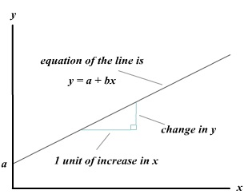

```{r, include = FALSE}
library(ggplot2)
library(dplyr)

options(width = 80)
```

# What are Mixed Models

<style type="text/css">
  .reveal p {
    text-align: left;
  }
  .reveal ul {
    display: block;
  }
  .reveal ol {
    display: block;
  }  
</style>


<!-- Send link by email: -->
<!-- https://dominiquemakowski.github.io/teaching/R/2021_05_CBL_MixedModels/2021_05_CBL_MixedModels.html -->


## All statistical tests are linear models


<small>[https://lindeloev.github.io/tests-as-linear](https://lindeloev.github.io/tests-as-linear/) *(Google "tests linear models")*</small>

## Whole World of Models

>- LM: Linear Model
>- GLM: General Linear Model (logistic, count, zero-inflated, ...)
>- GAM: General Additive Model 
>- GLMM / GAMM: **Mixed** GLM / GAM
>- Bayesian Models
>- <small>e.g. *Bayesian Scale-Location Mixed Shifted Log-normal General Additive Model*</small>

## What does "Mixed" Mean

>- Full name actually "Mixed **Effects**" Model
>- Includes **random effects** on top of the **fixed effects** (the model's main predictors)
>- Confusing names


>- Better term is "Hierarchical" Model
>- Hierarchical data is organized in *groups* which by themselves explain some variance
>- Groups can be any structure in the data, e.g., participants, items, datasets, ...

## Why use Mixed Models

>- Powerful (allows the quantification of a lot of interesting parameters)
>- Appropriate for the data we have in psychology / neuroscience
>- In 99\% of cases, there is no reason to use anything else than mixed models
>- Should be the default of stats in psychology

# Preparation

## Packages

```{r eval = FALSE}
install.packages(c("dplyr", "ggplot2", "lme4", "parameters", "modelbased", "report"))
```

```{r message=FALSE, warning=FALSE}
# Data Wrangling and plotting
library(dplyr)
library(ggplot2)

# Model fitting
library(lme4)

# Model analysis
library(report)
library(parameters)
library(modelbased)
```

## Data
```{r, include = FALSE, eval = TRUE}
set.seed(333)

# Make data
df <- correlation::simulate_simpson(n = 40, groups = 20, group_prefix = "S", difference=0.3)

names(df) <- c("RT", "Difficulty", "Participant")

# Add noise
df$RT <- df$RT + rnorm(nrow(df), 0, 0.3 * diff(range(df$RT)))


ggplot(df, aes(y=RT, x=Difficulty, color = Participant)) + 
  geom_point() +
  geom_smooth(method = "lm", se = FALSE)

write.csv(df, "data.csv", row.names = FALSE)
```

```{r eval = FALSE}
# Load data from URL (must be on one line)
df <- read.csv("https://raw.githubusercontent.com/
                DominiqueMakowski/teaching/master/
                R/2021_05_CBL_MixedModels/data.csv")
```
```{r include = FALSE, eval = TRUE}
df <- read.csv("https://raw.githubusercontent.com/DominiqueMakowski/teaching/master/R/2021_05_CBL_MixedModels/data.csv")
```


```{r}
report(df)

head(df)
```

## Data and Goals

>- 20 participants did a task with 40 trials (= 800 observations)
>- For each trial, their RT was recorded and they reported the "subjective" difficulty


>- **What's the relationship between RT and Subjective Difficulty?**
>- **Hypothesis**: Higher subjective difficulty = Higher RT (slower reaction)


# ANOVA

>- repeated-measures ANOVAs are a statistical abominations
>- We need to group participants based on their average RT and reported difficulty

## Summarize the data by participant 

- Get **individual difficulty scores** and **average RT**

```{r}
dfsub <- df %>% 
  group_by(Participant) %>% 
  summarise_all(mean)

dfsub
```

## Dichotomize the participants

- We split the participants into 2 groups based on their average difficulty

```{r}
dfsub$Difficulty_Group <- ifelse(dfsub$Difficulty < mean(dfsub$Difficulty),
                                 "Reported_Easy", "Reported_Hard")
```

## Run an ANOVA

```{r eval = FALSE}
model <- aov(RT ~ Difficulty_Group, data = dfsub)

report(model)
```
```{r echo = FALSE}
model <- aov(RT ~ Difficulty_Group, data = dfsub)

report(model, verbose = FALSE)
```

## Conclusion

>- We can conclude that `r emo::ji("shrug")`

## Conclusion (2)

- ANOVAs are just uninformative summaries of linear models


```{r eval = FALSE}
model <- anova(lm(RT ~ 1 + Difficulty_Group, data = dfsub))

report(model)
```
```{r echo = FALSE}
model <- anova(lm(RT ~ 1 + Difficulty_Group, data = dfsub))

report(model, verbose = FALSE)
```


# Linear Model

<center></center>

>- $y = a + bx$  equivalent to  $y \thicksim a(1) + b(x)$
>- becomes in R: $response \thicksim Intercept(1) + \beta(Var1)$

## In R

- No need to explicitly specify the intercept (`~ 1 + ...`), it's added by default

```{r}
model <- lm(RT ~ Difficulty_Group, data = dfsub)

report(model)
```

## Continuous Predictor


```{r}
model <- lm(RT ~ Difficulty, data = dfsub)

report(model)

parameters(model)
```

The two parameters are the **intercept** and the **slope**.

## Visualization (1) relation estimation

```{r}
viz_data <- estimate_relation(model)
viz_data
```

## Visualization (2) relation plotting


```{r}
p <- ggplot(data = viz_data, aes(x = Difficulty, y = Predicted)) +
  geom_line() +
  geom_ribbon(aes(ymin = CI_low, ymax = CI_high), alpha = 0.2)
p
```

## Visualization (3) add original data

```{r}
p <- p + 
  geom_point(data = dfsub, aes(x = Difficulty, y = RT, color = Participant)) +
  ylab("RT") +
  theme_minimal()
p
```

## Conclusion

>- Subjective difficulty is negatively associated with RT
>- The harder the task is, the faster they are
>- Mmmh `r emo::ji("thinking")`


# Linear Mixed Model

## Using all data

```{r}
model <- lm(RT ~ Difficulty, data = df)

summary(report(model))
```

Problems:

- Assumed independence of observations
- Inflated statistical power
- Information about group lost

Solutions:

- Mixed model

## Mixed model (random intercept)

```{r}
model <- lmer(RT ~ Difficulty + (1|Participant), data = df)

report(model)
```

## Get parameters

```{r}
parameters(model, effects = "fixed")
```

## Visualizing 

```{r}
viz_data <- estimate_relation(model)

p <- ggplot(data = viz_data, aes(x = Difficulty, y = Predicted)) +
  geom_line() +
  geom_ribbon(aes(ymin = CI_low, ymax = CI_high), alpha = 0.3) + 
  geom_point(data = df, aes(x = Difficulty, y = RT))
p
```

## Visualizing - color

```{r}
p <- ggplot(data = viz_data, aes(x = Difficulty, y = Predicted)) +
  geom_line() +
  geom_ribbon(aes(ymin = CI_low, ymax = CI_high), alpha = 0.3) + 
  geom_point(data = df, aes(x = Difficulty, y = RT, color = Participant))
p
```


## Visualizing - random

```{r}
viz_data_random <- estimate_relation(model, 
                                     include_random = TRUE, 
                                     preserve_range = TRUE,
                                     length = 100)

p <- p + 
  geom_line(data = viz_data_random, aes(color = Participant))
p
```

## What happened ?

- The model estimates two "fixed" parameters (across participants) of difficulty: the **intercept** and the **slope**
- It also estimates intercepts for all groups (the "random" variable)
- The "fixed" effects are informed by random effects, and **vice versa** (shrinkage)

## Mixed model (random intercept and random slope)

```{r}
model <- lmer(RT ~ Difficulty + (1 + Difficulty | Participant), data = df)

parameters(model, effects = "fixed")
```

- Both the intercept and the slope are estimated as fixed effects and for each level of the random variable


## Visualizing

```{r}
viz_data_fixed <- estimate_relation(model, include_random = FALSE)
viz_data_random <- estimate_relation(model, include_random = TRUE, preserve_range = TRUE, length = 100)

ggplot() +
  geom_point(data = df, aes(x = Difficulty, y = RT, color = Participant)) +
  geom_line(data = viz_data_fixed, aes(x = Difficulty, y = Predicted)) +
  geom_line(data = viz_data_random, aes(x = Difficulty, y = Predicted, color = Participant))
``` 
    

## Extracting random parameters

```{r}
dfrandom <- parameters(model, effects = "random", group_level = TRUE)

as.data.frame(dfrandom)
```

## Back to the individual scores

```{r}
dfsub$random_coef <- dfrandom$Coefficient[1:20]  # Where Parameters == (Intercept)

report(cor.test(dfsub$Difficulty, dfsub$random_coef))
```

## Take Home Message

>- Mixed models allow for the estimation (i.e., quantification) of individuals' characteristics under the regression framework
>- These individual's characteristics in turn inform the population-level parameters
>- The model-based approach allows to incorporate more sources of variance and quantify uncertainty
>- Powerful and well-understood framework that is flexible and informative

## Conclusion

- Use mixed models

## Resources

- Mixed models
  - **Mixed Models with R** *(https://m-clark.github.io/mixed-models-with-R/)*
  - Singmann, H., \& Kellen, D. (2019). **An Introduction to Mixed Models for Experimental Psychology**. *(preprint available online)*

- General / Other
  - **R for Psychological Science** *(https://psyr.djnavarro.net/)*
  - **YaRrr! The Pirate’s Guide to R** *(https://bookdown.org/ndphillips/YaRrr/)*
  - **GAMs in R** *(https://noamross.github.io/gams-in-r-course/)*
